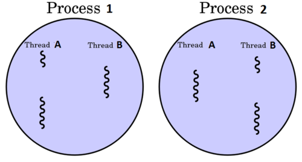

# 프로세스와 스레드

## 한눈에 이해하는 프로세스 & 스레드 개념

전공 지식 없이 컴퓨터의 프로그램을 이용하는데는 문제 없어 왔지만 소프트웨어를 개발하는 사람으로서 컴퓨터 실행 내부 요소를 따져보게 될때, 아마 컴퓨터 운영체제에 대해 입문하게 되면 가장 먼저 듣고 배우게 될 개념이프로세스와 스레드 일 것이다. 결론 부터 말하자면 이 둘을 한마디로 정의하자면 다음과 같다.

프로세스 (Process)스레드 (Thread)운영체제로부터 자원을 할당받은작업의 단위프로세스가 할당받은 자원을 이용하는실행 흐름의 단위운영체제(OS)에 대한 기본 배경 지식이 없다면 위의 정의가 무슨 소리인지 이해가 잘 되지 않을 것이다. 그래도 위의 문장에는 나름 설명이 함축되어 잘 정리 되어 있는 셈이다. 일단 프로세스의작업의 단위 라는 단어와 스레드의실행 흐름의 단위 라는 단어를 기억해 두고 글을 읽어보자. 글을 정독했을때 저 단어의 의미에 대해 확실히 깨닫게 될 것이다.

## 프로그램 과 프로세스

### 📌 정적 프로그램 (Static Program)

컴퓨터 전공이 아니라서 '프로세스' 라는 명칭은 낯설수 있는데, '프로그램' 은 친숙하리라 생각된다.프로그램은 윈도우의*.exe 파일이나 Mac의*.dmg 파일과 같은컴퓨터에서 실행 할 수 있는 파일을 통칭한다. 단, 아직파일을 실행하지 않은 상태이기 때문에 정적 프로그램(Static Program) 줄여서 프로그램(Program)이라고 부른 것이다.어떠한 프로그램을 개발하기 위해선 자바나 C언어와 같은 언어를 이용해 코드를 작성하여 완성된다. 즉, 프로그램은 쉽게 말해서 그냥코드 덩어리 인 것이다.

### 📌 프로세스(Process)

프로그램이 그냥 코드 덩어리이면, 프로세스는 프로그램을 실행 시켜 정적인 프로그램이 동적(動的)으로 변하여프로그램이 돌아가고 있는 상태를 말한다. 즉, 컴퓨터에서작업 중인 프로그램을 의미하는 것이다.이 개념은 절대 생소한 것이 아니다.ctrl + alt + del 단축키를 눌러 우리가 항상 보던 '작업' 관리자를 열어보면 개념이 고대로 들어있는걸 볼 수 있을 것이다.작업 끝내기는 실행중인 프로그램인 프로세스를 끝내는 것이다.

모든 프로그램은 운영체제가 실행되기 위한 메모리 공간을 할당해 줘야 실행될 수 있다. 그래서 프로그램을 실행하는 순간 파일은 컴퓨터 메모리에 올라가게 되고, 운영체제로부터 시스템 자원(CPU)을 할당받아 프로그램 코드를 실행시켜 우리가 서비스를 이용할 수 있게 되는 것이다.

어쨋든 똑같은 어플리케이션을 실행 하냐 안하냐 차이일 뿐이라서, 일반적으로 프로세스와 프로그램을 같은 개념으로 이야기할 때가 많지만, 정의를 보았듯이 엄밀히 따지면 이 둘은 다른 개념인 것이다.최종적으로 이 둘을 간단 명료하게 정리하면 아래 표와 같다.

## 스레드

### 📌 프로세스의 한계

과거에는 프로그램을 실행할 때 프로세스 하나만을 사용해서 이용했었다. 하지만 기술이 발전됨에 따라 프로그램이 복잡해지고 다채로워짐으로써 프로세스 작업 하나만을 사용해서 프로그램을 실행하기에는 한계가 있었다.

오늘날 컴퓨터는 파일을 다운 받으며 다른 일을 하는 멀티 작업은 너무 당연한 기능이라고 생각할지 모르겠지만, 과거에는 파일을 다운받으면 실행 시작부터 실행 끝까지 프로세스 하나만을 사용하기 때문에 다운이 완료될때까지 하루종일 기다려야 했다. 그렇다고 동일한 프로그램을 여러 개의 프로세스로 만들게 되면, 그만큼 메모리를 차지하고 CPU에서 할당받는 자원이 중복되게 될 것이다. 스레드(Thread)는 이러한 프로세스 특성의 한계를 해결하기 위해 탄생 하였다.

### 📌 스레드의 개념

스레드란, 하나의프로세스 내에서동시에 진행되는 작업 갈래, 흐름의 단위 를 말한다.이해하기 쉽게 비유를 들자면, 크롬 브라우저가 실행 되면 프로세스 하나가 생성될 것이다. 그런데 우리는 브라우저에서 파일을 다운 받으며 온라인 쇼핑을 하면서 게임을 하기도 한다.

즉, 하나의 프로세스 안에서 여러가지 작업들 흐름이 동시에 진행되기 때문에 가능한 것인데, 이러한 일련의 작업 흐름들을 스레드라고 하며 여러개가 있다면 이를 멀티(다중) 스레드 라고 부른다.

아래 그림에서 보듯이 하나의 프로세스 안에 여러개의 스레드들이 들어 있다고 보면 된다. 스레드 수가 많을 수록 당연히 프로그램 속도도 동시에 하는 작업이 많아져 성능이 올라간다.

스레드를 지렁이 같이 표현한 이유는 번역하면 실타래 이며, 실행 흐름을 표현하기 위해서이다

일반적으로 하나의 프로그램은 하나 이상의 프로세스를 가지고 있고, 하나의 프로세스는 반드시 하나 이상의 스레드를 갖는다. 즉, 프로세스를 생성하면 기본적으로 하나의 main 스레드가 생성되게 된다. 스레드 2개, 3개.. 는 프로그램을 개발한 개발자가 직접 프로그래밍하여 위치 시켜주어야 한다.

출처:

[https://inpa.tistory.com/entry/👩‍💻-프로세스-⚔️-쓰레드-차이](https://inpa.tistory.com/entry/%F0%9F%91%A9%E2%80%8D%F0%9F%92%BB-%ED%94%84%EB%A1%9C%EC%84%B8%EC%8A%A4-%E2%9A%94%EF%B8%8F-%EC%93%B0%EB%A0%88%EB%93%9C-%EC%B0%A8%EC%9D%B4)
[Inpa Dev 👨‍💻:티스토리]

### 한줄요약 by 얄코

- 프로그램 : 컴퓨터에서 실행할 수 있는 파일, 예를 들면 .exe 와 같은 파일
- 프로세스 : 프로그램이 실행되어서 돌아가고 있는 상태, 컴퓨터가 어떤 일을 하고 있는 상태

⇒ 오늘날처럼 쾌적하게 컴퓨터를 사용할 수 있는 건 운영체제가 여러개의 프로세스를 함께 돌리고 있기 때문이다.

- 스레드 : 한 프로세스 내에서도 여러 갈래의 작업들이 동시에 진행하는 것.

ex) 프로세서 = 요리사, 프로세스 = 라면 끓이기, 김밥 말기, 햄버거 만들기 등등..
라면, 김밥, 햄버거 조리대가 따로 있고, 스레드 = 요리사가 햄버거를 만들기위해 동시에서 스레드1. 패티굽고, 스레드2. 빵에 야채올리고 등등을 동시에 작업

- 즉, 프로세스는 컴퓨터의 자원을 분할해서 쓰지만, 스레드는 프로세스마다 주어진 전체자원을 함께 사용하는 것.
