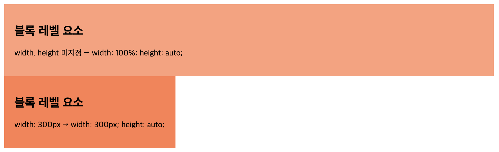
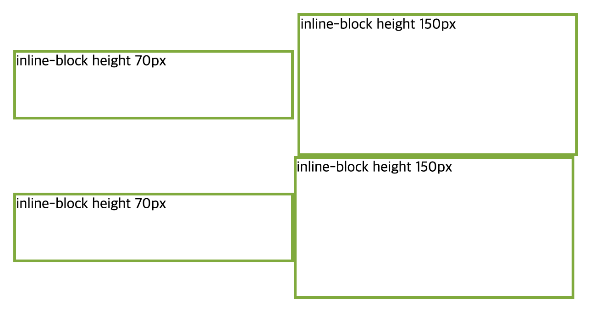

# display

## **display 속성이란?**

- display 프로퍼티는 layout 정의, 즉 요소를 어떻게 보여줄지 레이아웃을 결정하는 속성이다.
- 요소를 블록과 인라인 요소 중 어느 쪽으로 처리할지와 함께, flow, grid, flex 처럼 자식 요소를 배치할 때 레이아웃을 지정하기 위해 사용된다.
- 모든 HTML 요소는 아무런 CSS를 적용하지 않아도 기본적으로 브라우저에 표현되는 디폴트 표시값을 가진다. HTML 요소는 block 또는 inline 특성을 갖는다

## 1. block

- 항상 새로운 라인에서 시작한다.
- 화면 크기 전체의 가로폭을 차지한다. (width: 100%)
- width, height, margin, padding 프로퍼티 지정이 가능하다.
- block 레벨 요소 내에 inline 레벨 요소를 포함할 수 있다
- `div` , `h1 ~ h6`, `p` , `ol` , `ul` , `li` , `hr` , `table` , `form`

## 2. inline

- 새로운 라인에서 시작하지 않으며 문장의 중간에 들어갈 수 있다. 즉, 줄을 바꾸지 않고 다른 요소와 함께 한 행에 위치한다.
- content의 너비만큼 가로폭을 차지한다.
- **width, height, margin-top, margin-bottom 프로퍼티를 지정할 수 없다.** 상, 하 여백은 line-height로 지정한다.
- inline 레벨 요소 내에 block 레벨 요소를 포함할 수 없다. inline 레벨 요소는 일반적으로 block 레벨 요소에 포함되어 사용된다.
- `span` , `a` , `strong` , `img` , `br` , `input` , `select` , `textarea` , `button`

## 3. inline-block

block과 inline 레벨 요소의 특징을 모두 갖는다. **inline 레벨 요소와 같이 한 줄에 표현되면서 width, height, margin 프로퍼티를 모두 지정할 수 있다.**

- 기본적으로 inline 레벨 요소와 흡사하게 줄을 바꾸지 않고 다른 요소와 함께 한 행에 위치시킬 수 있다.
- block 레벨 요소처럼 width, height, margin, padding 프로퍼티를 모두 정의할 수 있다. 상, 하 여백을 margin과 line-height 두가지 프로퍼티 모두를 통해 제어할 수 있다.
- content의 너비만큼 가로폭을 차지한다.

## 4. none

- 화면 상 어떤 영역을 차지하지 않고 완전히 삭제된 것처럼 보이게 한다.

visibility 속성을 hidden으로 설정한 것과 달리 영역도 차지하지 않는다.

## 5. flex

- 아이템들을 가로 방향 혹은 세로 방향으로(1차원 배치) 배치할 수 있는 방식으로 요소의 크기가 불분명하거나 동적인 경우에도 각 요소를 정렬할 수 있는 효율적인 방법을 제공한다.
- Flex의 속성은 컨테이너에 적용되는 속성, 아이템에 적용되는 속성으로 나뉜다.

## 6. grid

- Flex와는 다르게 2차원으로 배치하는 방식으로 column과 row의 비율이나 크기를 지정한다.
  grid-template-rows는 가로에 배치할 셀들의 비율이나 크기를 지정하는 속성이고
  grid-template-columns는 세로로 배치할 셀들의 비율이나 크기를 나타낸다.
- grid-template-rows나 grid-template-columns에 입력할 수 있는 단위는 px, fr이 있는데 fr은 fraction으로 숫자 비율대로 트랙의 크기를 나누는 것이다.
  즉 grid-template-columns : 1fr 1fr 1fr 은 1:1:1로 나누는 것이고
  grid-template-columns : 100px 3fr 1fr 은 첫번째 셀은 100px, 두번째 셀과 세번째 셀은 남은 부분을 3:1로 나누어 차지한다.

참조  
https://poiemaweb.com/css3-display.
[https://velog.io/@sukong/CSS-display-속성](https://velog.io/@sukong/CSS-display-%EC%86%8D%EC%84%B1)
