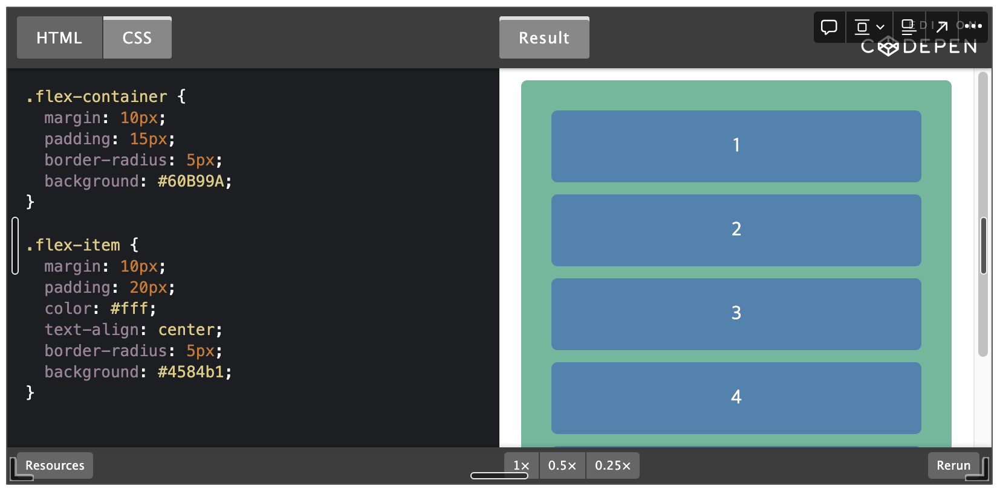
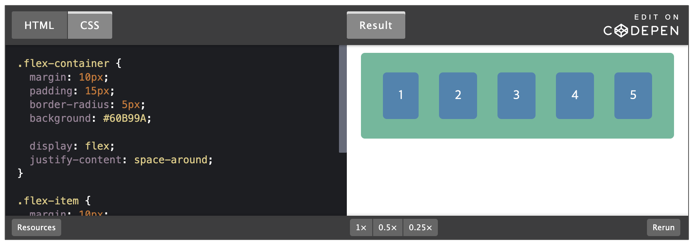
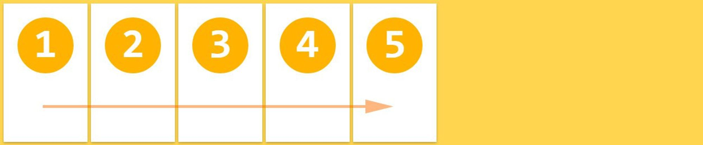
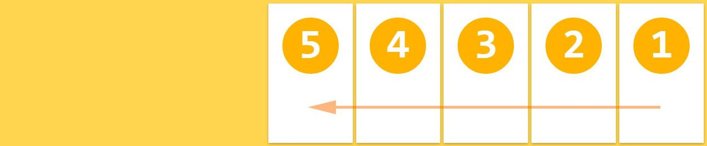
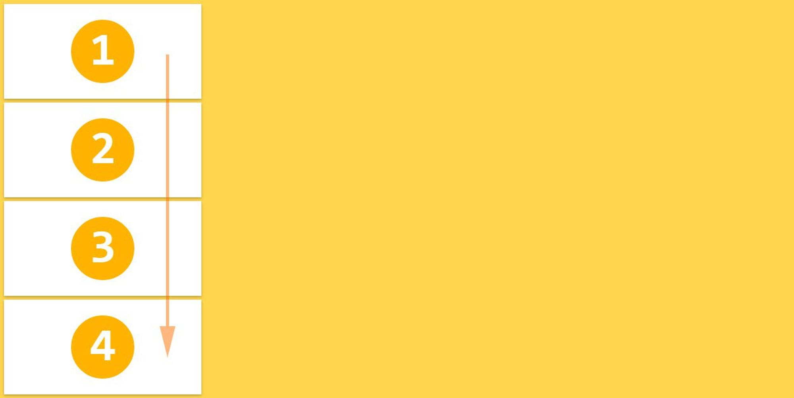
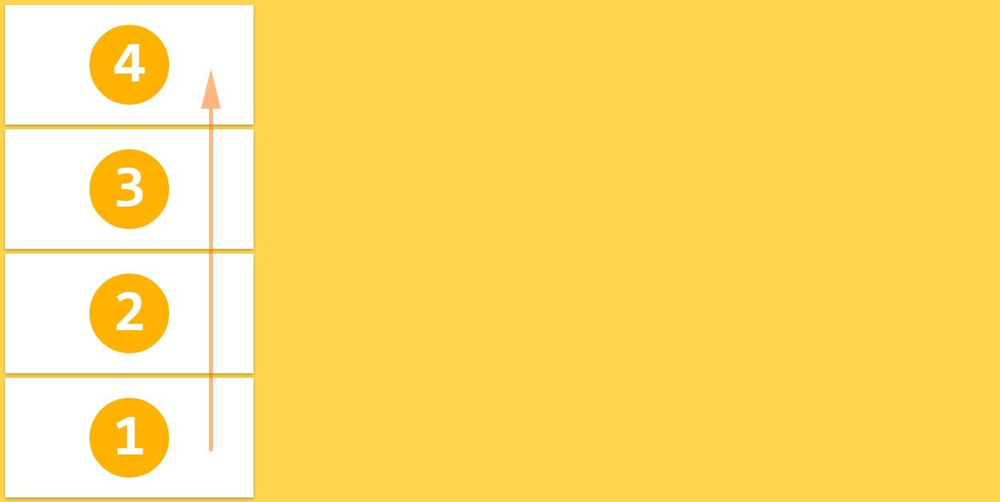

# Flex(Flexbox Layout )

## 📌 flex란?

Flexbox는 모던 웹을 위하여 제안된 기존 layout보다 더 세련된 방식의 니즈에 부합하기 위한 CSS3의 새로운 layout 방식이다.

**요소의 사이즈가 불명확하거나 동적으로 변화할 때에도 유연한 레이아웃을 실현할 수 있다. 복잡한 레이아웃이라도 적은 코드로 보다 간단하게 표현할 수 있다.**

## 📌 flex를 사용하는 이유?

flex는 레이아웃을 좀 더 편하게 잡기 위해서 만들어진 css 속성이다. flex를 사용하면 요소들의 크기나 위치를 쉽게 잡을 수 있다. 기존에 수평 구조를 만들 때 사용하는 속성이 float나 inline-block 등이 있었는데 여러가지 문제를 가지고 있었고 flex를 사용하면 이러한 속성의 한계를 보완할 수 있다. 물론 수평 뿐만 아니라 수직도 가능하다.

flex는 컨테이너와 아이템 개념을 사용하여 요소의 크기가 불분명하거나 동적인 경우에도 요소를 효율적으로 정렬할 수 있게 해준다.

## 1. introduction

<p align="center">

</p>

### 수직정렬 방법 1.

div 요소는 block 요소이므로 수직 정렬된다. 이를 수평 정렬하려면 자식요소(flex-item)를 inline-block으로 지정하거나 float 프로퍼티를 지정한다.

```jsx
.flex-item {
  display: inline-block;
  /* or */
  float: left;
}
```

이때 각 자식 요소을 부모 요소 내에서 정렬하기 위해서는 각 자식 요소의 너비를 %로 지정하는 등 번거로운 처리가 필요하다. 자식 요소의 사이즈가 불명확하거나 동적으로 변화할 때에는 더욱 처리가 복잡해 진다. grid 시스템을 사용할 수 도 있으나 이 또한 새로운 학습이 필요하고 라이브러리를 로드해야하는 번거로움이 존재한다.

### 수직정렬 방법 2.

Flexbox를 사용하여 위 예제를 부모 요소 내에서 균등 수평 정렬해 보자. 부모 요소에 아래와 같이 2행을 추가하면 된다.

```css
.flex-container {
  display: flex;
  justify-content: space-around;
}
```

Flexbox를 사용하면 기존에 방식에 비해 매우 간단히 레이아웃을 처리할 수 있다. 그 결과는 아래와 같다.

<p align="center">

</p>

Flexbox의 장점을 정리해 보면 아래와 같다.

- 1줄의 코드 추가로 수평 정렬이 가능하다.
- 요소의 상하좌우 정렬, 순서 변경이 간단하다.
- 요소가 간격 조절이 간단하다.
- 서로 다른 height를 갖는 요소의 수평정렬 시, 간단히 상하중앙 정렬이 가능하다.

비교적 최신 브라우저가 아니면 벤더 프리픽스를 사용하여야 하고 IE계열은 IE8,9의 경우 지원하지 않고 IE10,11의 경우도 일부 지원하므로 주의가 필요하다. IE계열에서 Flexbox를 사용하기 위해서는 flexibility.js를 사용하면 편리하다.

## 2. Usage

Flexbox 레이아웃은 **flex item**이라 불리는 복수의 자식 요소와 이들을 내포하는 **flex-container** 부모 요소로 구성된다.

<p align="center">

</p>

flexbox를 사용하기 위해서 HTML 부모 요소의 display 속성에 flex를 지정한다.

```css
.flex-container {
  display: flex;
}
```

부모 요소가 inline 요소인 경우 inline-flex을 지정한다.

```css
.flex-container {
  display: inline-flex;
}
```

flex 또는 inline-flex는 부모 요소에 반드시 지정해야하는 유일한 속성이며 자식 요소는 자동적으로 flex item이 된다.

## 3. Flexbox container 속성

### **3.1 flex-direction**

flex-direction 속성은 flex 컨테이너의 주축(main axis) 방향을 설정한다.

🎈 **flex-direction: row;**

좌에서 우로(ltr) 수평 배치된다. flex-direction 속성의 기본값이다.

```css
.flex-container {
  flex-direction: row;
}
```

<p align="center">

</p>

🎈 **flex-direction: row-reverse;**

우에서 좌로(rtl) 수평 배치된다.

```css
.flex-container {
  flex-direction: row-reverse;
}
```

<p align="center">

</p>

🎈 **flex-direction: column;**

위에서 아래로 수직 배치된다.

```css
.flex-container {
  flex-direction: column;
}
```

<p align="center">

</p>

🎈 **flex-direction: column-reverse;**

아래에서 위로 수직 배치된다.

```css
.flex-container {
  flex-direction: column-reverse;
}
```

<p align="center">

</p>

참조  
https://poiemaweb.com/css3-flexbox  
[https://devowen.com/272#flex를 사용하는 이유가 무엇인가요%3F (D사 화상면접)-1](<https://devowen.com/272#flex%EB%A5%BC%20%EC%82%AC%EC%9A%A9%ED%95%98%EB%8A%94%20%EC%9D%B4%EC%9C%A0%EA%B0%80%20%EB%AC%B4%EC%97%87%EC%9D%B8%EA%B0%80%EC%9A%94%3F%20(D%EC%82%AC%20%ED%99%94%EC%83%81%EB%A9%B4%EC%A0%91)-1>)
