# float (요소 정렬)

## 📌 float이란

float 프로퍼티는 주로 레이아웃을 구성할 때 블록 레벨 요소를 가로 정렬하기 위해 사용되는 중요한 기법이다. flexbox 레이아웃를 사용한다면 더욱 간단하게 정렬을 구현할 수도 있지만 flexbox 레이아웃을 지원하지 않는 IE를 고려해야 한다면 float 프로퍼티를 사용해야 한다.

float 프로퍼티는 본래 아래 예제와 같이 이미지와 텍스트가 있을 때, 이미지 주위를 텍스트로 감싸기 위해 만들어진 것이다.

<p align="center">
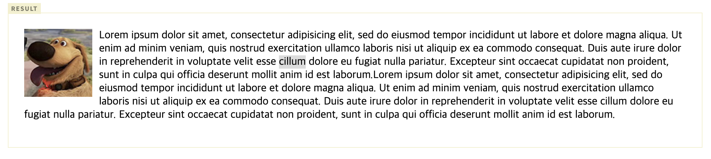
</p>

float 프로퍼티는 해당 요소를 다음 요소 위에 떠 있게(부유하게) 한다. 여기서 떠 있다(float)는 의미는 요소가 기본 레이아웃 흐름에서 벗어나 요소의 모서리가 페이지의 왼쪽이나 오른쪽에 이동하는 것이다. float 프로퍼티를 사용할 때 요소의 위치를 고정시키는 position 프로퍼티의 absolute를 사용하면 안된다.

| 프로퍼티값 | Description                          |
| ---------- | ------------------------------------ |
| none       | 요소를 떠 있게 하지 않는다. (기본값) |
| right      | 요소를 오른쪽으로 이동시킨다         |
| left       | 요소를 왼쪽으로 이동시킨다.          |

<p align="center">
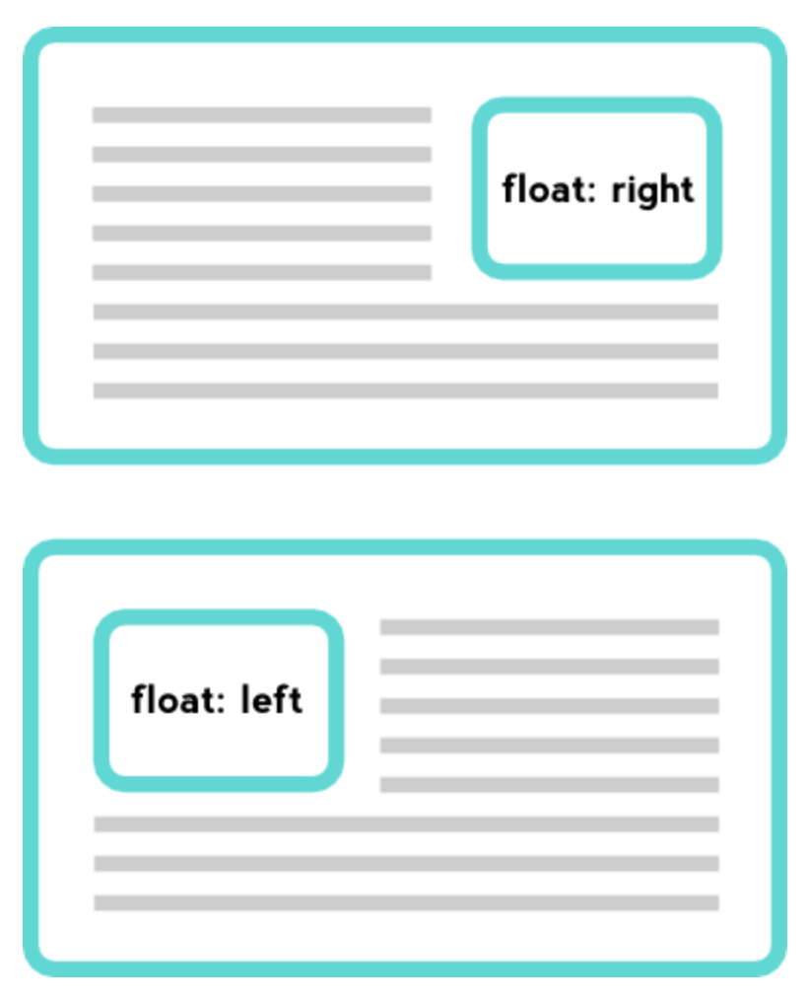
</p>

### 1. 정렬

float 프로퍼티를 사용하지 않은 블록 요소들은 수직으로 정렬된다. `float:left;` 프로퍼티를 사용하면 왼쪽부터 가로 정렬되고, `float:right;` 프로퍼티를 사용하면 오른쪽부터 가로 정렬된다.

오른쪽 가로 정렬의 경우, 먼저 기술된 요소가 가장 오른쪽에 출력되므로 출력 순서가 역순이 된다.

<p align="center">
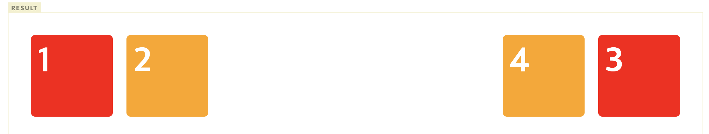
</p>

float 프로퍼티는 좌측, 우측 가로 정렬만 할 수 있다. 중앙 가로 정렬은 margin 프로퍼티를 사용해야 한다.

```jsx
div {
  width: 960px;
  margin: 0 auto;
}
```

### 2. width

- float 적용전
  width 프로퍼티의 기본값은 100%이므로 width 프로퍼티값을 지정하지 않은 block 요소는 부모 요소의 가로폭을 가득 채운다.

<p align="center">

</p>

- float 적용후
  width 프로퍼티를 선언하지 않은 block 레벨 요소에 float 프로퍼티가 선언되면 width가 inline 요소와 같이 content에 맞게 최소화되고 다음 요소 위에 떠 있게(부유하게) 된다.

  ```jsx
  <html>
  <head>
    <style>
      .box {
        color: white;
        font-weight: bold;
        font-size: 30px;
        line-height: 50px;
        height: 50px;
        margin: 0 10px;
        padding: 10px;
      }
      .d1 {
        float: left;
        background: red;
      }
      .d2 {
        background: orange;
      }
    </style>
  </head>
  <body>
    <div class="box d1"> float: left; </div>
    <div class="box d2"> div </div>
  </body>
  </html>
  ```

    <p align="center">
      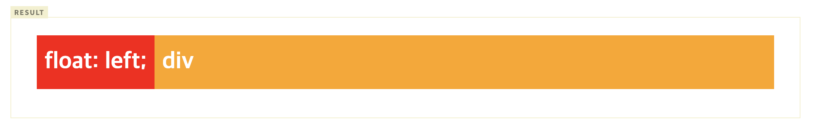
    </p>

  위 예제를 살펴보면 d1 클래스 요소에는 `float: left;`를 선언하였고 d2 클래스 요소에는 float를 선언하지 않았다. 이때 d1 클래스 요소는 width가 inline 요소와 같이 content에 맞게 최소화되고 다음 요소인 d2 클래스 요소 위에 떠 있게(부유하게) 된다.

  주의할 것은 d1 클래스 요소가 d2 클래스 요소 위에 떠 있게 되어도 d2 클래스 요소의 width는 d1 클래스 요소가 차이한 width만큼 줄어들지 않고 100%를 유지한다는 것이다. 이는 d2 클래스 요소는 float를 선언하지 않았기 때문에 본래의 width를 유지하기 때문이다. 따라서 d2 클래스 요소는 본래의 width(100%)를 유지한 상태에서 d1 클래스 요소가 그 위에 위치한다.

## 📌 float clear(float 해제)

`float`은 본래 이미지와 텍스트를 자연스러운 흐름으로 배치하기 위해 고안된 속성이나, 실무에서는 주로 어떠한 요소들을 옆으로 배치할 때 사용한다. 하지만 `float` 을 사용하면 브라우저가 높이를 인지하지 못하게 되기 때문에 clear 하는 과정이 필요하다.

예제를 통해 테스트 해본다.

<p align="center">
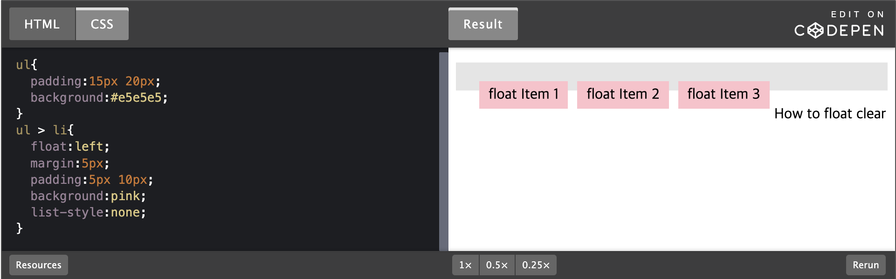
</p>

### 1. 부모에 height 적용

- float된 요소들의 부모태그에 height를 적용하면 clear된다.
- 높이가 바뀔때마다 수정되어야하며, 반응형 대응이 불가.
- 일반적으로 부모태그에는 높이값을 설정하지 않는다. 자식태그 높이값에 맞춰서 자연스럽게 따라가게 한다.

<p align="center">
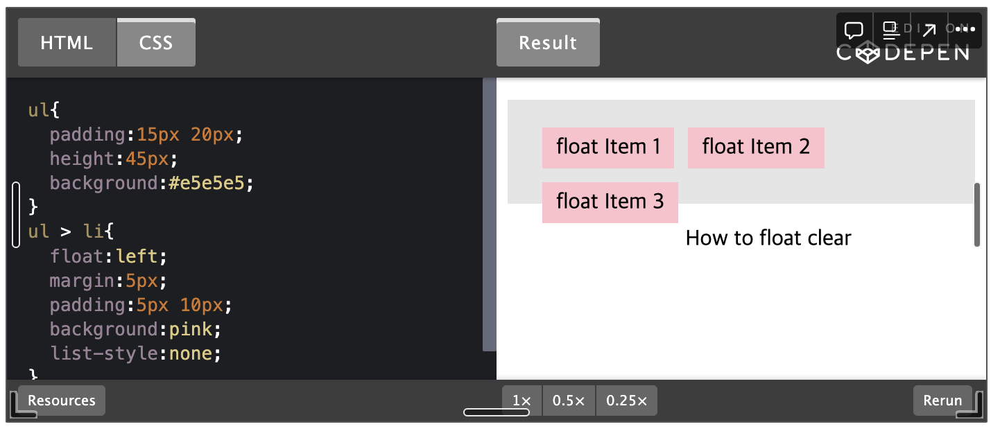
</p>

### 2. 부모에 overflow:hidden 적용

- float된 요소들의 부모태그에 overflow:hidden을 적용한다.
- 치명적인 단점 - 만약 이 부모 요소 안에 부모의 영역을 벗어나는 팝업과 같은 자식 콘텐츠가 있다고 가정한다면 그 팝업의 내용이 보이지 않는 현상이 일어난다. 하단의 예시처럼 부모 바깥으로 표현되어야하는 요소가 있을 때 표현이 불가하다.(노란색 원이 가려져서 나타난다.)

<p align="center">
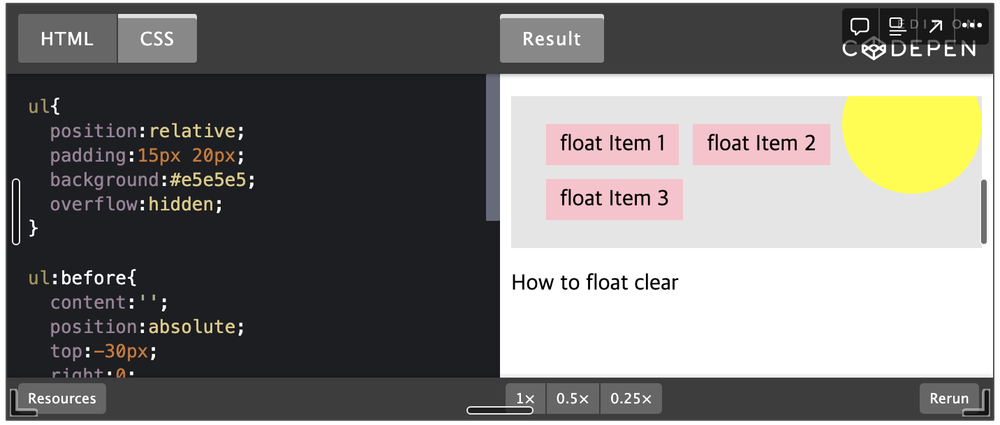
</p>

### 3. 부모에 overflow:auto 적용

- 특정상황에서 스크롤바가 생긴다

<p align="center">
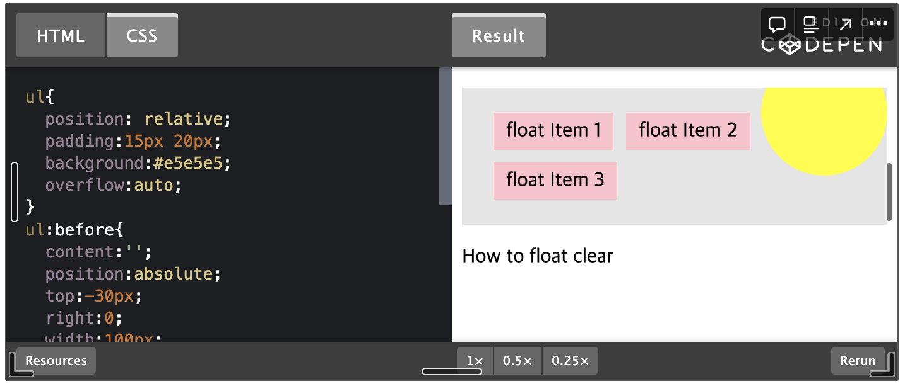
</p>

### 4. 부모에 float 적용

- float된 요소들의 부모태그에도 float 속성을 적용한다. - 부모요소에 float이 적용되면 자식요소의 float이 해제됨.
- float이 적용되면서 inline-block 아이템이 되고, 다음요소가 옆으로 배치된다.
- 해당 박스요소를 중앙이나 원하는 위치로 배치하기 어려워지고, 다음에 오는 요소 또한 원하는대로 배치되지 않을 가능성이 높다.
- 자식 요소의 float을 해제하기 위해서 부모 요소에 의미 없는 float을 부여하는 방법을 사용하는 것은 좋지 않다

<p align="center">
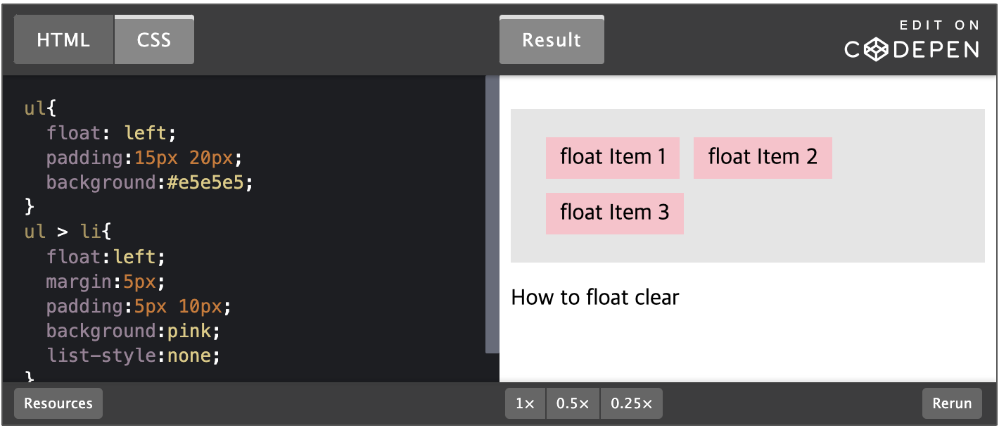
</p>

### 5. 부모 다음 요소/임의의 요소에 clear:both 적용

- float된 요소들의 부모태그 다음에 오는 요소 또는 임의의 요소를 만들어 clear:both를 한다.
- 줄바꿈은 적용되지만 부모태그의 높이는 여전히 인지되지 않으며,
- 다음 요소가 어떤 클래스를 사용하는지에 따라 매번 수정될 가능성이 있으며, margin-top 이 정확하게 적용되지 않는다.
- 또한 임의의 요소에 clear:both를 적용하는 것은 굳이 불필요한 요소를 추가하는 것이기에 가장 비추천하는 방법이다.

<p align="center">
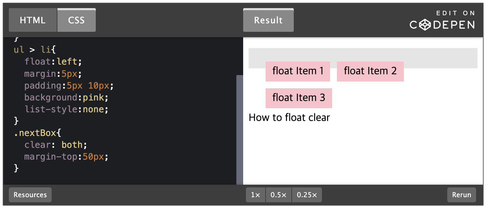
</p>

### ⭐ 6. 부모에 가상요소 after에 clear:both

- float된 요소들의 부모태그에 가상요소 `::after`를 사용해서 `clear:both`를 적용한다.
- 가장 보편적으로 이용되는 방법이다.
- 부모태그가 의도치 않게 inline-block 요소로 바뀌지 않으며, 높이가 정확하게 잡히고, 불필요한 요소가 추가되지 않는다.
- overflow hidden을 사용하는 방법과 같이 팝업과 같은 콘텐츠를 벗어나는 경우에도 대응이 되며, 콘텐츠의 높이 값이나 사이즈의 변화에도 유연한 대응이 된다.

<p align="center">
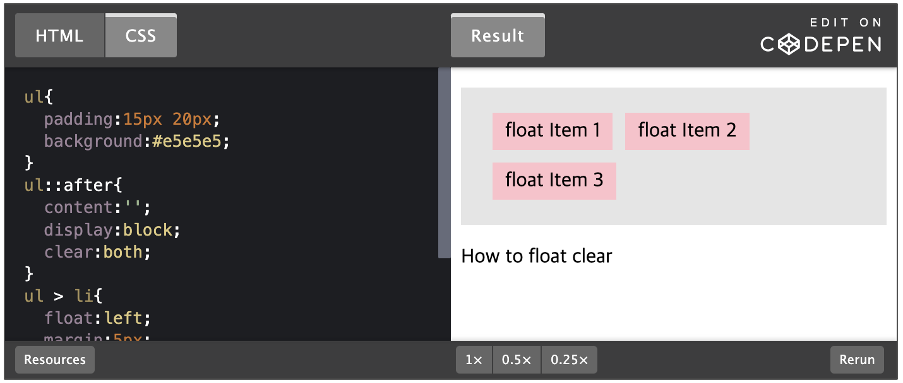
</p>

### 📍float 해제 방법(한줄정리)

1. 부모요소에 높이값을 적용(자동높이값 계산 불가능하다.)
   (일반적으로 부모태그에는 높이값을 설정하지 않는다. 자식태그 높이값에 맞춰서 자연스럽게 따라가게 한다.
2. 부모요소에 overflow:auto; 적용 (특정상황에서 스크롤바가 보인다.)
3. 부보요소에 overflow:hidden 적용(자식요소가 컨텐츠 바깥으로 빠지는 구조의 경우 디자인이 깨진다.)
4. 부모요소에 float이 적용되면 자식요소의 float이 해제됨.
5. float된 요소의 아래쪽에 컨텐츠를 넣고 clear:both; 적용
6. 부모요소에 가상요소인 ::after를 만든 다음 clear:both; 적용한다. (가장 좋은 방법!! 꼭 써야하는 방법!)

참조  
https://poiemaweb.com/css3-float  
[https://velog.io/@hsecode/CSS-float-해제하기-float-clear](https://velog.io/@hsecode/CSS-float-%ED%95%B4%EC%A0%9C%ED%95%98%EA%B8%B0-float-clear)
