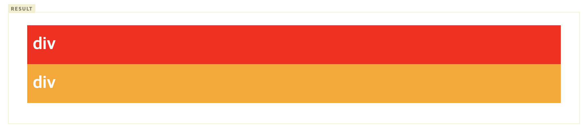

# float (요소 정렬)

## 📌 float이란

float 프로퍼티는 주로 레이아웃을 구성할 때 블록 레벨 요소를 가로 정렬하기 위해 사용되는 중요한 기법이다. flexbox 레이아웃를 사용한다면 더욱 간단하게 정렬을 구현할 수도 있지만 flexbox 레이아웃을 지원하지 않는 IE를 고려해야 한다면 float 프로퍼티를 사용해야 한다.

float 프로퍼티는 본래 아래 예제와 같이 이미지와 텍스트가 있을 때, 이미지 주위를 텍스트로 감싸기 위해 만들어진 것이다.

<p align="center">

</p>

float 프로퍼티는 해당 요소를 다음 요소 위에 떠 있게(부유하게) 한다. 여기서 떠 있다(float)는 의미는 요소가 기본 레이아웃 흐름에서 벗어나 요소의 모서리가 페이지의 왼쪽이나 오른쪽에 이동하는 것이다. float 프로퍼티를 사용할 때 요소의 위치를 고정시키는 position 프로퍼티의 absolute를 사용하면 안된다.

| 프로퍼티값 | Description                          |
| ---------- | ------------------------------------ |
| none       | 요소를 떠 있게 하지 않는다. (기본값) |
| right      | 요소를 오른쪽으로 이동시킨다         |
| left       | 요소를 왼쪽으로 이동시킨다.          |

<p align="center">

</p>

### 1. 정렬

float 프로퍼티를 사용하지 않은 블록 요소들은 수직으로 정렬된다. `float:left;` 프로퍼티를 사용하면 왼쪽부터 가로 정렬되고, `float:right;` 프로퍼티를 사용하면 오른쪽부터 가로 정렬된다.

오른쪽 가로 정렬의 경우, 먼저 기술된 요소가 가장 오른쪽에 출력되므로 출력 순서가 역순이 된다.

<p align="center">

</p>

float 프로퍼티는 좌측, 우측 가로 정렬만 할 수 있다. 중앙 가로 정렬은 margin 프로퍼티를 사용해야 한다.

```jsx
div {
  width: 960px;
  margin: 0 auto;
}
```

### 2. width

- float 적용전

  width 프로퍼티의 기본값은 100%이므로 width 프로퍼티값을 지정하지 않은 block 요소는 부모 요소의 가로폭을 가득 채운다.

<p align="center">

</p>

- float 적용후
  
 width 프로퍼티를 선언하지 않은 block 레벨 요소에 float 프로퍼티가 선언되면 width가 inline 요소와 같이 content에 맞게 최소화되고 다음 요소 위에 떠 있게(부유하게) 된다.
  
 `jsx <html> <head> <style> .box { color: white; font-weight: bold; font-size: 30px; line-height: 50px; height: 50px; margin: 0 10px; padding: 10px; } .d1 { float: left; background: red; } .d2 { background: orange; } </style> </head> <body> <div class="box d1"> float: left; </div> <div class="box d2"> div </div> </body> </html>`
   <p align="center">

</p>
    
    위 예제를 살펴보면 d1 클래스 요소에는 `float: left;`를 선언하였고 d2 클래스 요소에는 float를 선언하지 않았다. 이때 d1 클래스 요소는 width가 inline 요소와 같이 content에 맞게 최소화되고 다음 요소인 d2 클래스 요소 위에 떠 있게(부유하게) 된다.
    
    주의할 것은 d1 클래스 요소가 d2 클래스 요소 위에 떠 있게 되어도 d2 클래스 요소의 width는 d1 클래스 요소가 차이한 width만큼 줄어들지 않고 100%를 유지한다는 것이다. 이는 d2 클래스 요소는 float를 선언하지 않았기 때문에 본래의 width를 유지하기 때문이다. 따라서 d2 클래스 요소는 본래의 width(100%)를 유지한 상태에서 d1 클래스 요소가 그 위에 위치한다.


참조  
https://poiemaweb.com/css3-float  
[https://velog.io/@hsecode/CSS-float-해제하기-float-clear](https://velog.io/@hsecode/CSS-float-%ED%95%B4%EC%A0%9C%ED%95%98%EA%B8%B0-float-clear)
