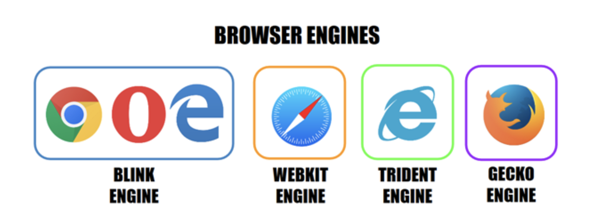
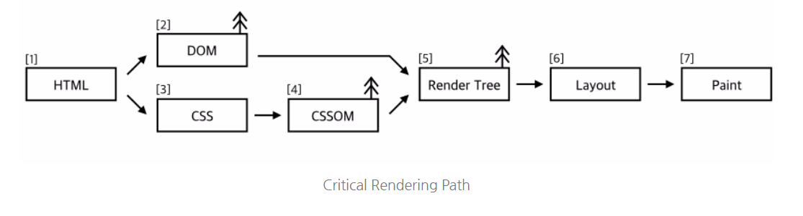
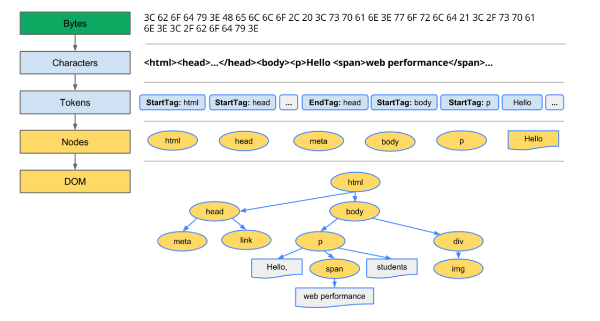
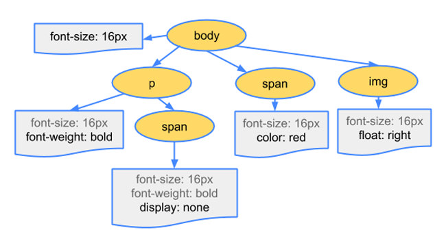
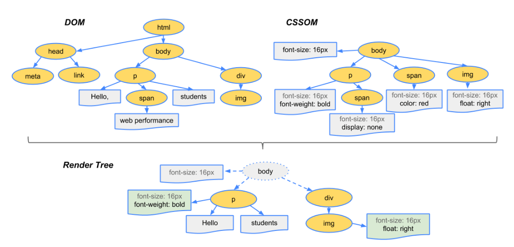
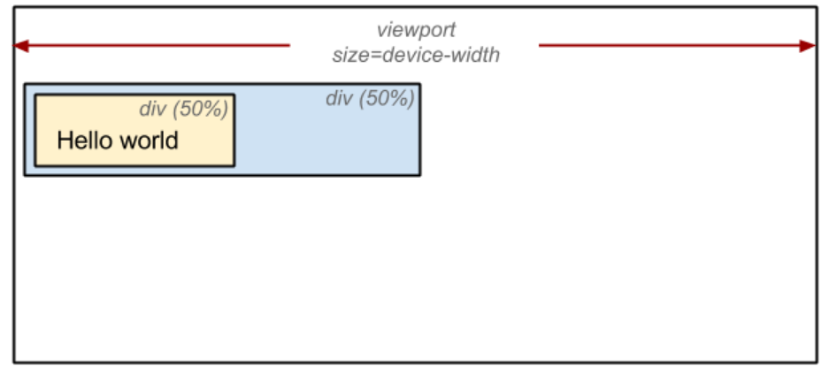
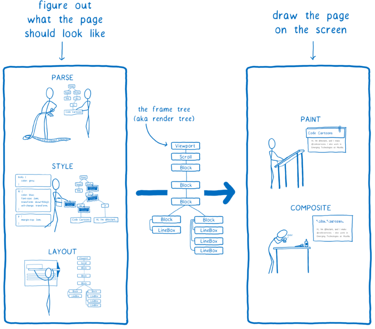

# 브라우저 렌더링 과정

### 브라우저란?

---

- HTML, CSS, JS의 코드를 가지고 웹페이지를 그려준다.
- **웹 브라우저는 동기(Synchronous)적으로 (HTML + CSS), Javascript 언어를 해석하여 내용을 화면에 보여주는 응용 소프트웨어입니다.**
- 웹 브라우저가 웹 서버에 필요한 자원(웹 페이지)을 요청하면 서버는 응답하고 웹 브라우저는 이를 해석한 후 사용자(Client)에게 보여줍니다. 보통 자원은 HTML 문서지만 PDF, 이미지 등 다양한 형태일 수 있습니다.
  웹 브라우저의 종류는 다양합니다. 크롬, 네이버 웨일, 파이어폭스, 사파리 등이 대표적인 예입니다.

### 웹브라우저의 구조

---

<p align="center">

</p>

1. User Interface : 주소 표시줄, 뒤로/앞으로 가기 버튼, 홈 버튼, 북마크 버튼아 등이 포함된다. 요청한 페이지가 표시되는 창을 제외한 브라우저의 모든 부분(사용자와 상호작용하는 인터페이스)을 표시한다.
2. Browser engine : User interface와 렌더링 엔진 사이를 연결하는 브라우저 엔
3. Rendering engine : 요청된 콘텐츠 표시를 담당한다. 예를 들어, 요청된 콘텐츠가 HTML인 경우 렌더링 엔진은 HTML, CSS를 파싱하고 파싱한 콘텐츠를 화면에 표시한다.
4. Networking : HTTP/HTTPS 네트워크 요청을 처리한다.
5. JavaScript Interpreter : 자바스크립트 코드를 파싱 및 실행하는데 사용된다.(크롬에서는 v8엔진이 여기에 해당)
6. UI Backend : 기본 위젯을 그리는 데 사용된다. UI Backend는 특정 플랫폼이 아닌 OS의 방법을 사용한다.
7. Data Persistence : 보조기억 장치에 데이터를 저장하는 파트. 쿠키, localStorage, IndexedDB, WebSQL, FileSystem 같이 로컬에 저장되어 좀 더 오래 유지되어야만 하는(persistence) 스토리지 메커니즘을 지원하는 영역이다.

## Rendering Engine

---

- 웹브라우저마다 다른 렌더링 엔진. 크롬,엣지는 블링크, 사파리는 웹킷, 파이어폭스는 겍코 렌더링 엔진을 사용한다.

<p align="center">

</p>

### 렌더링 엔진의 목표

1. HTML, CSS, JS, 이미지 등 웹페이지에 포함된 모든 요소들을 화면에 보여준다.
2. 업데이트가 필요할 때 효율적으로 렌더링 할 수 있도록 자료구조를 생성한다. - 여기서 말하는 업데이트는 사용자가 입력하거나, 스크롤, 애니메이션 동작, 비동기요청으로 인한 데이터 로딩.

### 렌더링 엔진의 동작과정

<p align="center">

</p>

1. HTML 데이터 파싱
2. Dom 트리 만들기
3. CSSOM 트리 만들기
4. JavaScript 실행
5. Render 트리 만들기
6. 레이아웃 생성하기
7. 페인팅

### 1. HTML 데이터 파싱

브라우저 주소창에 url을 입력하여 요청을 보내면 서버로부터 HTML 문서를 받아오게 된다. 이걸 파싱하기 시작하면서 브라우저가 데이터를 화면에 그리는 과정이 시작된다.

### 2. Dom 트리 만들기

<p align="center">

</p>

1. 브라우저는 읽어들인 바이트 데이터를 해당 파일에 지정된 인코딩에 따라 문자열로 바꾼다.
2. 바꾼 문자열을 다시 읽어서 HTML 표준에 따라 문자열을 토큰으로 변환한다.
3. 이렇게 만들어진 토큰을 다시 노드로 바꾸는 과정을 거친다. `StartTag:html`이 들어왔으면 `EndTags:html`을 만나기 전까지 들어오는 토큰들은 html 노드의 자식 노드로 넣는 식의 변환이 이루어진다.
4. 이 과정이 끝나면 DOM 트리가 완성된다.

### 3. CSSOM 트리 만들기

1. 브라우저는 읽어들인 바이트 데이터를 해당 파일에 지정된 인코딩에 따라 문자열로 바꾼다.
2. 바꾼 문자열을 다시 읽어서 HTML 표준에 따라 문자열을 토큰으로 변환한다.
3. 이렇게 만들어진 토큰을 다시 노드로 바꾸는 과정을 거친다. `StartTag:html`이 들어왔으면 `EndTags:html`을 만나기 전까지 들어오는 토큰들은 html 노드의 자식 노드로 넣는 식의 변환이 이루어진다.
4. 이 과정이 끝나면 DOM 트리가 완성된다.

<p align="center">

</p>

### 4. Javascript 실행

JavaScript 파일을 만나면 해당 파일을 받아와서 실행할 때까지 파싱이 멈춘다. 따라서 문서 내의 요소를 참조하는 JavaScript 파일이 있는 경우 해당 문서가 표시된 후에 배치해야 한다.

### 5. Render tree 만들기

<p align="center">

</p>

DOM 과 CSSOM은 문서의 각기 다른 측면을 표현하는 서로 독립적인 객체이다. 하나는 콘텐츠를 설명하고 하나는 문서에 적용되어야 하는 스타일 규칙을 설명한다. 이 두가지를 병합하여 브라우저가 어떻게 화면에 픽셀을 렌더링하는지에 대한 정보를 가진 Render 트리를 만든다.

Render 트리는 DOM 트리에 있는 것들 중에서 실제로 화면에 보이는 노드들로만 이루어진다.

만약 `display:none` 라면 그 노드와 자식노드들은 Render 트리에 추가되지 않는다. 마찬가지로 `<head> , <meta>`태그 안의 내용들도 Render 트리에는 추가되지 않는다.

### 6. 레이아웃 생성하기(Layout)

지금까지 표시할 노드와 해당 노드의 스타일을 계산했다. 하지만 기기의 뷰포트 내에서이러한 노드의 정확한 위치와 크기를 계산하지 않았다. 이를 계산하는 것이 레이아웃 단계이다. 리플로우(reflow)라고 부르기도 한다.

```html
<html>
  <head>
    <meta name="viewport" content="width=device-width,initial-scale=1" />
    <title>Critial Path: Hello world!</title>
  </head>
  <body>
    <div style="width: 50%">
      <div style="width: 50%">Hello world!</div>
    </div>
  </body>
</html>
```

예를들어, 다음과 같은 코드가 있을 때 첫 번째 div는 뷰포트 너비의 50%로 설정하며 두번 째 div는 상위 항목 너비의 50% 이므로 뷰포트 너비의 25%로 설정한다.

<p align="center">

</p>

레이아웃 과정에서는 뷰포트 내에서 각 요소의 정확한 위치와 크기를 정확하게 계산하여 위와 같은 박스 모델로 출력된다.

### 7. 페인팅(Paint)

마지막으로, 이제 표시되는 노드와 해당 노드의 스타일 및 기하학적 형태를 파악했으므로 렌더링 트리의 각 노드를 화면의 실제 픽셀로 변환한다.

텍스트, 색, 이미지, 그림자 등 요소의 모든 시각적 부분을 그리는 작업을 포함한다.

### 8. 합성과 렌더

페인트 단계에서 생성된 레이어를 합성하여 스크린을 업데이트한다. 합성과 렌더 단계가 끝나면 화면에서 웹 페이지를 볼 수 있다.

다음 그림은 브라우저 로딩 과정을 나타낸다. 웹 애플리케이션에서 성능 개선점을 찾기 위해서는 브라우저 로딩 과정을 이해해야 한다.

<p align="center">

</p>

#### 참고

---

https://velog.io/@mu1616/Critical-Rendering-Path
https://ui.toast.com/fe-guide/ko_PERFORMANCE#%EC%84%B1%EB%8A%A5-%EC%B5%9C%EC%A0%81%ED%99%94%EC%97%90-%ED%95%84%EC%9A%94%ED%95%9C-%EC%9D%B4%EB%A1%A0%EA%B3%BC-%EC%B8%A1%EC%A0%95-%EB%8F%84%EA%B5%AC  
https://choar816.tistory.com/192
