# Cache

## 1. Cache

캐시는 데이터나 값을 미리 복사해 놓은 임시 저장소를 말한다. 캐시는 데이터를 접근하는 시간이 오래걸리는 경우나 값을 계산하는 시간이 오래걸리는 로직 등에 사용한다. 캐시가 없다면 데이터가 변경되지 않는 고정 데이터임에도 계속해서 네트워크를 통해 데이터를 다운 받아야 한다. 불필요한 데이터를 계속 받는다면 데이터 비용의 비중도 올라가게 된다. 그리고 결국 사용자 측면에서도 로딩 속도가 반복해서 느려지게 되고, 이는 사용자에게 좋지 못한 경험을 제공합니다.

캐시를 사용하면 새로고침 시에 반복되는 데이터가 네트워크를 통하지 않으므로 네트워크 사용량이 줄고, 브라우저 로딩 속도가 빨라지게 되며, 이는 빠른 사용자 경험으로 직결된다.

## 2. Web Cache

프론트엔드에서는 서버에 요청을 보내고 응답을 받아 화면을 렌더링하는 경우가 많다. 네트워크를 통해 서버에 데이터를 요청하게 되면, 해당 서버가 응답을 반환할 때까지 페이지가 로드되지 않는다.

페이지 로딩에 필요한 css, js, html, 이미지 등의 정적 리소스를 캐싱하여 사용하게 되면, 요청을 보내는 네트워크 요청 횟수를 줄일 수 있을 뿐만 아니라 서버 응답을 기다려야 할 필요도 없기 때문에 사용자에게 보다 빠르게 화면을 보여줄 수 있다. 이러한 개념을 **웹 캐싱**이라고 한다.

웹 캐시의 종류에 대해 알아보자. 일반적으로 브라우저에서 리소스를 요청하게 되면, 다음과 같은 순서로 캐시가 동작한다.

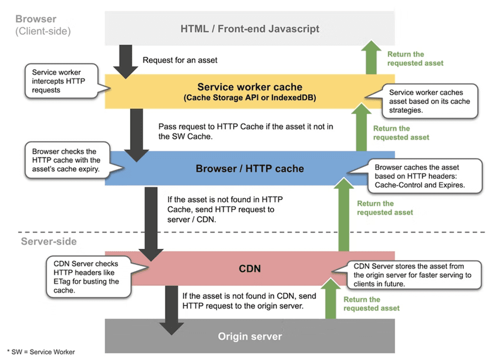

브라우저 단에서 HTTP 요청을 보내게 되면, 해당 요청을 바로 서버로 전송하지 않고 캐시된 데이터가 있는지 확인한다.

캐시는 차례대로 **서비스 워커 캐시 → 브라우저 캐시 → CDN(or 프록시 서버 캐시)** 순으로 참조되며, 모든 캐시에 유효한 응답(데이터)이 없을 경우에는 서버에 요청을 보내서 응답을 받게 된다.

## 2-1. Service Worker Cache

서비스워커는 브라우저가 백그라운드에서 실행하는 스크립트로, 웹페이지와는 별개로 작동하며 웹페이지 또는 사용자의 인터랙션이 필요하지 않은 기능만 제공하고 있다.

서비스워커의 수명 주기는 웹페이지와는 **완전히 별개이다.** **웹 서비스와 브라우저 및 네트워크 사이에서 프록시 서버의 역할을 하며, 오프라인에서도 서비스를 사용할 수 있도록 합니다.**

웹 페이지와 별개로 존재하기 때문에 다음과 같은 제약이 있습니다.

1. 서비스워커는 요청하지 않는 이상, 없는 것이나 다름없습니다.
2. 웹 페이지 life cycle을 따르지 않습니다. 서비스워커는 웹페이지가 닫히더라도 자동으로 비활성화되지 않습니다.
3. 웹 페이지와 별개로 존재하므로 DOM이나 window요소에 접근할 수 없습니다.

**위 제약을 고려했을 때, 서비스워커는 다음과 같이 활용할 수 있습니다.**

### 1. 캐시와 상호작용

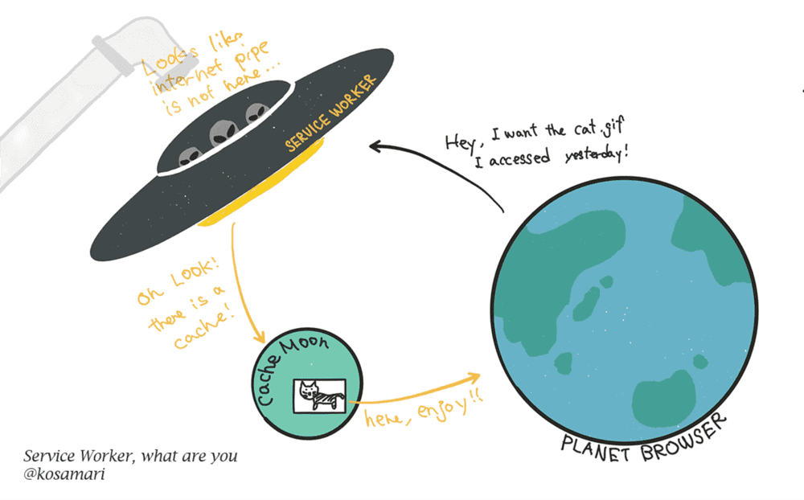

`fetch` 이벤트의 중간자 역할로 사용할 수 있습니다. 이 경우 서비스워커는 HTTP를 통해 정보를 요청하는 대신 가지고 있는 캐시에서 자료를 전달합니다. 캐시가 삭제되지 않는 한 브라우저는 인터넷 연결 없이도 정보를 보여줄 수 있습니다.

### 2. 푸쉬 알림

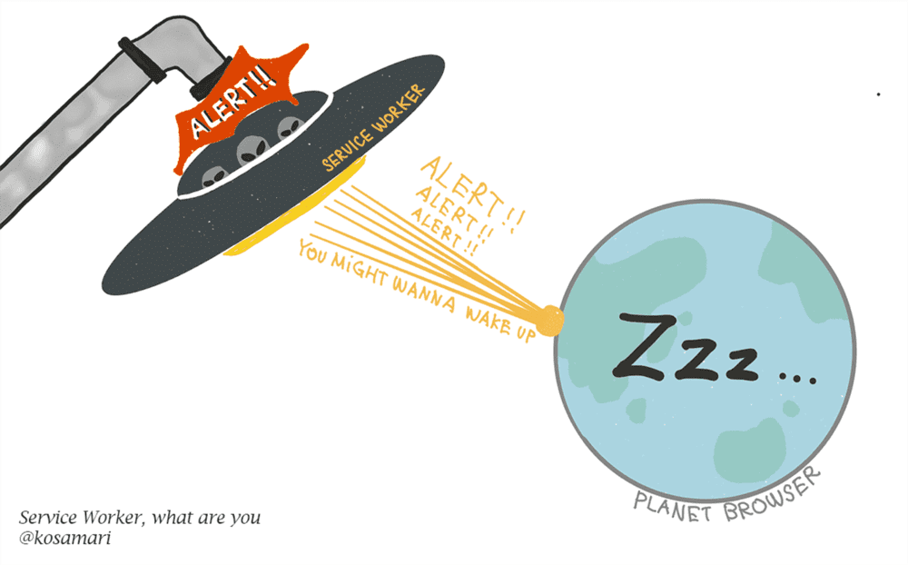

브라우저 창이 닫힌 상태에서도 동작하므로, 푸시 알람을 구현할 수 있습니다.

### 3. 백그라운드 동기화

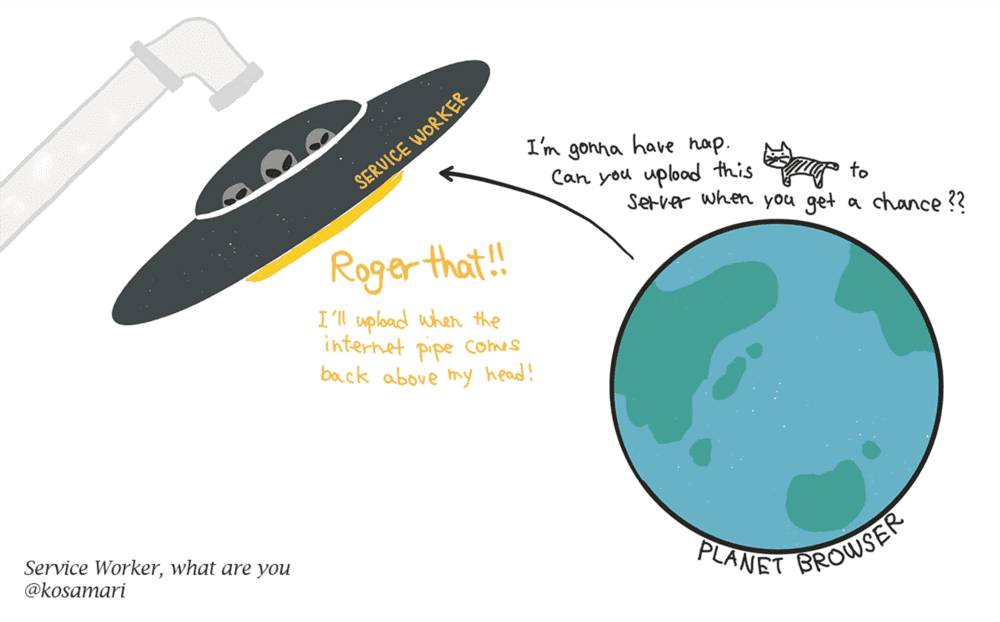

채팅 메시지 또는 사진 업로드 등의 작업 도중 컴퓨터가 오프라인 상태가 되는 경우 온라인 상태가 되었을 때 해당 작업을 마저 완료할 수 있습니다.

## 2-2. Browser Cache

웹브라우저는 서버와 HTTP 프로토콜을 통해 리소스를 서버에게 요청을 하여 가져오고 이를 사용자에게 리소스를 화면으로 보여주거나 제공한다. 이러한 통신 과정을 거치면서 클라이언트는 네트워크를 거치는 시간이 소비되며, 서버는 요청을 처리하는데 시간이 소비된다.

만약 클라이언트가 이전에 받은 데이터와 똑같은 데이터를 서버에 재요청을 할때 똑같은 통신 과정을 거치게 된다면 이 과정은 낭비라고 할 수 있다. 따라서 이러한 낭비를 줄이기 위한 해결책으로 캐시의 개념을 웹브라우저에 그대로 적용한, HTTP에서 제공하는 헤더(Headers)인 `Cache-Control` 이다.

브라우저는 이Cache-Control 헤더를 적절하게 사용함으로써, 상황에 따라 서버의 부하를 줄일수있으며 클라이언트는 네트워크 통신 기간이나 트래픽 량을 줄일 수 있게 되었다. 하지만 캐시(Cache)는 다루기 까다로운 녀석이다. 잘못 캐싱하게 되면 불일치한 리소스를 받게 되거나 서비스 의도와는 다른 동작을 할 수 있게 된다.

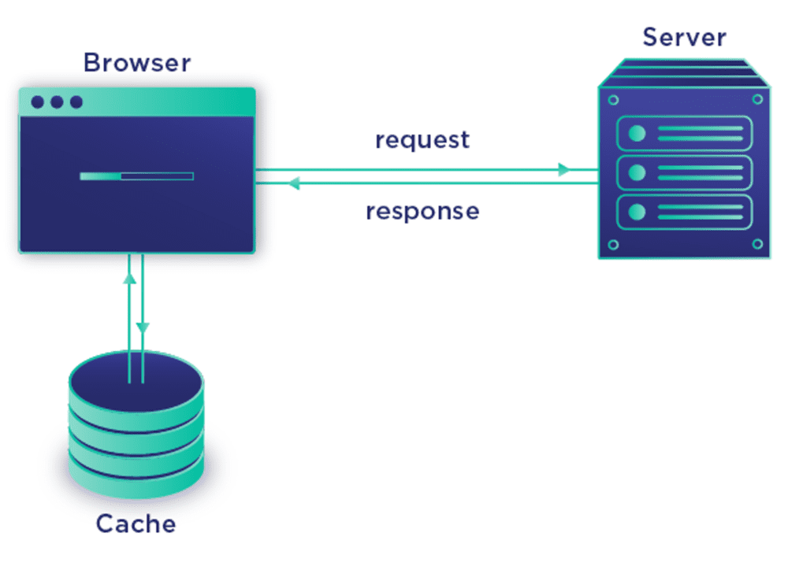

## 📌 HTTP 캐시 제어 - Cache-Control 헤더

캐시의 유효 시간(생명 주기)을 명시하는 응답(Resonse) 헤더

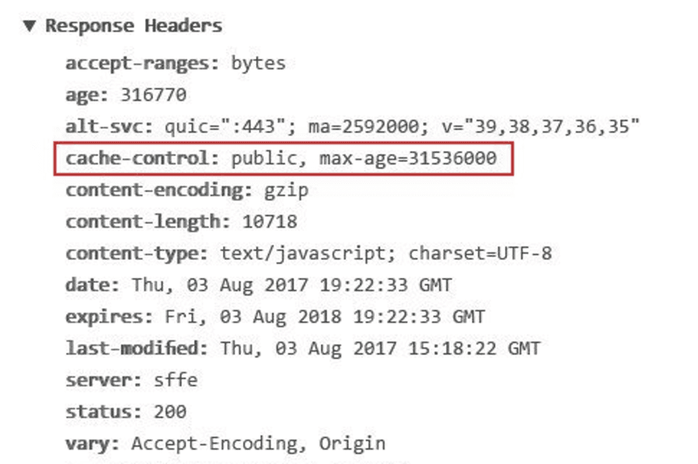

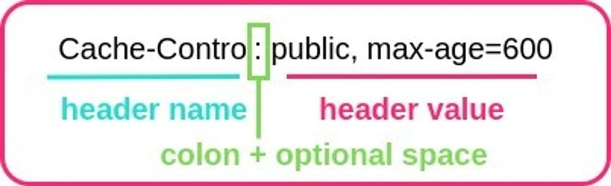

### **📍 헤더 값 파라미터 종류**

- max-age : 캐시 유효 시간, 초 단위
- no-cache : 데이터는 캐시해도 되지만,항상 Origin Server 에 검증후 사용
- no-store : 데이터에 민감한 정보가 포함되어 있어저장 불가 혹은 최대한빨리 삭제
- public : public 캐시(프록시 캐시 서버)에 저장 가능
- private : public 캐시에 저장 불가
- s-maxage : 프록시 캐시 서버에 적용되는 max-age
- Age : Origin Server 의 응답이 프록시 캐시 서버에 머문 시간(sec)
- must-revalidate : 캐시 만료후 최초 조회시 Origin Server 에 검증

## 📌 웹브라우저의 캐시 기본 동작

### 캐시가 없을 경우 ❌

만일 캐시가 없을 경우 똑같은 이미지를 요청한다면, 서버에서는 동일한 이미지를 매번 1.1M 용량의 데이터로 응답해야 한다. 용량이 작은 리소스일 경우 큰 문제가 되지는 않겠지만 용량이 크면 클 수록 통신 비용이 커지게 되고 로딩속도가 느려지게 된다.

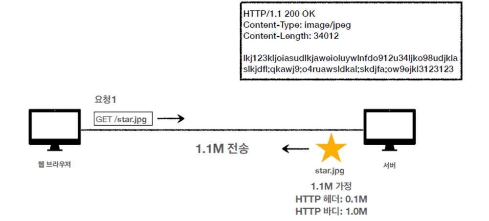

1. 클라이언트에서 star.jpg 이미지를 요청한다.
2. 서버에서는 해당 이미지가 있으면 응답을 줘야하는데, 이미지의 HTTP 헤더+바디를 합쳐 대략 1.1M정도 용량의 데이터를 응답한다.
3. 클라이언트에서는 해당 이미지를 응답 받아 사용한다.
4. 클라이언트에서는 star.jpg 이미지를 다시 한 번 요청한다.
5. 서버에서는 동일한 이미지를 다시 1.1M정도 용량의 데이터를 응답해준다.
6. 클라이언트에서는 해당 이미지를 응답 받아 사용한다.
7. 동일한 이미지를 요청하는데 네트워크를 통해 같은 데이터를 또 다운받아야 한다.

### 캐시를 이용한 요청 ⭕

그러면 웹브라우저에 캐시를 적용하면 얼마나 이점이 있는지 알아보자.

1. 클라이언트에서 star.jpg 이미지를 요청한다.
2. 서버에서는 해당 이미지를 응답해준다. 이때 HTTP 메세지에cache-control 헤더를 넣어주어 캐시가 유효한 시간을 설정한다. (그림에서는 60초로 설정해 60초 동안은 해당 캐시가 유효하다는 의미다)
3. 서버로부터 응답을 받게되면, 클라이언트에서는cache-control 헤더를 이해하고 웹브라우저 캐시에 응답 결과를 60초 동안 저장하게 된다.
4. 클라이언트가 star.jpg 이미지를 재차 요청한다. 이때 서버에게 가는 것이 아닌 우선 캐시 저장소를 조회하게 된다.
5. 만일 캐시 되어있고 60초 이내에 요청한 상태라면, 캐시에서 자료를 가져오게 된다.

캐시를 사용하게 되면, 한 번 응답받았던 데이터는 브라우저의 캐시 저장소에 남아 일정 시간 내에 계속해서 참조할 수 있기 때문에, 서버로부터 불필요한 네트워크 다운로드를 효과적으로 줄일 수 있다. 사용자는 빠른 서비스 경험을 이용할수 있게 되면, 서버는 네트워크 사용량을 줄여 비용을 아낄수 있게 된다.

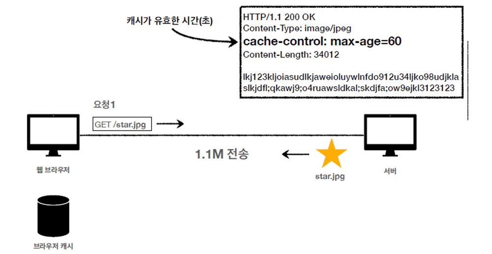

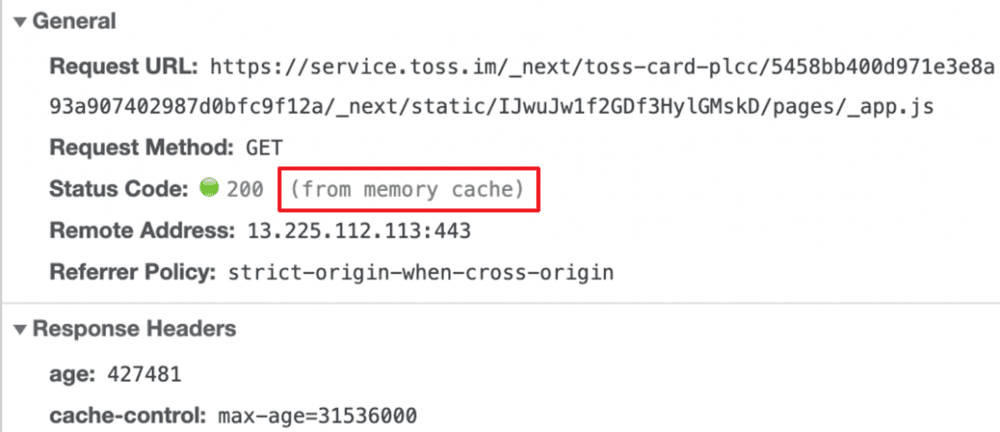

### 캐시 유효 시간이 지날 경우 🚩

그런데 만일 60초 가 지나 캐시 유효 기간이 만료된 후에 클라이언트가 그 자료를 요청할 경우 어떻게 될까?

1. 클라이언트가 star.jpg 이미지를 재차 요청한다. 그런데 캐시 60초 유효시간이 초과되어 버려 더이상 가져올수 없게 되었다.
2. 그러면 클라이언트는다시 서버에게 처음과 같이 요청하게 된다. (다시 네트워크 다운로드가 발생)
3. 서버는 똑같이cache-control 헤더를 응답하게 되고, 브라우저는 다시 자료를 캐시에 저장하게 된다.

이처럼 6번 상황을 보듯이 캐시 유효기간이 지날경우 처음과 같이 쌩 요청을 보내야한다.그러면 캐시 유효 기간을 길게 늘리면 되지 않냐 싶은데 이는 좋지 않은 방법이다. 왜냐하면 오랜 기간 변경되지 않아도 되는 데이터가 있는 반면, 짧은 변경 주기를 가지는 데이터도 있기 때문이다.

즉, 만료기간이 긴 경우 캐시 데이터가 오래된 데이터일 가능성이 높아지게 된다.따라서 비록 캐시 유효 시간이 지났더라도 오랜 기간 변경되지 않아도 되는 데이터일 경우 처음부터 요청을 하는 건 낭비를 초래하는 요청이 된다는 소리이다. 그래서 더욱 더 효율적인 캐시 전략을 위해 웹 브라우저에는 별도의캐시 검증 로직을 수행하게 된다.

## 📌 HTTP 캐시 검증 & 조건부 요청

### 1. 캐시 검증 헤더 종류

서버가 클라이언트에게 응답(Response) 할때 HTTP 메세지 헤더에 넣는 캐시 관련 헤더 정보들이다.

**Last-Modified 헤더**

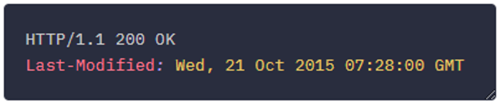

- 데이터의 최종 수정 시각을 명시한다. (윈도우 파일을 보면 최종 수정 시각 같은 개념이다)
- `If-Modified-Since` 요청(Request) 헤더와 함께 사용된다
- 클라이언트가 캐시 유효 기간이 초과된 데이터를 서버에 요청하는 경우, 이를 기준으로 데이터가 수정되었는지 검증한다. 예를들어 서버의 데이터 최종 수정 시각이 Last-Modified 보다 이후라면, 데이터가 수정된 것으로 간주하고, 서버의 데이터 최종 수정 시각이 Last-Modified 와 같다면 데이터가 수정되지 않은 것으로 간주한다.
- ex) last-modified: Tue, 15 Mar 2022 06:48:06 GMT . . .

**ETag 헤더**

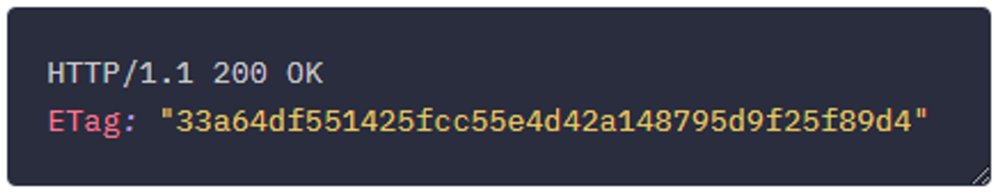

- 특정 버전의 리소스를 식별하는 고유 식별자 (데이터의 버전 이름 혹은 해시값)
- 서버는 파일이 변경될 때마다 새 ETag 값을 생성하고 이전 ETag 값을 유지한다.
- `If-None-Match` 요청(Request) 헤더와 함께 사용된다
- Last-Modified 헤더의 한계를 극복하기 위한 리소스 검증 헤더
- ex) ETag: "a2jiodwjekjl3" , ETag: "v1.0" . . .

### 2. 조건부 요청 헤더 종류

클라이언트가 서버에 요청(Request) 할때 HTTP 메세지 헤더에 넣는 캐시 관련 헤더 정보들이다.

**If-Modified-Since 헤더**

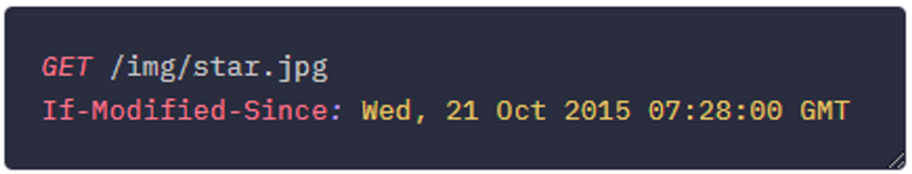

- 클라이언트의 요청(Request) 시 사용되며, 캐시 데이터의 `Last-Modified` 값이 들어간다.
- 서버의 데이터 최종 수정 시각과 캐시 데이터의 최종 수정 시각을 비교하여 데이터 수정 여부를 확인하기 위해 사용한다.
  - 캐시에 있는 리소스 수정 시각과 서버에 있는 리소스 수정 시작이 같으면, 304 Not Modified 응답 → 캐시 재사용
  - 캐시에 있는 리소스 수정 시각과 서버에 있는 리소스 수정 시작이 다르면, 200 OK 응답 → 새로 데이터 전송 (네트워크 다운로드)

**If-None-Match 헤더**

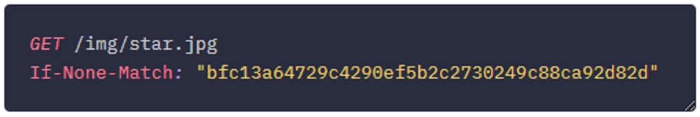

- 클라이언트의 요청(Request) 시 사용되며, 캐시 데이터의ETag 값이 들어간다.
- 서버의 데이터`ETag` 와 캐시 데이터의`ETag` 를 비교하여 데이터 수정 여부를 확인하기 위해 사용한다.
  - 캐시에 있는`ETag` 와 서버에 있는 `ETag`가 같으면, 304 Not Modified 응답 → 캐시 재사용
  - 캐시에 있는`ETag`와 서버에 있는 `ETag`가 다르면, 200 OK 응답 → 새로 데이터 전송 (네트워크 다운로드)

**If-Unmodified-Since /If-Match헤더**

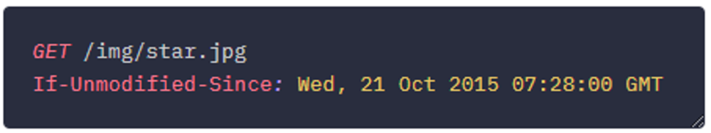

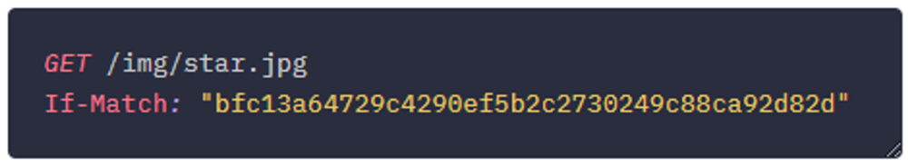

- 각각If-None-Match 와If-Modified-Since 반대 역할 수행을 한다도 보면 된다.
- 이 헤더들은 412 Precondition failed 상태 코드를 반환하는데 사용된다.

## 2-3. Proxy Cache

클라이언트와 서버 사이에 위치한 네트워크 상(프록시 서버)에서 동작하는 캐시로, 회사나 IPS의 방화벽에 설치된다.

브라우저 캐시와는 달리 다수의 웹 서버에서 공유하여 사용할 수 있다는 장점이 있다.

프록시 캐시와 비슷한 개념으로는 CDN이 있다.

> CDN(Content Delivery Network)이란?  
> 콘텐츠를 효율적으로 전송하기 위해 지리적으로 분산된 서버 네트워크실 서버에 접속하여 리소스를 다운로드하는 것이 아닌 클라이언트와 가장 가까운 곳에 위치한 네트워크에 요청하여 리소스를 받아옴→ CDN을 적절하게 사용하면 데이터 사용량이 많은 어플리케이션의 페이지 로딩 속도를 개선할 수 있음

CDN은 하나의 커다란 공유 캐시와 같다. 다수의 실 서버가 갖고 있는 데이터를 캐시하여 클라이언트에게 제공한다.

### 📌 프록시 캐시의 동작 원리

프록시는 클라이언트와 본서버를 중계하는 중간에 위치한 서버 대리자로서, 클라이언트의 요청을 대신 받고 본서버에 전해주는 역할을 한다. 이 프록시를캐시 서버로서 이용할수 있는데, 예를들어 한국에 있는 클라이언트에서 이미지가 필요한상황인데, 해당 이미지의 원서버가 미국에 있다고 가정해보자. 한국 서버에서 미국 서버까지 직접 접근하여 이미지를 가져오는데 0.5초가량 걸린다고하면, 한국에 위치한 컴퓨터들은 모두 0.5초 가량을 기다려야 해당 이미지를 받을 수 있게 된다.

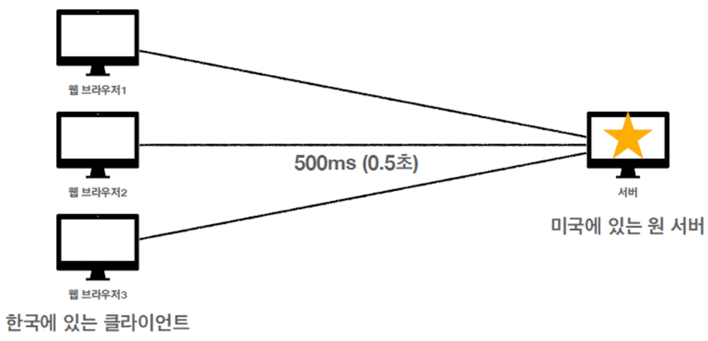

그래서 이를 해결하기 위해 프록시 캐시를 도입하여 사용한다고 보면 된다.

한국에 프록시 캐시 서버를 따로 두고, 최초의 요청에만 미국 서버까지 가서 이미지 리소스를 받아오고 프록시 캐시 서버에 저장한다. 그러면 한국의 클라이언트는 리소스를 가져올때 프록시 캐시 서버로 부터 자료를 가져오면 된다. 특히 여러 사람들이 찾는 자료일수록 이미 캐시에 등록되어있기에 효과적으로 빠른 속도로 자료를 가져올 수 있다. 우리가 유튜브에서 고용량의 영상도 빨리 볼 수 있는 이유도 이에 해당한다.

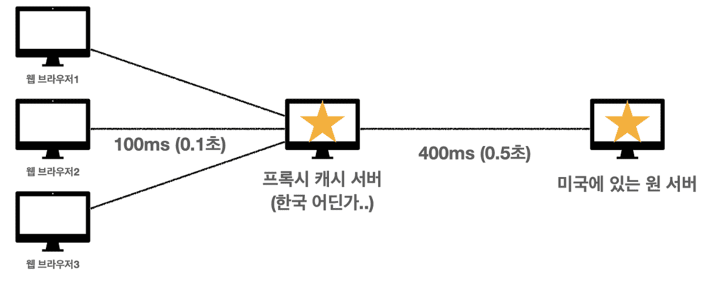

즉, 같은 국내에 있기에 원서버에 접근하는것보다 훨씬 빠른 속도에 자료를 가져올 수 있다는 것이다.

참고로 클라이언트에서 사용되고 저장되는 캐시를 **private 캐시**라 하고 프록시 캐시 서버의 캐시를 **public 캐시**라 한다.

웹브라우저 캐시와 프록시 서버 캐시가 분리되어 운용되는 만큼, 위에서 배운 `Cache-Control` HTTP 헤더도 프록시 전용 캐시 설정을 해야 한다.

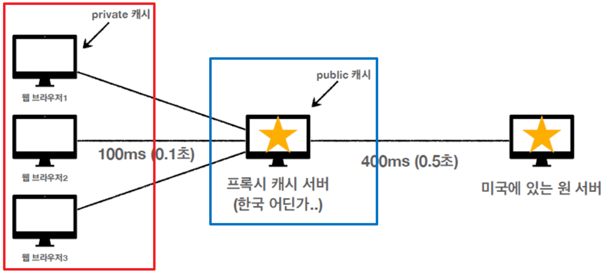

참조  
https://zero-base.co.kr/event/media_FE_school_qna
https://guiyomi.tistory.com/130  
[https://inpa.tistory.com/entry/HTTP-🌐-웹-브라우저의-캐시-전략-Cache-Headers-다루기#웹브라우저의*캐시cache*원리](https://inpa.tistory.com/entry/HTTP-%F0%9F%8C%90-%EC%9B%B9-%EB%B8%8C%EB%9D%BC%EC%9A%B0%EC%A0%80%EC%9D%98-%EC%BA%90%EC%8B%9C-%EC%A0%84%EB%9E%B5-Cache-Headers-%EB%8B%A4%EB%A3%A8%EA%B8%B0#%EC%9B%B9%EB%B8%8C%EB%9D%BC%EC%9A%B0%EC%A0%80%EC%9D%98_%EC%BA%90%EC%8B%9Ccache_%EC%9B%90%EB%A6%AC)  
https://so-so.dev/web/service-worker/
