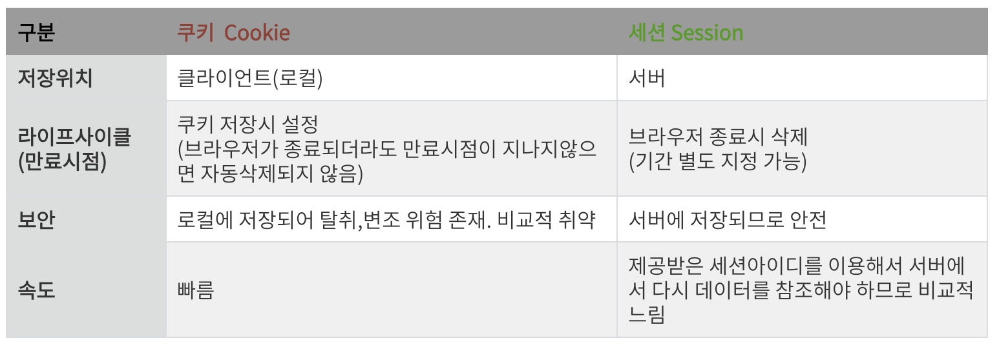

# Cookie 와 Session

## 1. HTTP 특징과 쿠키와 세션을 사용하는 이유

---

- 기본적으로 HTTP 프로토콜 환경은 "connectionless, stateless"한 특성을 가지기 때문에 서버는 클라이언트가 누구인지 매번 확인해야한다. ⇒ 이런 HTTP 프로토콜의 특성이자 약점을 보완하기 위해서 쿠키 또는 세션을 사용한다.
- 보통 웹 환경에서는 클라이언트와 서버가 HTTP프로토콜을 이용해 통신한다.

### HTTP 특징

- Connectionless
  - 클라이언트가 요청을 한 후 응답을 받으면 그 연결을 끊어 버리는 특징
  - HTTP는 먼저 클라이언트가 request를 서버에 보내면, 서버는 클라이언트에게 요청에 맞는 response를 보내고 접속을 끊는 특성이 있다.
  - 헤더에 keep-alive라는 값을 줘서 커넥션을 재활용하는데 HTTP1.1에서는 이것이 디폴트다.
  - HTTP가 tcp위에서 구현되었기 때문에 (tcp는 연결지향,udp는 비연결지향) 네트워크 관점에서 keep-alive는 옵션으로 connectionless의 연결비용을 줄이는 것을 장점으로 비연결지향이라 한다.
- Stateless
  - 통신이 끝나면 상태를 유지하지 않는 특징
  - 연결을 끊는 순간 클라이언트와 서버의 통신이 끝나며 상태 정보는 유지하지 않는 특성이며, 즉, 연결이 끊어지는 순간 모든 상태 정보가 사라지게 된다.

### 쿠키와 세션을 사용하는 이유

쿠키와 세션은 위의 두 가지 특징을 해결하기 위해 사용한다.

예를 들어, 쿠키와 세션을 사용하지 않으면 쇼핑몰에서 옷을 구매하려고 로그인을 했음에도, 페이지를 이동할 때 마다 계속 로그인을 해야 한다.

쿠키와 세션을 사용했을 경우, 한 번 로그인을 하면 어떠한 방식에 의해서 그 사용자에 대한 인증을 유지하게 된다.

### 쿠키를 발급받고 사용하는 과정

## 2. 쿠키(Cookie)

---

### 쿠키란?

- 쿠키는 클라이언트(브라우저) 로컬에 저장되는 키와 값이 들어있는 데이터 파일이다. 이러한 쿠키는 클라이언트에 저장되서 필요시 정보를 참조하거나 재사용할 수 있다.

### 쿠키 특징

1. 이름, 값, 만료일(저장기간), 경로 정보로 구성되어 있다.
2. 클라이언트에 총 300개의 쿠키를 저장할 수 있다.
3. 하나의 도메인 당 20개의 쿠키를 가질 수 있다.
4. 하나의 쿠키는 4KB(=4096byte)까지 저장 가능하다.

### 쿠키의 동작 순서

1. 클라이언트가 페이지를 요청한다.(사용자가 웹사이트에 접근)
2. 웹 서버는 쿠키를 생선한다.
3. 생성한 쿠키에 정보를 담아 HTTP화면에 돌려줄 때, 클라이언트에게 돌려준다.
4. 넘겨받은 쿠키는 클라이언트가 가지고 있다가(로컬 PC에 저장) 다시 서버에 요청할때 요청과 함께 쿠키를 전송한다.
5. 동일 사이트 재방문 시 클라이언트의 PC에 해당 쿠키가 있는 경우, 요청 페이지와 함께 쿠키를 전송한다.

### 쿠키의 사용 예

- 방문 사이트에서 로그인 시, “아이디와 비밀번호를 저장하시겠습니까?”
- 쇼핑몰의 장바구니 기능
- 팝업에서 ‘오늘 더 이상 이 창을 보지 않음’ 체크

## 3. 세션(Session)

---

### 세션이란?

- 세션은 일정 기간 동안 같은 사용자(클라이언트)로 부터 들어오는 일련의 요구를 하나의 상태로 보고 그 상태를 유지시키는 기술이다.
- 세션은 쿠키를 기반으로 하고 있지만, 사용자 정보 파일을 브라우저에서 저장하는 쿠키와 달리 세션은 서버측에서 저장하고 관리한다.

### 세션 특징

- 웹 서버에 웹 컨테이너의 상태를 유지하기 위한 정보를 저장한다.
- 웹 서버의 저장되는 쿠키(=세션 쿠키)
- 브라우저를 닫거나, 서버에서 세션을 삭제했을 때만 삭제되므로, 쿠키보다 비교적 보안이 좋다.
- 저장 데이터에 제한이 없다.(서버 용량이 허용하는 한에서)
- 각 클라이언트에 고유 Session ID를 부여한다. Session ID로 클라이언트를 구분해 각 요구에 맞는 서비스를 제공한다.

### 세션 동작 순서

1. 클라이언트가 페이지에 요청한다.
2. 서버는 접근한 클라이언트의 Request-Header 필드인 Cookie를 확인하여, 클라이언트가 해당 session-id를 보냈는지 확인한다.
3. session-id가 존재하지 않는다면 서버는 session-id를 생성해 클라이언트에게 넘겨준다.
4. 클라이언트는 서버로부터 받은 session-id를 쿠키에 저장한다.
5. 클라이언트는 서버에 요청시 이 쿠키의 session-id 값을 같이 서버에 전달한다.
6. 서버는 전달받은 session-id로 session에 있는 클라이언트 정보를 가지고 요청을 처리 후 응답한다.

### 세션의 사용 예

- 화면을 이동해도 로그인이 풀리지 않고 로그아웃하기 전까지 유지
- 세션을 체크하여 관리자/사용자 여부 판단 등등..

## 🎀 쿠키와 세션 차이

## 🎀 세션을 사용하면 좋은데 쿠키를 사용하는 이유

- 세션이 쿠키에 비해 보안이 높은 편이나 쿠키를 사용하는 이유는 세션은 서버에 저장되고, 서버의 자원을 사용하기에 서버 자원에 한계가 있고, 속도가 느려질 수 있기 때문에 자원관리 차원에서 쿠키와 세션을 적절한 요소 및 기능에 병행 사용하여 서버 자원의 낭비를 방지하며 웹사이트의 속도를 높일 수 있다.

## 4.캐시(Cache)

---

### 캐시란?

캐시란 자주 사용하는 데이터나 값을 미리 복사해 놓은 임시 장소를 말한다.

캐시는 캐시의 접근 시간에 비해 원래 데이터를 접근하는 시간이 오래 걸리는 경우나 값을 다시 계산하는 시간을 절약하고 싶은 경우에 사용한다.

캐시는 데이터를 미리 복사해 놓으면 계산이나 접근 시간이 없어 더 빠른 속도로 데이터에 접근 할 수 있다.

## 캐시의 특징

- 캐시는 이미지, 비디오, 오디오, css, js파일 등 데이터나 값을 미리 복사해 놓는 리소스 파일들의 임시 저장소이다.
- 저장 공간이 작고 비용이 비싼 대신 빠른 성능을 제공한다.
- 같은 웹 페이지에 접속할 때 사용자의 PC에서 로드하므로 서버를 거치지 않아도 된다.
- 이전에 사용된 데이터가 다시 사용될 가능성이 많으면 캐시 서버에 있는 데이터를 사용한다.
- 그래서 다시 사용될 확률이 있는 데이터들이 빠르게 접근할 수 있어진다. (페이지의 로딩 속도 ↑)
- 캐시 히트(hit) : 캐시를 사용할 수 있는 경우 (ex. 이전에 왔던 요청이랑 같은 게 왔을 때)
- 캐시 미스(miss) : 캐시를 사용할 수 없는 경우 (ex. 웹서버로 처음 요청했을 때)

### 캐시 사용 예

1. 접근 시간에 비해 원래 데이터를 접근하는 시간이 오래 걸리는 경우
2. 반복적으로 동일한 결과를 돌려주는 경우(특정 이미지 or 썸네일 등)

### 웹 캐시란?

웹 캐시는 사용자(client)가 웹 사이트(serve)에 접속할 때, 정적 컨텐츠(이미지, JS, CSS 등)를 특정 위치(Client, Network 등)에 저장하여, 웹 사이트 서버에 해당 컨텐츠를 매번 요청하여 받는 것이 아니라, 특정 위치에서 불러옴으로써 사이트 응답시간을 줄이고 서버 트래픽 감소 효과를 볼 수 있는 것을 말한다.

### 쿠키와 세션 그리고 캐시

캐시는 웹 페이지 요소를 저장하기 위한 임시 저장소이고, 쿠키/세션은 정보를 저장하기 위해서 사용된다.

캐시는 웹 페이지를 빠르게 렌더링 할 수 있도록 도와주고, 쿠키/세션은 사용자의 인증을 도와준다.
