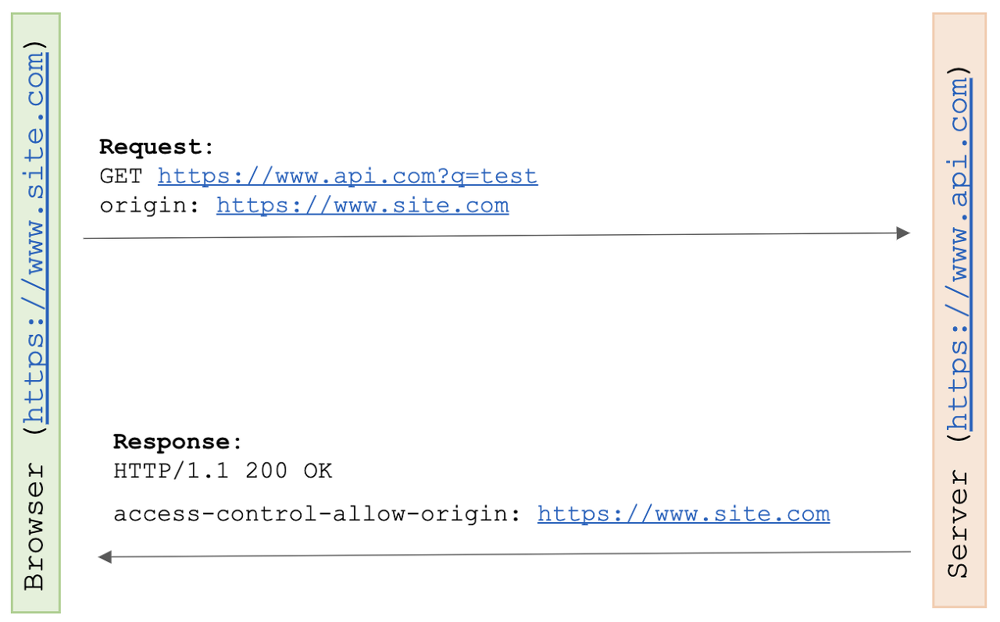
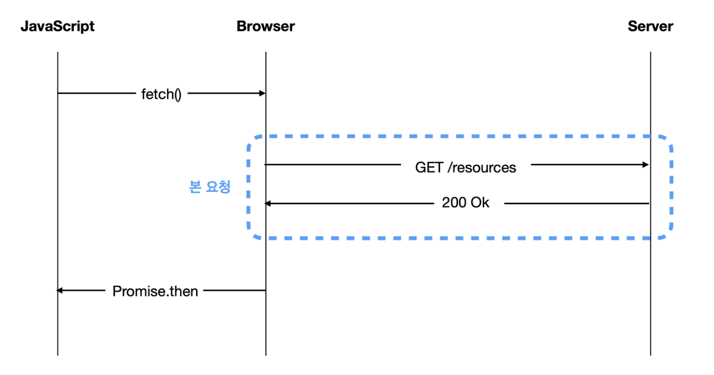
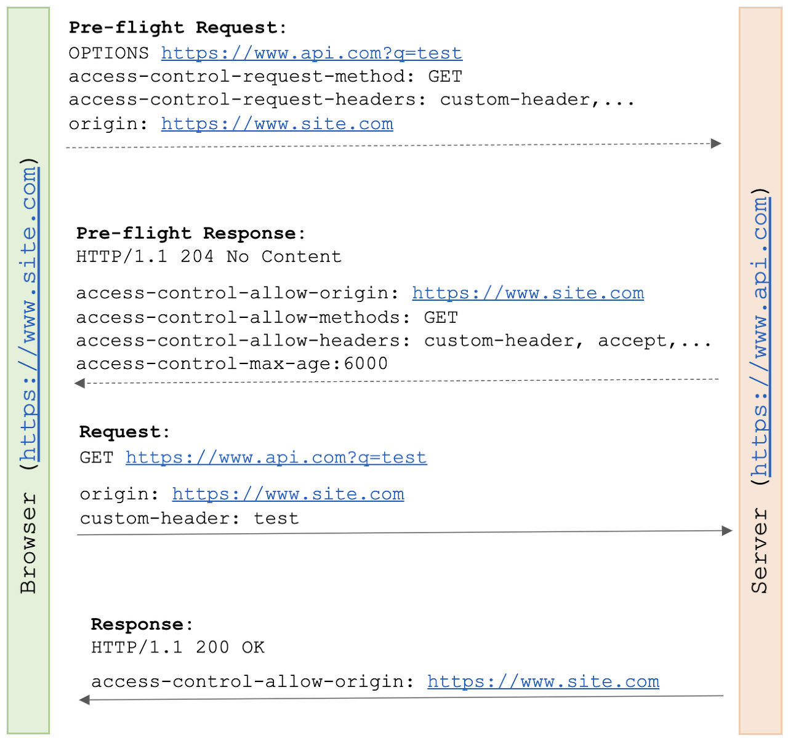
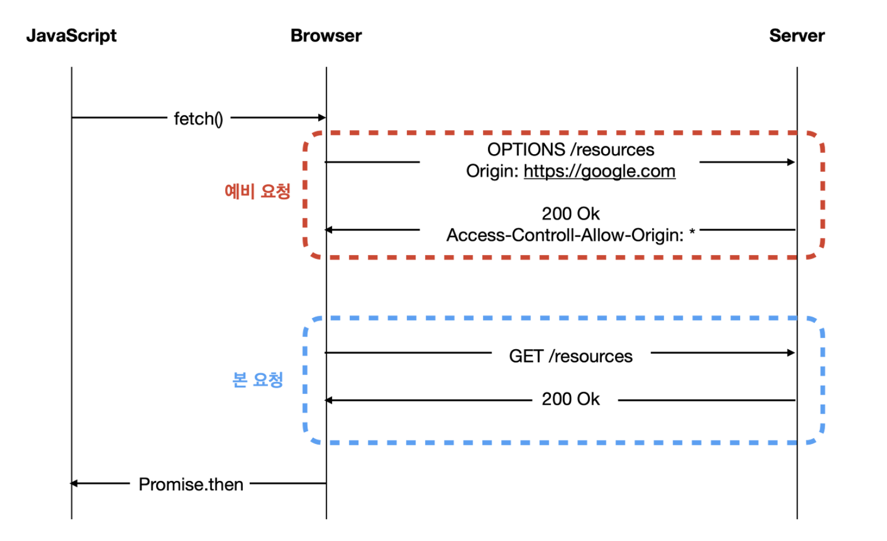

# CORS(Cross-Origin Resource Sharing)

## CORS란?

---

> 교차 출처 리소스 공유(Cross-Origin Resource Sharing, CORS)는 추가 HTTP 헤더를 사용하여, 한 출처에서 실행 중인 웹 애플리케이션이 다른 출처의 선택한 자원에 접근할 수 있는 권한을 부여하도록 브라우저에 알려주는 체제이다. - MDN

- CORS는 Cross-Origin Resource Sharing의 약자로 동일한 출처가 아닌 다른 출처에서 데이터를 주고 받는 것을 허용하는 정책이다.
- 브라우저에서는 보안적인 이유로 `cross-origin` HTTP 요청들을 제한합니다. 그래서 `cross-origin` 요청을 하려면 서버의 동의가 필요합니다. 만약 서버가 동의한다면 브라우저에서는 요청을 허락하고, 동의하지 않는다면 브라우저에서 거절한다.
  이러한 허락을 구하고 거절하는 메커니즘을 HTTP-header를 이용해서 가능한데, 이를 CORS라고 부른다.

## Same Origin Policy(동일 출처 정책)

---

동일 출처 정책은 웹 브라우저에서 보안을 강화하기 위하여 동일한 출처에서만 리소스를 주고 받도록 하는 정책이다.

어디까지를 같은 출처라고 할까?

<p align="center">

</p>

위의 구성요소 중에서 **Protocol** + **Host** + **Port** 3가지가 같으면 동일 출처(Origin)라고 한다.

즉 출처란 URL주소이고, 동일한 출처는 URL 중에서도 프로토콜, 도메인 주소, 포트 번호가 같은 것을 의미한다.

### \*동일 출처 예시

|                                                                            |                                                                        |
| -------------------------------------------------------------------------- | ---------------------------------------------------------------------- |
| http://Example.com:80 <br> http://example.com                              | HTTP 기본 Port인 80번이 생략되어있으므로 동일 출처입니다               |
| http://example.com/app1/index.html <br> http://example.com/app2/index.html | Protocol, Host, Port(생략)이 같으며, Path부터 다르므로 동일 출처입니다 |

### \*다른 출처 예시

|                                                                              |                              |
| ---------------------------------------------------------------------------- | ---------------------------- |
| http://example.com/app1 <br> https://example.com/app2                        | Protocol이 다릅니다          |
| http://example.com <br> http://www.example.com <br> http://myapp.example.com | Host가 다릅니다              |
| http://example.com:80 <br> http://example.com:8080                           | 80, 8080으로 포트가 다릅니다 |

## CORS는 왜 필요한가?

출처가 다른 두 개의 어플리케이션이 마음대로 소통하는 환경은 위험한 환경이다. 웹에서 돌아가는 클라이언트 어플리케이션은 사용자 공격에 매우 취약하다. 개발자 도구만 열더라도 DOM, JavaScript코드 등 각종 통신 정보를 쉽게 열람할 수 있다. 이를 통해서 사용자가 악의를 가지고 다른 사이트로 본 사이트를 모방할 수 있다. 이렇게 다른 출처의 어플리케이션이 통신하는 것에 제약이 없다면, 기존 사이트와 동일하게 동작하여 사용자의 정보가 탈취되기 쉬워진다.

## CORS가 동작하는 원리

---

웹 어플리케이션이 다른 출처의 리소스에 접근할 때는 HTTP header에 요청을 보낸다. HTTP 프로토콜을 사용하여 요청을 보내며, 요청 헤더에 `origin` 필드에 요청을 보내는 출처를 담아서 보낸다.

에를 들어, `https://foo.example` 의 웹 컨텐츠가 `https://bar.other` 도메인의 컨텐츠를 호출하길 원한다면, 다음과 같은 브라우저가 서버로 전송하는 내용에 `origin` 필드에 요청 주소가 담긴다.

```jsx
Origin: https://foo.example
```

이후 서버가 이 요청에 대한 응답을 할 때 응답헤더의 `Access-Control-Allow-Origin` 이라는 값에 “리소스 접근이 허용된 출처”를 내려주고, 응답을 받은 브라우저는 자신이 보낸 `Origin` 과 서버가 보내준 응답인 `Access-Control-Allow-Origin` 을 비교하고 유효한 응답인지 확인한다.. 만약 유효하지 않으면 그 응답을 사용하지 않는다.

## CORS가 동작하는 3가지 방식(시나리오)

---

### 1. Simple Request(단순 요청)

- 단순 요청은 예비 요청을 보내지 않고 서버에 본 요청을 보낸 후, 서버가 응답 헤더에 `Access-Control-Allow-Origin` 과 같은 값을 그 때 브라우저가 CORS 정책 위반 여부를 검사하는 방식이다.
- 요청코드 & 과정

```jsx
const xhr = new XMLHttpRequest()
const url = 'https://www.api.com?q=test'
xhr.open('GET', url)
xhr.onreadystatechange = requestHandler
xhr.send()
```

<p align="center">

</p>

- 브라우저는 다른 출처에 자신의 주소 https://www.site.com를 origin에 담아서 요청을 보낸다. 서버는 요청을 확인하고 다른 출처 주소 https://www.site.com에 에 접근이 가능하다는 access-control-allow-origin에 해당 주소를 담아서 결과를 리턴한다.
  특히, access-control-allow-origin은 CORS 헤더의 중요 요소 중 하나로 어떤 요청을 허용할지 결정한다. 이 헤더 값은 하나의 출처가 될 수도 있고 "\*"를 사용해 어떤 출처도 허용하도록 할 수 있다.

<p align="center">

</p>

- 예비 요청을 생략할 수 있는 Simple Request는 특정 조건을 만족해야 한다.
  - `Access-Control-Request-Method`를 통해 요청할 때 메서드는 HTTP 메서드가 아닌 `GET`, `HEAD`, `POST` 중 하나여야 한다.
  - `Access-Control-Request-Headers` 통해 요청을 보낼 때 `Accept`  `Accept-Language`,`Content-Language`, `Content-TypeDPR`, `Downlink`, `Save-Data`, `Viewport-Width` 중 하나여야 한다.
  - `Content-Type`을 사용할 경우 a`pplication/x-www-form-urlencoded`, `multipart/form-data`, `text/plain` 중 하나여야 한다.

### 2. Preflight Request(예비 요청)

- 일반적으로 웹 어플리케이션을 개발할 떄 가장 많이 마주치는 시나리오로 이 상황에서 브라우저는 요청을 한 번에 보내지 않고 예비 요청과 본 요청으로 나누어서 서버로 전송한다.
  본 요청을 보내기 전에 보내는 예비 요청을 preflight이라고 하며, 예비 요청에는 `OPTIONS` 메소드가 사용된다.
- 프리플라이트는 `OPTIONS` 메서드로 HTTP 요청을 미리 보내 실제 요청이 전송하기에 안전한지 확인한다. 다른 출처 요청이 유저 데이터에 영향을 줄 수 있기 때문에 미리 전송한다는 의미이다.
- 요청 헤더에는 다음 값이 포함된다.  
  **origin** : 어디서 요청을 했는지 서버에 알려주는 주소  
  **access-control-request-method** : 실제 요청이 보낼 HTTP 메서드**access-control-request-headers** : 실제 요청에 포함된 header
- 응답헤더에는 다음값이 포함된다  
  **access-control-allow-origin** : 서버가 허용하는 출처  
  **access-control-allow-methods** : 서버가 허용하는 HTTP 메서드 리스트**access-control-allow-headers** : 서버가 허용하는 header 리스트**access-control-max-age** : 프리 플라이트 요청의 응답을 캐시에 저장하는 시간
- 요청 코드 & 과정

```jsx
  const xhr = new XMLHttpRequest();
  const url = 'https://www.api.com?q=test';
  xhr.open(‘GET', url);
  xhr.setRequestHeader(‘custom-header', ’test')
  xhr.onreadystatechange = requestHandler;
  xhr.send();
```

<p align="center">

</p>

- 프리플라이트 요청은 OPTIONS 요청과 함께 origin, access-control-request-method, access-control-request-headers를 같이 보낸다.
  정상적인 응답으로 access-control-allow-origin, access-control-allow-method, access-control-allow-headers, access-control-max-age를 응답받는다.
  정상 요청과 응답이 가능하다는 프리플라이트 덕분에 실제 요청을 한다.

<p align="center">

</p>

### 3. Credential Request(신용 요청)

- 인증된 요청을 사용하는 방법으로 CORS 기본적인 방식 보다는 다른 출처 간 통신에서 조금 더 보안을 강화하고 싶을 때 사용하는 방법이다.
  `XMLHttpRequest` 객체나 `fetch` API는 별도의 옵션 없이 브라우저의 쿠키 정보나 인증과 관련된 헤더를 요청에 담지 않는다. 이때 요청에 인증 관련 정보를 담을 수 있게 해주는 옵션이 바로 `credentials` 옵션이다.

- 요청 코드 & 과정

```jsx
const invocation = new XMLHttpRequest()
const url = 'https://bar.other/resources/credentialed-content/'

function callOtherDomain() {
  if (invocation) {
    invocation.open('GET', url, true)
    invocation.withCredentials = true
    invocation.onreadystatechange = handler
    invocation.send()
  }
}
```

<p align="center">

</p>

## CORS 해결하기

---

### 1. 서버에서 Access-Control-Allow-Origin 헤더 세팅하기

가장 정석적인 해결책은 직접 서버에서 HTTP 헤더 설정을 통해 출처를 허용하게 설정하는 것이다.

```jsx
Access-Control-Allow-Origin : https://naver.com
```

### 2. 프록시 사이트 이용하기

프록시(Proxy)란 클라이언트와 서버 사이의 중계 대리점이라고 보면 된다.

즉, 프론트에서 직접 서버에 리소스를 요청을 했더니 서버에서 따로 설정을 안해줘서 CORS 에러가 뜬다면, **모든 출처를 허용한 서버 대리점**을 통해 요청을 하면 되는 것이다.

다만 현재 무료 프록시 서버 대여 서비스들은 모두 악용 사례 때문에 api 요청 횟수 제한을 두어 실전에서는 사용하기 무리이다. 따라서 테스트용이나 맛보기용으로 사용하되, 실전에서는 직접 프록시 서버를 구축하여 사용하여야 한다.

**참고**

https://hannut91.github.io/blogs/infra/cors  
https://escapefromcoding.tistory.com/724  
[https://fomaios.tistory.com/entry/Network-CORS란-feat-보안HTTP](https://fomaios.tistory.com/entry/Network-CORS%EB%9E%80-feat-%EB%B3%B4%EC%95%88HTTP)  
https://hymndev.tistory.com/78  
[https://inpa.tistory.com/entry/WEB-📚-CORS-💯-정리-해결-방법-👏](https://inpa.tistory.com/entry/WEB-%F0%9F%93%9A-CORS-%F0%9F%92%AF-%EC%A0%95%EB%A6%AC-%ED%95%B4%EA%B2%B0-%EB%B0%A9%EB%B2%95-%F0%9F%91%8F)  
https://developer.mozilla.org/en-US/docs/Web/HTTP/CORS
