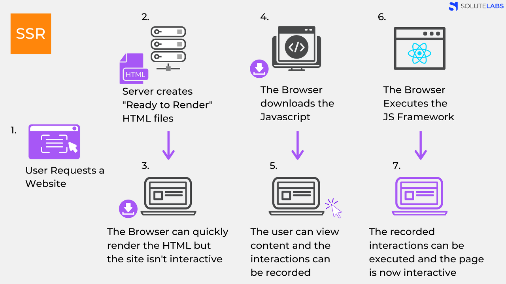

# CSR(Client Side Rendering) vs SSR(Server Side Rendering)

## SPA 와 MPA

---

### SPA(Single Page Application)

---

- SPA(Single Page Application)는 한 개(Single)의 Page로 구성된 Application이다.
- SPA는 웹 에플리케이션에 필요한 모든 정적 리소스를 최초 한 번에 다운로드한다. 그 이후 새로운 페이지 요청이 있을 때, 페이지 갱신에 필요한 데이터만 전달 받아서 페이지를 갱신한다.
- 첫 요청시 딱 한 페이지만 불러오고 페이지 이동 시 기존 페이지의 내부를 수정해서 보여주는 방식이다.이를 클라이언트 관점에서 말하자면 최초 페이지를 로딩한 시점부터는 페이지 리로딩 없이 필요한 부분만 서버로 부터 받아서 화면을 갱신하는 것이다.필요한 부분만 갱신하기 때문에 네이티브 앱에 가까운 자연스러운 페이지 이동과 사용자 경험(UX)을 제공할 수 있다.
- 우리 알고 있는 Vue, Angular, React 프레임워크로 만든 홈페이지들이 대부분 여기에 속합니다.

### MPA(Multiple Page Application)

---

- MPA(Multiple Page Application)는 여러 개(Multiple)의 Page로 구성된 Application이다.
- MPA는 새로운 페이지를 요청할 때마다 정적 리소스(HTML, CSS, JavaScript)가 다운로드된다. 매번 전체 페이지가 다시 렌더링 된다.
- 페이지 이동하거나 새로고침하면 전체 페이지를 다시 렌더링한다.

## CSR(Client Side Rendering) vs SSR(Server Side Rendering)

---

### CSR(Client Side Rendering)

---

- 초기 로드 시 빈 HTML과 모든 로직이 담겨 있는 Javascript 다운로드를 한다. 그 후 빈 HTML에 Javascript를 이용하여  Dom을 동적으로 생성하여 그려 내게 된다. ⇒ 서버에서 받은 데이터를 클라이언트인 브라우저가 렌더링을 처리하는 방식.

👍 장점

- 네이티브 앱과 비슷한 빠른 인터렉션을 구현할 수 있다.
  - Javascript를 사용해서 동적으로 Dom을 그려내기 때문에 원하는 내용만 업데이트를 할 수 있다. 예를 들어 링크 이동을 클릭했을 때 헤더, 푸터와 같이 중복되는 내용은 고정으로 두고 안에 콘텐츠만 업데이트하여 로드할 수 있다.
  - 렌더링을 브라우저에게 담당시킴으로서 서버 트래픽을 감소시키고, 사용자에게 더 빠른 인터렉션을 제공해준다.
  - 새로고침이 발생하지 않아 사용자가 네이티브 앱과 비슷한 경험을 할 수 있따.
- 첫 페이지 로딩은 느리지만, 나머지 페이지 로딩은 변경된 부분과 관련된 데이터만 가져오므로 서버사이드 랜더링 보다 속도가 빠르고, 서버의 부담을 줄일 수 있다.

👎 단점

- 첫 페이지 로딩속도가 서버 사이드 렌더링에 비해 다소 느린다.
  - 서버에 첫 요청시 전체 페이지에 대한 모든 문서를 파일을 받다 보니 로딩 속도가 느리다.
  - 검색엔진최적화(SEO)에 대한 추가 보완 작업이 필요하다.
    - 검색 엔진은 자동화된 로봇인 '크롤러'로 웹 사이트들을 읽는다. 자바스크립트를 사용하여 사용자와 상호 작용 후에 페이지 내용을 로드하기 때문에 웹 크롤러가 페이지를 색인화 하려고 하면 내용의 빈 페이지 처럼 보이게 된다.

### SSR(Server Side Rendering)

---

- 클라어언트(브라우저)가 서버에 매번 데이터를 요청하여 서버에서 처리하는 방식이다. 클라이언트에서 요청이 들어올 때마다 매번 서버에서 새로운 화면(view)을 만들어 제공한다. 즉 서버가 화면(view)를 그리는 주체가 된다.
- 클라이언트에서 요청할 때마다 각 상황에 맞는 HTML 파일을 넘겨주기 때문에 페이지가 여러 가지일 수밖에 없다. 그러므로 MPA 구동 방식과 밀접한 관계가 있다.

👍 장점

- 첫 페이지 로딩 속도가 클라이언트 사이드 렌더링에 비해 더 빠르다.
  - 해당 첫 페이지에 해당하는 문서만 브라우저에게 전달하여 브라우저가 렌더링하기 때문에 초기 로딩 속도가 빠르다.

👎 단점

- 초기 로딩 이후 페이지 이동시 속도가 느리다.
- 매번 페이지를 요청할 때마다 새로 고침 되기 때문에 사용자 경험이 다소 떨어진다.
- 서버측 부하가 증가한다. 페이지를 요청할 때마다 서버에서 페이지를 구성하는 모든 리소스를 준비해서 응답하므로 서버 부담이 증가된다.

### CSR(Client Side Rendering) 동작과정

---

1. User가 Website 요청을 보냄.
2. CDN이 HTML 파일과 JS로 접근할 수 있는 링크를 클라이언트로 보낸다.
   CDN : aws의 cloudflare를 생각하면 됨. 엔드 유저의 요청에 '물리적'으로 가까운 서버에서 요청에 응답하는 방식
3. 클라이언트는 HTML과 JS를 다운로드 받는다.(**이때 SSR과 달리 유저는 아무것도 볼 수 없다**.)
4. 브라우저가 자바스크립트 다운로드 받는다.
5. 다운이 완료된 JS가 실행된다. 데이터를 위한 API가 호출된다.(이때 유저들은 placeholder를 보게된다. )
6. 서버가 API로부터의 요청에 응답한다.
7. API로부터 받아온 data를 placeholder 자리에 넣어준다. 이제 페이지는 상호작용이 가능해진다.

즉, 서버에서 처리 없이 클라이언트로 보내주기 때문에 자바스립트가 모두 다운로드 되고 실행이 끝나기 전까지 사용자는 볼수 있는게 없다.

### SSR(Server Side Rendering) 동작과정

---

1. User가 Website 요청을 보냄.
2. Server는 'Ready to Render'. 즉, 즉시 렌더링 가능한 html파일을 만든다.
   (리소스 체크, 컴파일 후 완성된 HTML 컨텐츠로 만든다.)
3. 클라이언트에 전달되는 순간, 이미 렌더링 준비가 되어있기 때문에 HTML은 즉시 렌더링 된다.
   그러나 사이트 자체는 조작 불가능하다. (Javascript가 읽히기 전이다.)
4. 클라이언트가 자바스크립트를 다운받는다.
5. 다운 받아지고 있는 사이에 유저는 컨텐츠는 볼 수 있지만 사이트를 조작 할 수는 없다. 이때의 사용자 조작을 기억하고 있는다.
6. 브라우저가 Javascript 프레임워크를 실행한다.
7. JS까지 성공적으로 컴파일 되었기 때문에 기억하고 있던 사용자 조작이 실행되고 이제 웹 페이지는 상호작용 가능해진다.

즉. 서버에서 이미 '렌더 가능한' 상태로 클라이언트에 전달되기 때문에, JS가 다운로드 되는 동안 사용자는 무언가를 보고 있을 수 있다.

### CSR + SSR ⇒ Next or Nuxt

---

CSR와 SSR의 단점을 해결하기 위해서 React 나 Vue 에 서버사이드렌더링 기능을 더하여 SPA와 SSR의 장점을 가질 수 있게 한다.
