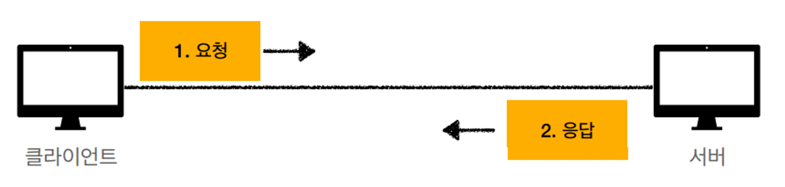
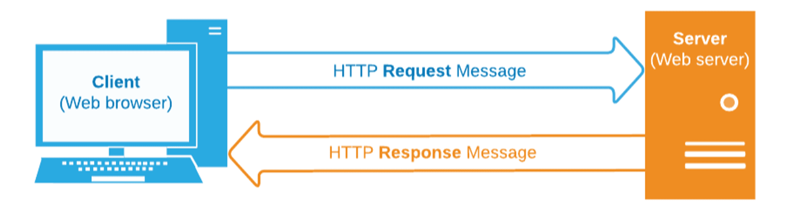
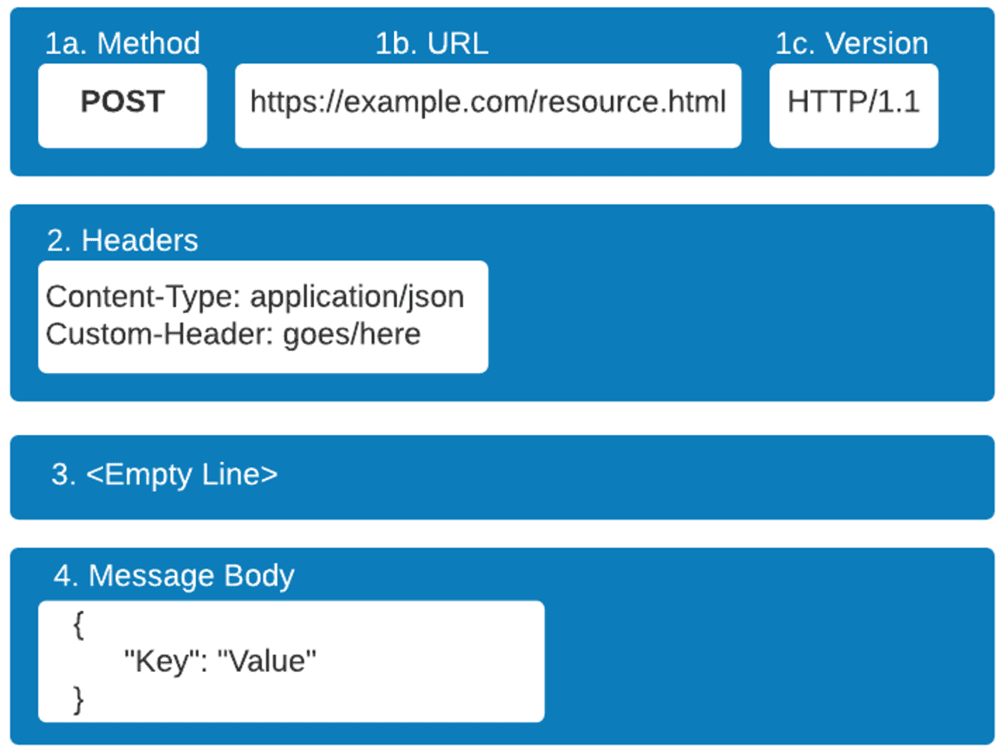
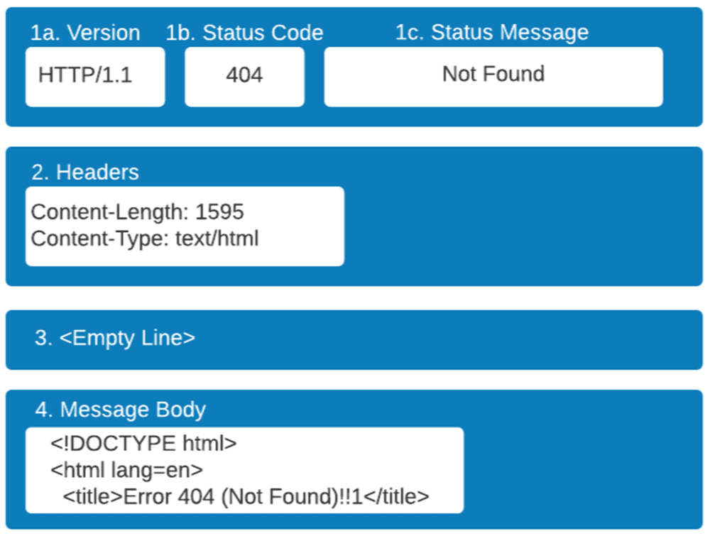
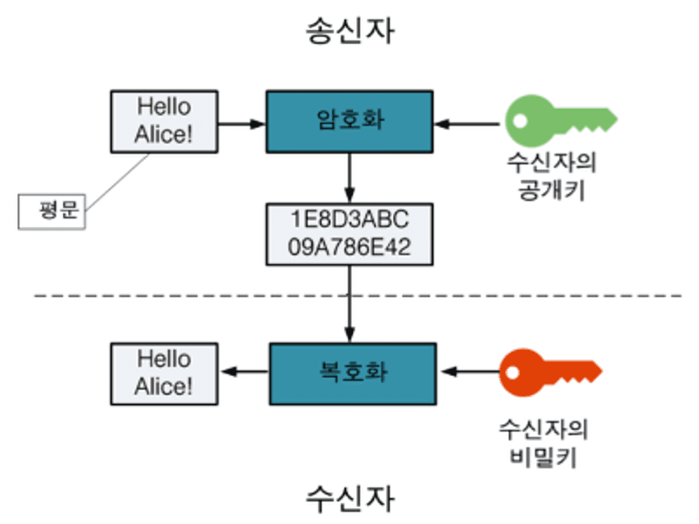
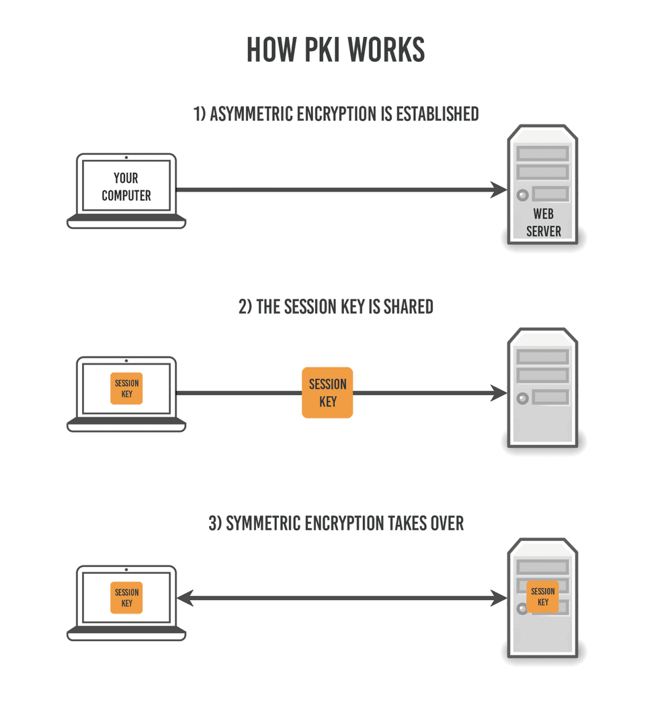

# HTTP와 HTTPS

## 1. HTTP

### 1-1. HTTP란? HyperText Transfer Protocol

HTTP는 **서버와 클라이언트가 서로 데이터를 주고받기 위해 사용되는 통신 규약**을 말일컷는다.

웹 문서간에 링크를 통해 연결할 수 있는 프로토콜이며, 문서뿐 아니라 다음과 같은 여러 종류의 데이터들을 폭 넓게 전송할 수 가 있다.

- HTML, TEXT
- IMAGE, 음성, 영상, 파일
- JSON, XML(API)
- 거의 모든 형태의 데이터가 전송 가능

서버간에 데이터를 주고 받을 때 대부분 HTTP라는 프로토콜을 사용해서 통신한다고 보면 된다.

### 1-2. HTTP의 통신 구조

HTTP 통신은 클라이언트(Front-End)와 서버(Back-End)로 나뉘어진 구조로 되어있다.

클라이언트가 요청(Request)하면 서버가 응답(Response) 하는 것이다.

예를 들어 클라이언트가 HTTP 메세지를 만들어 보내고 , 서버에서 요청에 대한 응답이 올 때까지 기다린다. 그리고 서버는 요청에 대한 결과를 만들어서 응답한다.

그럼 HTTP 통신하는데 있어, 어째서 이렇게 클라이언트와 서버를 분리해야만 할까?

이유는 각자의 역할에 집중할 수 있기 때문이다.
클라이언트에서는 복잡한 비즈니스로직이나 데이터를 다룰 필요없고, UI를 그리는데 집중할 수 있다.서버에서는 복잡한 비즈니스 로직이나, 데이터를 다루는데만 집중하면 된다. 만약 트래픽이 폭주해 고도화가 필요한 경우 클라이언트는 신경쓰지 않고 서버만 개선하면 된다.즉, 클라이언트와 서버를 독립적으로 구분한다는 것은 각자의 책임을 나눠 해당 책임에만 집중하여, 클라이언트와 서버 양쪽이 각각 독립적으로 고도화 할수 있다는 것이다.

### 1-3. HTTP 메세지 구조

HTTP 메시지는 기본적으로 위에서부터 차례대로 시작 라인(Start Line), 헤더(Header), 공백 라인(Empty Line), 바디(Message Body)로 구성되어 있다.

참고로 공백 라인은 HTTP 메세지 값 구분을 하기 위한 라인이므로, 단순히 보기 편하게 넣는 것을 넘어서 반드시 있어야 한다. 만약 보낼 메세지 바디가 없다면 공백만 넣고 끝내면 된다.

그리고 HTTP 요청 종류에 따라 Message Body가 포함될 수도 있고 아닐 수도 있다.전체적인 골자는 위와 같고 HTTP 요청(Request)냐 응답(Response)냐에 따라 안의 내용물이 약간 다르게 된다.

📌 **HTTP 요청 메세지**

- 시작 라인(Start Line)
  - Method : GET / POST / PUT / DELTE 등 (HTTP 메서드)
  - URL : 요청 대상 경로 표시
  - Version : 사용된 http 버전
- 헤더(Header)
  - Headers : HTTP 전송에 필요한 모든 부가 정보를 담고 있다. (메세지 크기, 압축 여부, 인증, 브라우저 정보, 서버 정보, 캐시 ..등)
    - User-Agent : 웹브라우저의 다른 표현
- 공백 라인(Empty Line) : 헤더와 바디를 구분하기 위한 라인
- 바디(Message Body)
  - Message Body : 실제 전송할 데이터 (HTML 문서, 이미지, 영상, JSON 등)

📌 **HTTP 응답 메세지**

- 시작 라인(Start Line)
  - Version : 사용된 http 버전
  - Status Code : 클라이언트가 보낸 요청이 성공인지 실패인지 숫자 코드로 나타낸다. (200, 404, 505)
  - Status Message : Status Code 에 대한 결과를 사람이 이해할 수 있는 글로 표현
- 헤더(Header)
  - Headers : HTTP 전송에 필요한 모든 부가 정보를 담고 있다. (메세지 크기, 압축 여부, 인증, 브라우저 정보, 서버 정보, 캐시 ..등)
    - Content-Type : text/html 이라면 브라우저가 이것을 보고 HTML로 해석해서 화면에 보여준다.
- 공백 라인(Empty Line) : 헤더와 바디를 구분하기 위한 라인
- 바디(Message Body)
  - Message Body : 전송 받은 데이터

### 1-4. HTTP 메서드

HTTP 메서드란, 클라이언트와 서버 사이에 이루어지는 요청(Request)과 응답(Response) 데이터를 전송하는 방식을 일컫는다.

쉽게 말하면 서버에 주어진 리소스에 수행하길 원하는 행동, 서버가 수행해야 할 동작을 지정하는 요청을 보내는 방법이다.

📌 **HTTP 메서드 종류**

HTTP 메소드의 종류는 총 9가지가 있다. 이 중 주로 쓰이는 메소드는 5가지가 있다.

주요 메소드 5가지

- GET : 리소스 조회
- POST : 요청 데이터 처리, 주로 데이터 등록에 사용
- PUT : 리소스를 대체, 해당 리소스가 없으면 생성
- PATCH : 리소스를 일부만 변경
- DELETE : 리소스 삭제

기타 메소드 4가지

- HEAD: GET과 동일하지만 메시지 부분을 제외하고, 상태 줄과 헤더만 반환
- OPTIONS: 대상 리소스에 대한 통신 가능 옵션을 설명(주로 CORS에서 사용)
- CONNECT: 대상 자원으로 식별되는 서버에 대한 터널을 설정
- TRACE: 대상 리소스에 대한 경로를 따라 메시지 루프백 테스트를 수행

### 1-5. HTTP 상태 코드

- 1xx(정보) : 요청을 받았으며 프로세스를 계속 진행
- 2xx(성공): 요청을 성공적으로 받았으며 인식했고 수용
- 3xx(리다이렉션) : 요청 완료를 위해 추가 작업 조치가 필요
- 4xx(클라이언트 오류) : 요청의 문법이 잘못되었거나 요청을 처리할 수 없음
- 5xx(서버 오류) : 서버가 명백히 유효한 요청에 대한 충족을 실패

## 2. HTTPS

### 2-1. HTTPS란? HyperText Transfer Protocol Secure

HTTPS는 **HTTP에 데이터 암호화가 추가된 프로토콜**이다. HTTP의 확장 버전 또는 더 안전한 버전으로, HTTPS에서는 브라우저와 서버가 데이터를 전송하기 전에 안전하고 암호화된 연결을 설정합니다.

### 2-2. 대칭키 암호화와 비대칭키 암호화

HTTPS는 대칭키 암호화 방식과 비대칭키 암호화 방식을 모두 사용하고 있다. 각각의 암호화 방식은 다음과 같다.

📌 **대칭키 암호화**

- 클라이언트와 서버가 동일한 키를 사용해 암호화/복호화를 진행함
- 키가 노출되면 매우 위험하지만 연산 속도가 빠름

**📌 비대칭키 암호화**

- 1개의 쌍으로 구성된 공개키와 개인키를 암호화/복호화 하는데 사용함
- 키가 노출되어도 비교적 안전하지만 연산 속도가 느림

비대칭키 암호화는 공개키/개인키 암호화 방식을 이용해 데이터를 암호화하고 있다. 공개키와 개인키는 서로를 위한 1쌍의 키이다.

- 공개키: 모두에게 공개가능한 키
- 개인키: 나만 가지고 알고 있어야 하는 키

암호화를 공개키로 하느냐 개인키로 하느냐에 따라 얻는 효과가 다른데, 공개키와 개인키로 암호화하면 각각 다음과 같은 효과를 얻을 수 있다.

- 공개키 암호화: 공개키로 암호화를 하면 개인키로만 복호화할 수 있다. -> 개인키는 나만 가지고 있으므로, 나만 볼 수 있다.
- 개인키 암호화: 개인키로 암호화하면 공개키로만 복호화할 수 있다. -> 공개키는 모두에게 공개되어 있으므로, 내가 인증한 정보임을 알려 신뢰성을 보장할 수 있다.

### 2-3. HTTPS의 동작 과정

HTTPS는 대칭키 암호화와 비대칭키 암호화를 모두 사용하여 빠른 연산 속도와 안정성을 모두 얻고 있다.

HTTPS 연결 과정(Hand-Shaking)에서는 먼저 서버와 클라이언트 간에 세션키를 교환한다. 여기서 세션키는 주고 받는 데이터를 암호화하기 위해 사용되는 대칭키이며, 데이터 간의 교환에는 빠른 연산 속도가 필요하므로 세션키는 대칭키로 만들어진다.

문제는 이 세션키를 클라이언트와 서버가 어떻게 교환할 것이냐 인데, 이 과정에서 비대칭키가 사용된다.

즉, 처음 연결을 성립하여 안전하게 세션키를 공유하는 과정에서 비대칭키가 사용되는 것이고, 이후에 데이터를 교환하는 과정에서 빠른 연산 속도를 위해 대칭키가 사용되는 것이다.

실제 HTTPS 연결 과정이 성립되는 흐름을 살펴보면 다음과 같다.

1. 클라이언트(브라우저)가 서버로 최초 연결 시도를 함
2. 서버는 공개키(엄밀히는 인증서)를 브라우저에게 넘겨줌
3. 브라우저는 인증서의 유효성을 검사하고 세션키를 발급함
4. 브라우저는 세션키를 보관하며 추가로 서버의 공개키로 세션키를 암호화하여 서버로 전송함
5. 서버는 개인키로 암호화된 세션키를 복호화하여 세션키를 얻음
6. 클라이언트와 서버는 동일한 세션키를 공유하므로 데이터를 전달할 때 세션키로 암호화/복호화를 진행함

## 3. HTTP보다 HTTPS를 선택하는 이유는 무엇인가요?

다음으로, HTTP와 비교했을 때 HTTPS의 몇 가지 장점에 대해 알아보겠습니다.

### 보안

HTTP 메시지는 일반 텍스트이므로, 권한이 없는 당사자가 인터넷을 통해 쉽게 액세스하고 읽을 수 있습니다. 반면, HTTPS는 모든 데이터를 암호화된 형태로 전송합니다. 사용자가 민감한 데이터를 제출할 때 제3자가 네트워크를 통해 해당 데이터를 가로챌 수 없음을 확신할 수 있습니다. 신용카드 세부 정보 또는 고객 개인 정보와 같은 잠재적으로 민감한 정보를 보호하려면 HTTPS를 선택하는 것이 좋습니다.

### 권위

검색 엔진은 HTTP의 신뢰성이 더 낮기 때문에 보통 HTTP 웹 사이트 콘텐츠의 순위를 HTTPS 웹 페이지보다 낮게 지정합니다. 고객도 HTTP보다 HTTPS 웹 사이트를 더 선호합니다. 브라우저는 브라우저 주소 표시줄에서 웹 사이트 URL 옆에 있는 자물쇠 아이콘을 배치하여 사용자에게 HTTPS 연결을 표시합니다. 사용자는 이러한 추가 보안 및 신뢰 요소 때문에 HTTPS 웹 사이트 및 애플리케이션을 선호합니다.

### 성능 및 분석

HTTPS 웹 애플리케이션은 HTTP 애플리케이션보다 로드 속도가 더 빠릅니다. 마찬가지로, HTTPS는 참조 링크도 더 잘 추적합니다. 추천 트래픽은 광고 또는 소셜 미디어 백링크와 같은 서드 파티 소스에서 생성되는 웹 사이트 트래픽입니다. 분석 소프트웨어가 신뢰할 수 있는 트래픽 소스를 정확하게 식별하도록 하려면 HTTPS를 활성화해야 합니다.

## 4. 차이점 요약: HTTP와 HTTPS

|               | HTTP                                                                        | HTTPS                                                                 |
| ------------- | --------------------------------------------------------------------------- | --------------------------------------------------------------------- |
| 의미          | Hypertext Transfer Protocol                                                 | Hypertext Transfer Protocol Secure                                    |
| 기본 프로토콜 | HTTP/1과 HTTP/2는 TCP/IP를 사용합니다. HTTP/3은 QUIC 프로토콜을 사용합니다. | HTTP 요청 및 응답을 추가로 암호화하기 위해 SSL/TLS와 함께 HTTP/2 사용 |
| 포트          | 기본 포트 80                                                                | 기본 포트 443                                                         |
| 용도          | 이전 텍스트 기반 웹 사이트                                                  | 모든 최신 웹 사이트                                                   |
| 보안          | 추가 보안 기능 없음                                                         | 퍼블릭 키 암호화에 SSL 인증서 사용                                    |
| 이점          | 인터넷을 통한 통신 지원                                                     | 웹 사이트에 대한 권위, 신뢰성 및 검색 엔진 순위 개선                  |

참조  
[https://inpa.tistory.com/entry/HTTP-🌐-백엔드-로드맵-HTTP는-무엇일까요](https://inpa.tistory.com/entry/HTTP-%F0%9F%8C%90-%EB%B0%B1%EC%97%94%EB%93%9C-%EB%A1%9C%EB%93%9C%EB%A7%B5-HTTP%EB%8A%94-%EB%AC%B4%EC%97%87%EC%9D%BC%EA%B9%8C%EC%9A%94)  
https://mangkyu.tistory.com/98  
[https://aws.amazon.com/ko/compare/the-difference-between-https-and-http/#:~:text=HTTP 메시지는 일반 텍스트,을 확신할 수 있습니다](https://aws.amazon.com/ko/compare/the-difference-between-https-and-http/#:~:text=HTTP%20%EB%A9%94%EC%8B%9C%EC%A7%80%EB%8A%94%20%EC%9D%BC%EB%B0%98%20%ED%85%8D%EC%8A%A4%ED%8A%B8,%EC%9D%84%20%ED%99%95%EC%8B%A0%ED%95%A0%20%EC%88%98%20%EC%9E%88%EC%8A%B5%EB%8B%88%EB%8B%A4).
