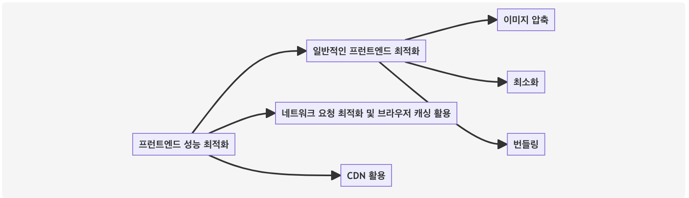
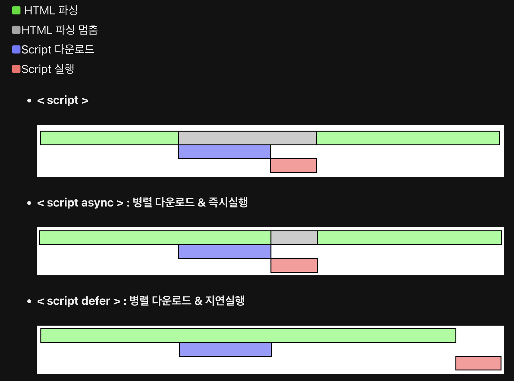

# 성능 최적화

프론트엔드 성능 최적화는 빠르고 원활하며 매력적인 사용자 경험을 제공하기 위해 중요하다. 웹사이트 방문자는 대기할 수 없는 성향이 있기 때문에 페이지 로드 시간이 몇 초만 더 지연되어도 참여율이 크게 감소할 수 있다고 한다. 성능 최적화 방법으로 일반적인 Frontend 최적화 구현, 네트워크 요청 최적화 및 브라우저 캐싱 활용, 콘텐드 전송 네트워크(CDN)를 활용한 자산 전달 개선 등이 있다.

## 브라우저 동작원리

> 브라우저 로딩 과정 : 파싱 > 스타일 > 레이아웃(리플로우) > 페인트 > 합성 + 렌더

프론트엔드의 성능 최적화를 확인하기 전에 브라우저가 어떻게 화면을 사용자에게 보여주는지를 알아야한다.

### 레이아웃과 리페인트

브라우저 로딩 과정 중 스타일 이후의 과정(스타일 → 레이아웃 → 페인트 → 합성)을 렌더링이라고 하는데, 이 렌더링 과정은 상황에 따라 반복하여 발생할 수 있다. 스타일 단계에서 구성되는 렌더 트리는 자바스크립트에 의해 DOM트리, CSSOM 트리가 변경될 때 다시 재구성된다. DOM이 추가/삭제되거나 요소에 기하학적인 영향(높이, 넓이, 위치)를 주는 CSS 속성값을 변경하는 경우, 렌더 트리가 다시 재구성된다. 즉, 레이아웃부터 이후 과정을 다시 수행하며 이것을 **레이아웃** 또는 **리플로우** 라고 한다.

<p align="center">

</p>

레이아웃은 요소에 기하학적인 영향을 주는 CSS 속성값을 변경할 때 발생한다고 하였는데, 반대로 영향을 주지 않는 CSS 속성값을 변경하면 레이아웃 과정을 건너띈다. 페인트부터 수행하며 이를 **리페인트**라고 한다.

<p align="center">

</p>

레이아웃이 일어나면 전체 픽셀을 다시 계산해야 하므로 부하가 크다. 반면 리페인트는 이미 계산된 픽셀값을 이용해 화면을 그리기 때문에 레이아웃에 비해 부하가 적다.

**요소에 기하적인 영향을 주는 CSS 속성값 변경**

- CSS 속성값 : `height`, `width`, `left`, `top`, `font-size`, `line-height` 등

**요소에 기하적인 영향을 주지 않는 CSS 속성값 변경**

- CSS 속성값 : `background-color`, `color`, `visibility`, `text-decoration` 등

# 성능최적화 방법

## 1. 일반적인 프론트엔드 최적화 구현 : 이미지 압축, 최소화, 번들링

- **이미지 압축** : 이미지는 웹 페이지에서 다운로드되는 바이트의 대부분을 차지한다. 이미지를 압축하여 파일 크기를 줄이면 다운로드와 렌더링 속도가 크게 향상됩니다.
- **최소화** : 최소화는 코드에서 불필요한 데이터(공백, 줄 바꿈 문자, 주석, 블록 구분자 등)를 제거하는 과정이다. 이는 코드의 크기를 줄이고 다운로드 시간을 단축시킨다.
- **번들링** : 번들링은 여러 작은 파일을 하나의 큰 파일로 결합하는 과정입니다. 이를 통해 브라우저가 수행해야 하는 HTTP 요청 수가 줄어들어 페이지 로드 시간이 빨라집니다.

## 2. 네트워크 요청 최적화 및 브라우저 캐싱 활용

웹페이지가 요청하는 모든 파일(HTML, CSS, JavaSCript, 이미지 등)은 개별 HTTP요청으로 처리된다. 페이지가 보다 많은 요청을 수행할수록 로딩 시간이 더 오래 걸린다. 파일 번들링(위에서 언급한 대로), 데이터 URL을 사용하여 이미지를 인라인으로 삽입하거나 작은 이미지에 대한 CSS 스프라이트를 사용하여 요청 수를 줄일 수 있다.

브라우저 캐싱은 사이트 성능을 크게 향상 시킬 수 있다. 파일에 적절한 캐싱 정책을 지정하여 브라우저에 리소스를 캐시하도록 지시하면 다음 페이지 방문 시 HTTP 요청을 크게 줄어든다.

### 웹 캐쉬(web cache)

웹 캐쉬란 client가 요청하는 html, image, js, css 등에 대해 첫 요청 시에 파일을 내려받아 특정 위치에 복사본을 저장(USING SPACE)하고, 이후 동일한 URL의 Resource요청은 다시 내려 받지 않고 내부에 저장한 파일을 사용하여 더 빠르게 서비스(SAVE TIME)하기 윈한 거이다. 서버를 통해 내려 받은 양이 적어지니 응답시간이 감소하고 네트워크 트레픽이 감소되니 server와 client 모두가 win-win할 수 있는 최고의 tradeoff 이다.

- 브라우저 캐쉬(Browser Caches)
  - 브라우저 또는 HTTP요청을 하는 Client Application에 의해 내부 디스크에 캐쉬
  - Cache된 Resource를 공유하지 않는 한 개인에 한정된 Cache
  - 브라우저의 Back버튼 또는 이미 방문한 페이지를 재 방문하는 경우 극대화

## 3. 콘텐츠 전송 네트워크(CDN)을 활용한 자산 전달 개선

콘텐츠 전송 네트워크(CDN)는 전 세계 여러 위치에 분산된 서버 네트워크이다. CDN은 이러한 서버에 사이트의 정적 리소스를 캐시하고 가장 가까운 서버에서 사용자에게 제공하여 대기 시간을 줄일 수 있다.

> **CDN이란 무엇인가요?**

콘텐츠 전송 네트워크(CDN)는 데이터 사용량이 많은 애플리케이션의 웹 페이지 로드 속도를 높이는 상호 연결된 서버 네트워크입니다. CDN은 콘텐츠 전송 네트워크 또는 콘텐츠 배포 네트워크를 의미할 수 있습니다. 사용자가 웹 사이트를 방문할 때 해당 웹 사이트 서버의 데이터는 사용자의 컴퓨터에 도달하기 위해 인터넷을 통해 이동해야 합니다. 사용자가 해당 서버에서 멀리 떨어져 있는 경우 동영상 또는 웹 사이트 이미지와 같은 대용량 파일을 로드하는 데 시간이 오래 걸립니다. 대신 웹 사이트 콘텐츠는 지리적으로 사용자와 가까운 CDN 서버에 저장되며 컴퓨터에 훨씬 빨리 도달합니다.

>

<p align="center">

</p>

# 성능최적화 방법

`성능 최적화` 내지는 `웹성능 최적화`를 구글에 검색하면 수많은 이론과 자료가 나온다. 어떤 부분에 초점을 맞추느냐에 따라서 그 방법은 분류 또한 다양해진다.

성능 최적화는 크게 `렌더링 최적화`와 `로딩 최적화` 두 가지로 나눌 수 있다.

> 성능 최적화 = 렌더링 최적화 + 로딩 최적화

렌더링, 로딩 과정을 종합적으로 최적화 하면 웹 성능을 평가하는`핵심적인 웹 지표(LCP,FID,CLS)` 수치를 개선할 수 있다.

## 📌 렌더링 최적화

렌더링 차단 리소스란 브라우저의 렌더링을 막는 소스들로 일반적으로 `css`와 `js`파일을 말한다. (모든 css와 js가 렌더링 차단 리소스인 것은 아니다.)

> 웹 페이지 렌더링 최적화의 목표는 리플로우를 최대한 적게 발생시키면서, 빠르게 화면을 그리는 것

### 1. CSS 최적화

- **리플로우, 리페인트(Reflow/Repaint)를 고려한 스타일 작성**
  리플로우가 일어나면 브라우저가 전체 픽셀을 다시 계산해야 하기때문에 되도록 **리페인트** 속성을 사용해 스타일을 작성하는 것이 성능면에서 좋다.
- **사용하지 않는 css 제거**
  Unused css는 구글 크롬 라이트하우스(`Lighthouse`)를 통해 확인할 수 있다.
- **간결한 스타일 작성**
  css가 복잡하고 방대할수록 레이아웃을 그리는 데에 시간이 많이 소요된다.

### 2. HTML 최적화

- **인라인 스타일을 사용하지 않는다.**
  인라인 스타일은 웹 페이지가 그려지면서 레이아웃에 영향을 미치면서 추가로 리플로우를 발생시킨다.
- **복잡한 DOM 트리 지양**
  DOM 트리가 깊고, 자식 요소가 많을수록 DOM 트리는 커진다. DOM 트리가 커지면 DOM 변경 시 계산해야하는 것이 많아진다.

### 3. 애니메이션 최적화

- 애니메이션을 구현할 때에는 자바스크립트 api, 라이브러리 보다 `css`를 통해 구현하는 것이 성능면에서 이득이다.
- `transform`은 리플로우와 리페인트 모두 발생시키지 않고 합성만 발생시키는 속성이다.때문에 애니메이션에서 사용 시 렌더링 속도를 향상시킬 수 있다.
- position 설정 시 `absolute`나 `fixed`로 설정하면 주변 요소에 영향을 주지 않는다.

### 4. JS(JavaScript) 최적화

자바스크립트 실행 시간이 긴 경우, 한 프레임 처리가 오래 걸려 렌더링 성능이 떨어진다. 많은 작업을 수행할 때 자바스크립트 실행 시간은 당연히 오래 걸린다. 그러나 코드가 단순하더라도 불필요한 레이아웃으로 인해 실행 시간이 오래 걸릴 수 있으므로 성능 저하의 원인을 잘 파악해야 한다. 또한 레이아웃을 줄일 수 있도록 DOM 및 스타일 변경을 최소화해야 한다.

- **강제 동기 레이아웃 최적화**  
  DOM의 속성을 변경하면 화면 업데이트를 위해 레이아웃이 일어날 수 있다. 원래 레이아웃은 비동기이나 특정 상황에서 동기적으로 레이아웃이 발생할 수 있다. 특정 속성을 읽을 때 최신 값을 계산하기 위해 레이아웃이 동기적으로 발생하며 이를 강제 동기 레이아웃이라고 한다. 강제 동기 레이아웃은 자바스크립트 실행 시간을 늘어나게 하므로 신경 써야 한다. 강제 동기 레이아웃이 일어나는 경우와 개선 방법은 다음과 같다.
- **강제 동기 레이아웃 피하기**  
  스타일을 변경한 다음 `offsetHeight`, `offsetTop`과 같은 계산된 값을 속성으로 읽을 때 강제로 동기 레이아웃을 수행해야 한다.

  ```jsx
  const tabBtn = document.getElementById('tab_btn')

  tabBtn.style.fontSize = '24px'
  console.log(testBlock.offsetTop) // offsetTop 호출 직전 브라우저 내부에서는 동기 레이아웃이 발생한다.
  tabBtn.style.margin = '10px'
  // 레이아웃
  ```

  계산된 값을 반환하기 전에 변경된 스타일이 계산 결과에 적용되어 있지 않으면 변경 이전 값을 반환하기 때문에 브라우저는 동기로 레이아웃을 해야만 한다. 최신 브라우저에도 동일하게 발생하는 부분이므로 강제 동기 레이아웃을 발생할 수 있는 코드를 최대한 사용하지 않도록 주의해야 한다.

- **레이아웃 스래싱(thrashing) 피하기**  
  한 프레임 내에서 강제 동기 레이아웃이 연속적으로 발생하면 성능이 더욱 저하된다. 다음 코드에서는 `paragraphs[i]` 요소를 순회하면서 각 요소의 너비를 `box` 요소의 너비와 일치하도록 설정한다. 반복문 안에서 `style.width`를 설정하고 `box.offsetWidth`를 읽어오면 `for`문이 반복 실행될 때마다 레이아웃이 발생한다. 이것을 레이아웃 스래싱이라고 한다. 반복문 밖에서 `box` 엘리먼트의 너비를 읽어오면 레이아웃 스래싱을 막을 수 있다.

  ```jsx
  function resizeAllParagraphs() {
    const box = document.getElementById('box')
    const paragraphs = document.querySelectorAll('.paragraph')

    for (let i = 0; i < paragraphs.length; i += 1) {
      paragraphs[i].style.width = box.offsetWidth + 'px'
    }
  }
  // 레이아웃 스래싱을 개선한 코드
  function resizeAllParagraphs() {
    const box = document.getElementById('box')
    const paragraphs = document.querySelectorAll('.paragraph')
    const width = box.offsetWidth

    for (let i = 0; i < paragraphs.length; i += 1) {
      paragraphs[i].style.width = width + 'px'
    }
  }
  ```

## 📌 로딩 최적화

### 1. 렌더 블로킹 최적화

브라우저 로딩 과정에서 파싱 중 블록 리소스가 발생할 수 있으며, CSS와 자바스크립트가 블록 리소스에 해당한다고 했다. 최적화의 첫 번째 단계는 이 블록 리소스를 최적화하는 것이다.

- **CSS 최적화**  
  렌더 트리를 구성하기 위해서는 DOM 트리와 CSSOM 트리가 필요하다. DOM 트리는 파싱 중에 태그를 발견할 때마다 순차적으로 구성할 수 있지만, CSSOM 트리는 CSS를 모두 해석해야 구성할 수 있다. 즉, CSSOM 트리가 구성되지 않으면 렌더 트리를 만들지 못하고 렌더링이 차단된다. 이러한 이유로 CSS는 렌더링 차단 리소스라고 하며, 렌더링이 차단되지 않도록 **CSS는 항상 HTML 문서 최상단(`<head>` 아래)에 배치한다.**
- **자바스크립트 최적화**  
  자바스크립트는 DOM 트리와 CSSOM 트리를 동적으로 변경할 수 있기 때문에 HTML 파싱을 차단하는 블록 리소스이다. `<script>` 태그를 만나면 스크립트가 실행되며 그 이전까지 생성된 DOM에만 접근할 수 있다. 그리고 스크립트 실행이 완료될 때까지 DOM 트리 생성이 중단된다. 외부에서 가져오는 자바스크립트의 경우에는 모든 스크립트가 다운로드되고 실행될 때까지 DOM 트리 생성이 중단된다. 이러한 이유로 자바스크립트도 렌더링 차단 리소스라고 하며, HTML 문서 최하단(`</body>` 직전)에 배치한다.
  - **async / defer**  
    `async`와 `defer` 속성은 스크립트 파일을 병렬로 다운로드하게 해준다. 즉, 로딩 시 웹페이지 해석을 멈추지 않고 스크립트를 다운로드 하는것이다.
  - `async는` 다운로드 후 즉시 실행한다.
  - `defer`는 웹페이지가 모두 그려지고 DOM이 들어왔을 때 스크립트를 실행한다.
    <p align="center">
      
    </p>

### 2. 이미지 최적화

- **picture 태그 사용하기**
  - `picture` 태그의 `type` 속성을 통해 사용자 환경에 맞는 이미지를 제공할 수 있다.
    - webp - IE 미지원, jpg/png 대비 30~70% 수준의 용량
    - avif - 크롬/삼성인터넷 지원, 저용량이면서 고품질
    ```html
    <!-- 브라우저가 avif를 지원하면 avif를 사용하고, 
        그렇지 않은 경우 webp, 
        둘 다 지원하지 않을 경우 jpg 이미지를 사용한다. -->
    <picture>
      <source srcset="aaa.avif" type="image/avif" />
      <source srcset="aaa.webp" type="image/webp" />
      
    </picture>
    ```
    - `media` 속성을 사용해서 브라우저 사이즈에 맞는 이미지를 제공할 수 있다.media의 조건 즉, `해상도`에 따라 출력할 이미지를 지정할 수 있다.
      ```html
      <picture>
        <source srcset="mob.webp" media="(max-width: 760px)" />
        <!-- 브라우저의 넓이가 760px 이하일때 mob.webp 이미지 출력-->
        
      </picture>
      ```
    - picture 나 source 요소는 화면에 출력되는 요소가 아니다.
- **img 지연로딩 활용하기**
  - `loading` 속성을 사용해서 이미지를 브라우저 화면에 지연/병렬 로딩할 수 있다.
  - 사용 가능한 값으로 `auto`, `lazy`, `eager`가 있다.
    - `auto`: 디폴트 값. `loading` 속성을 쓰지 않은 것과 같다.
    - `lazy`: 화상에 보이는 부분만 먼저 출력하고 화면 바깥쪽 이미지들은 로딩하지 않는다. 사용자가 화면을 위로 올리면 아래쪽에 있던 이미지가 올라오면서 로딩된다.
    - `eager`: 화면 위치에 상관없이 페이지가 로딩되자마자 이미지를 로드한다.
    ```html
    
    ```
- **스프라이트 이미지 사용**  
  웹 페이지에서 아이콘마다 다른 이미지 파일을 사용할 경우 리소스 요청이 파일 갯수만큼 여러번 발생한다. 이런 경우 이미지 스프라이트 기법을 사용하여 요청을 1번으로 줄일 수 있다. → **이미지 파일 개수 자체를 줄이므로 리소스 요청 개수를 줄일 수 있다.**
  이미지 스프라이트는 여러 개 이미지를 하나로 만들고, CSS의 `background-position` 속성을 사용해 부분 이미지를 사용하는 방법이다. 아래 CSS에서 사용된 `icons-sprite.png`가 스프라이트 이미지다. 이 이미지 스프라이트 기법을 사용하면 웹 페이지를 보다 빨리 보여줄 수 있다.
  ```jsx
  <button class="btn">확인</button>
  .btn {
    background-image: url(../images/icon-sprite.png);
    background-position: 10px 10px;
    width: 20px;
    height: 20px;
  }
  ```

### 3. 웹팩(Webpack) 사용

- 모듈 번들러 웹팩(Webpack)을 사용해서 css와 js 파일을 `번들링`해(하나의 파일들로 묶어서) 리소스 요청을 줄일 수 있다

```html
<html>
  <head>
    <link href="main.css" rel="stylesheet" />
    <link href="sub.css" rel="stylesheet" />
    <link href="sub2.css" rel="stylesheet" />
  </head>
  <body>
    <div id="content">
      ...
    </div>
    <script async src="sample1.js" type="text/javascript"></script>
    <script async src="sample2.js" type="text/javascript"></script>
  </body>
</html>
```

⬇️ 웹팩 등을 통한 css/js 번들링 후 ⬇️

```html
<html>
  <head>
    <link href="bundle.css" rel="stylesheet" />
  </head>
  <body>
    <div id="content">
      ...
    </div>
    <script async src="bundle.js" type="text/javascript"></script>
  </body>
</html>
```

### 4. Gzip 사용

- `Gzip`을 사용해 텍스트 기반의 리소스로 압축한다.
- 이미지, pdf 등은 이미 압축된 파일일 경우가 많아서 Gzip을 사용하지 않는다.

### 5. js 압축

- `UglifyJS` 등을 사용해서 js 파일을 압축한다.
- 불필요한 공백이나 줄바꿈을 제거해서 파일의 용량이 감소하며, 난독화를 하면 민감한 코드를 알아보기 어렵게 만들 수 있다.

### 6. CDN 사용

- `CDN(Content Delivery Network)`은 유저에게 많은 콘텐츠를 손실없이 빠르게 전달하는 서비스이다.
- 대용량 콘텐츠 다운 또는 스트리밍 등에 사용
- 사용한 만큼 비용을 지불한다.

### 7. 캐싱

- 캐쉬란 사용자가 요청하는 html, css, js, image 등을 첫 요청 시에 내려받은 뒤 특정 위치에 복사본을 저장하고, 이후 동일한 URl의 리소스 요청이 왔을 때 이전에 저장해둔 파일을 사용해서 더 빠르게 로딩하는데에 사용된다.
- 브라우저가 다운로드할 파일의 개수 자체를 줄이므로 시간적 측면에서 이득이 크다.

참조

[효율과 성능의 삼위일체](https://wikidocs.net/197790#:~:text=%ED%94%84%EB%9F%B0%ED%8A%B8%EC%97%94%EB%93%9C%20%EC%84%B1%EB%8A%A5%20%EC%B5%9C%EC%A0%81%ED%99%94%20%EC%A0%84%EB%9E%B5,-%EC%A0%84%EB%9E%B5&text=%EC%9D%B4%EB%AF%B8%EC%A7%80%20%ED%8C%8C%EC%9D%BC%20%ED%81%AC%EA%B8%B0%EB%A5%BC%20%EC%A4%84%EC%97%AC%20%EB%8B%A4%EC%9A%B4%EB%A1%9C%EB%93%9C%EC%99%80%20%EB%A0%8C%EB%8D%94%EB%A7%81%20%EC%86%8D%EB%8F%84%EB%A5%BC%20%ED%96%A5%EC%83%81%EC%8B%9C%ED%82%B5%EB%8B%88%EB%8B%A4.&text=%EA%B8%B0%EB%8A%A5%EC%97%90%20%EC%98%81%ED%96%A5%EC%9D%84%20%EC%A3%BC%EC%A7%80,%EB%B6%88%ED%95%84%EC%9A%94%ED%95%9C%20%EB%8D%B0%EC%9D%B4%ED%84%B0%EB%A5%BC%20%EC%A0%9C%EA%B1%B0%ED%95%A9%EB%8B%88%EB%8B%A4.&text=%EC%97%AC%EB%9F%AC%20%ED%8C%8C%EC%9D%BC%EC%9D%84%20%ED%95%98%EB%82%98%EC%9D%98,%EC%9A%94%EC%B2%AD%20%EC%88%98%EB%A5%BC%20%EC%A4%84%EC%9E%85%EB%8B%88%EB%8B%A4)  
https://ui.toast.com/fe-guide/ko_PERFORMANCE  
[https://velog.io/@kmlee95/프론트엔드-성능최적화](https://velog.io/@kmlee95/%ED%94%84%EB%A1%A0%ED%8A%B8%EC%97%94%EB%93%9C-%EC%84%B1%EB%8A%A5%EC%B5%9C%EC%A0%81%ED%99%94)  
https://cyberx.tistory.com/9  
[https://velog.io/@hsecode/최적화-웹-성능-최적화-방법-5분-완성](https://velog.io/@hsecode/%EC%B5%9C%EC%A0%81%ED%99%94-%EC%9B%B9-%EC%84%B1%EB%8A%A5-%EC%B5%9C%EC%A0%81%ED%99%94-%EB%B0%A9%EB%B2%95-5%EB%B6%84-%EC%99%84%EC%84%B1)
