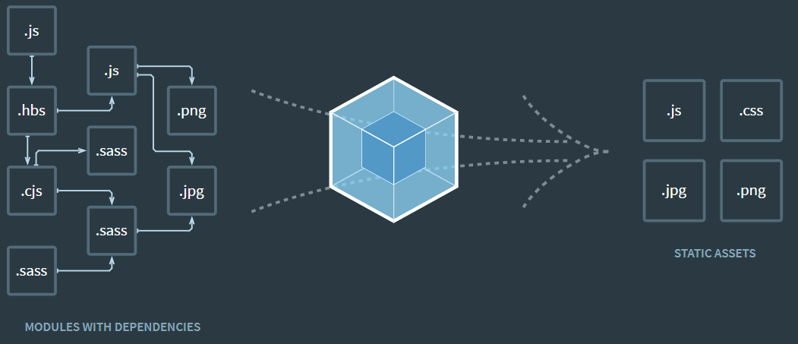

# Webpack, Babel, Polyfill

---

## Webpack

---

### 웹팩이란?

- 웹팩이란 최신 프론트엔드 프레임워크에서 가장 많이 사용되는 **_모듈 번들러_**(Module Bundler)다. 모듈 번들러란 웹어플리케이션을 구성하는 (HTML, CSS, Javascript, Images 등)을 모두 각각의 모듈로 보고 이를 조합해서 병합된 하나의 결과물을 만드는 도구를 의미한다.

### 모듈이란?

- 모듈이란 프로그래밍 관전에서 특정 기능을 갖는 작은 코드 단위를 의미한다. 자바스크립트로 치면 아래와 같은 코드가 모듈이다.

```jsx
// math.js
function sum(a, b) {
  return a + b
}

function substract(a, b) {
  return a - b
}

const pi = 3.14

export { sum, substract, pi }
```

- 이 `math.js` 파일은 아래와 같은 3가지 기능을 갖고 있는 모듈이다.
  1. 두 숫자의 합을 구하는 `sum()` 함수
  2. 두 숫자의 차를 구하는 `substract()` 함수
  3. 원주율 값을 갖는 `pi` 상수

⇒ 이처럼 성격이 비슷한 기능들을 하나의 의미 있는 파일로 관리하면 모듈이 된다.

### 웹팩에서의 모듈

- 웹팩에서 지칭하는 모듈이라는 개념은 위와 같이 자바스크립트 모듈에만 국한되지 않고 앱 어플리케이션을 구성하는 모든 자원을 의미힌다. 웹 어플리케이션을 제작하려면, HTML, CSS, Javascript, Images, Font 등 많은 파일들이 필요하고 이 파일 하나하나가 모두 모듈이다.

### 모듈 번들링이란?

아래 그림과 같이 웹 어플리케이션을 구성하는 몇십, 몇백개의 자원들을 하나의 파일로 병합 및 압축해주는 동작을 모듈번들링이라고 한다.

<p align="center">

</p>

React를 통해 개발을 한다면 기능을 여러 컴포넌트로 분리할 것이다. Webpack은 이렇게 쪼개져있는 컴포넌트들을 하나의 javascript로 변환해준다.

### 웹팩을 왜 사용해야 할까?

1. 웹 어플리케이션의 빠른 로딩 속도와 높은 성능
   웹사이트 진입 시 브라우저는 서버로부터 해당 어플리케이션의 자원(HTML, CSS, JS, Image)등을 다운로드한다. 이때 자바스크립트 번들러인 웹팩을 사용하여 여러 개의 자원을 하나의 파일로 병합시켜준다. 따라서 서버로부터 받아야 하는 자원이 줄어드는 효과가 있어, 네트워크의 부하를 줄일 수 있다.
   즉, 네트워크 요청 자체가 줄어든다.

2. 웹 개발 작업 자동화 도구(web task manager)
   웹에서 가장 많이 하는 것 VScode 같이 편집기에서 코드 수정하고 저장하고 웹에서 확인 및 새로고침 하는 것이다.
   html, css, js 압축, 이미지 압축, scss→css 전처리 변환 과 같은 작업들을 웹팩이 자동으로 관리해준다.

3. 파일 단위의 자바스크립트 모듈 관리의 필요성
   ES6 이후부터 자바스크립트에서 표준 모듈 시스템을 제안하였고, 이것이 export/import 방식이 등장하였다. 그러나 모든 브라우저에서 ES6 방식의 모듈 시스템을 지원하지는 않았다. 따라서 개발자들은 브라우저와 버전에 상관없이 편리한 모듈 시스템을 사용하기를 원했고 이러한 배경에 의해 등장하게 된 툴이 웹팩이다. ⇒ 즉 일부 브라우저에서 지원이 되지 않는 ES6 형식의 자바스크립트 파일을 ES5로 변환하여 사용할 수 있게 만들어준다.

## Babel

---

### Babel 이란?

> Babel is a JavaScript Complier.  
> Babel is a toolchain that is mainly used to convert ECMAScript 2015+ code into a backwards compatible version of JavaScript in current and older browsers or environments.  
> 바벨은 자바스크립트 컴파일러다. 바벨은 주로 ECMAScript 2015+ 코드를 현재 및 과거의 브라우저와 같은 환경에서 호환되는 버전으로 변화하는데 주로 사용되는 도구이다.  
> -바벨 공식 웹사이트

### Babel을 왜 사용하는가?

- **_크로스 브라우징(Cross Browsing)_**  
  크로스 브라우징은 브라우저나 플랫폼마다 보여지는 모습이 다른 경우가 많은데, 이러한 차이를 최소화하여 브러우저, 환경에 영향을 최소한으로 받고 해당 웹 서비스를 사용할 수 있게 최적화를 하는 작업을 말한다. 일부 최신 브라우저에서만 동작하는 기능을 그렇지 않은 브라우저에서 구현해야 할 경우, 기능을 단순화하거나 생략해야 하는 경우가 발생하기도 한다.  
  이러한 크로스 브라우징 이슈를 해결하기 위해서 생겨난 툴이 바벨이다. ES6+ 버전의 자바스크립트나 타입스크립트, JSX 등 다른 언어로 분류되는 언어들에 대해서도 모든 브라우저에서 동작할 수 있도록 호환성을 지켜준다. **_바벨은 이렇게 추상화 수준을 유지한 채로 코드를 변화시키는 트랜스파일러의 역할을 한다.  
  ⇒ 바벨을 통해 ES6+의 자바스크립트 코드는 하위 버전으로 변환되고, 그로 인해 IE 나 다른 브라우저에서 동작할 수 있게 만든다._**

## Polyfill

---

### Polyfill 이란?

바벨은 ES6 이상의 문법들에 대하여 ES5 문번의 자바스크립트로 변환해준다.

- 화살표 함수는 일반 function으로 변환한다.
- 템플릿 리터럴은 문자열 concatenation으로 변환한다.
- Promise는?

Promise는 ES5 버전의 문법에 존재하지 않는 기능이다.
즉, 바벨은 추가적인 설정이 없다면 Promise에 대한 변환을 수행할 수 없다는 것이다.
⇒ **_폴리필은 최신 ECMAScript 환경을 만들기 위해 코드가 실행되는 환경에 존재하지 않는 빌트인, 메소드 등을 추가하는 역할을 한다._**

> 바벨은 **컴파일 타임**에 코드를 트랜스파일링한다. (문법 전환)  
> 폴리필은 **런타임**에 등록되지 않은 메서드나 기능을 주입해준다. (함수 전환)

### Polyfill을 사용하는 3가지 방법

1. @babel/polyfill 를 import 해서 사용
2. core-js 에서 필요한 폴리필만 import 해서 사용
3. @babel/preset-env 프리셋 사용

참고  
[https://joshua1988.github.io/webpack-guide/webpack/what-is-webpack.html#웹팩이란](https://joshua1988.github.io/webpack-guide/webpack/what-is-webpack.html#%EC%9B%B9%ED%8C%A9%EC%9D%B4%EB%9E%80)  
https://codermun-log.tistory.com/605  
https://ingg.dev/webpack/  
[https://devowen.com/293#참고자료-1](https://devowen.com/293#%EC%B0%B8%EA%B3%A0%EC%9E%90%EB%A3%8C-1)  
https://nukw0n-dev.tistory.com/25
