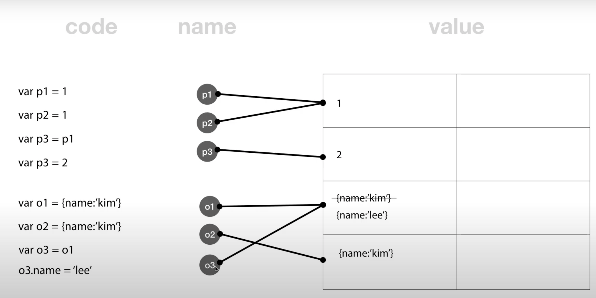
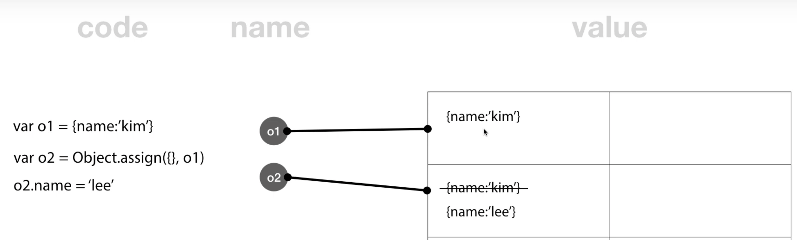
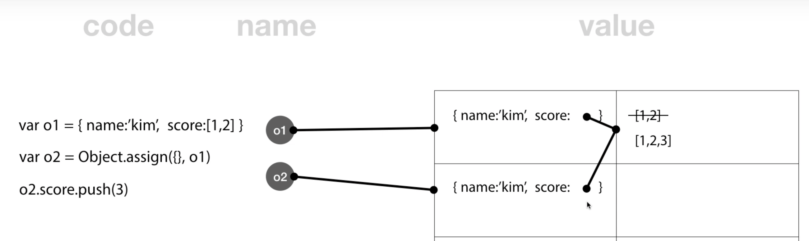
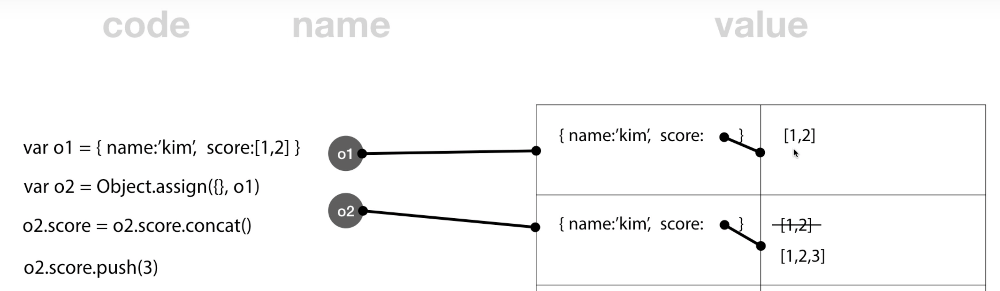

# 객체와 불변성(immutable)

## immutable value vs. mutable value

Javascript의 원시 타입(primitive data type)은 변경 불가능한 값(immutable value)이다.

- Boolean
- null
- undefinedn
- Number
- String
- Symbol (New in ECMAScript 6)

원시 타입 이외의 모든 값은 객체(Object) 타입이며 객체 타입은 변경 가능한 값(mutable value)이다. 즉, 객체는 새로운 값을 다시 만들 필요없이 직접 변경이 가능하다는 것이다.

<p align="center">

</p>

## 불변 데이터 패턴(immutable data pattern)

의도하지 않은 객체의 변경이 발생하는 원인의 대다수는 “레퍼런스를 참조한 다른 객체에서 객체를 변경”하기 때문이다. 이 문제의 해결 방법은 비용은 조금 들지만 객체를 불변객체로 만들어 프로퍼티의 변경을 방지하며 객체의 변경이 필요한 경우에는 참조가 아닌 객체의 방어적 복사(defensive copy)를 통해 새로운 객체를 생성한 후 변경한다.

이를 정리하면 아래와 같다.

- 객체의 방어적 복사(defensive copy)Object.assign
- 불변객체화를 통한 객체 변경 방지Object.freeze

### Object.assign

Object.assign은 타킷 객체로 소스 객체의 프로퍼티를 복사한다. 이때 소스 객체의 프로퍼티와 동일한 프로퍼티를 가진 타켓 객체의 프로퍼티들은 소스 객체의 프로퍼티로 덮어쓰기된다. 리턴값으로 타킷 객체를 반환한다. ES6에서 추가된 메소드이며 Internet Explorer는 지원하지 않는다.

<p align="center">

</p>

Object.assign을 사용하여 기존 객체를 변경하지 않고 객체를 복사하여 사용할 수 있다. Object.assign은 완전한 deep copy를 지원하지 않는다. **객체 내부의 객체(Nested Object)는 Shallow copy된다.**

**중첩된 객체의 복사(Nested Object)**

- 배열에서 push 는 가변 API

<p align="center">

</p>

- 배열인 경우 concat, slice, arrayfrom을 사용해서 복제해주는 명령어, API를 사용해야 한다. → Object.assign으로 shallow copy할 경우 중첩된 객체의 복사는 concat, slice, arrayfrom와 같은 API해결

<p align="center">

</p>

### Object.freeze

`Object.freeze()`를 사용하여 불변(immutable) 객체로 만들수 있다. 객체를 얼려버려서 누구도 그 객체를 수정하지 못하도록 하는 것이라고 생각하면 된다.

```jsx
var o1 = { name: 'kim', score: [1, 2] }
Object.freeze(o1)
Object.freeze(o1.score) // nested object,내부 객체까지 변경 불가능하게 만들려면 Deep freeze를 하여야 한다.
o1.name = 'lee' // 무시된다
o1.city = 'seoul' // 무시된다
o1.score.push(3) // Object.freeze(o1.score); 떄문에 에러가 발생한다.
console.log(o1)
```

## 얕은 복사(shallow copy) & 깊은 복사(deep copy)

copy에는 두 가지가 있다. **shallow copy**(얕은 복사)와 **deep copy**(깊은 복사)인데, shallow copy는 가장 상위 객체만 새로 생성되고 내부 객체들은 참조 관계인 경우를 의미합니다. deep copy는 내부 객체까지 모두 새로 생성된 것을 의미합니다.

### **얕은 복사**

객체를 복사할 때 참조에 의한 할당이 이루어지므로 원본과 같은 메모리 주소를 갖게 되고 이것이 얕은 복사이다. 그러므로 한 변수의 데이터를 변경하면 다른 변수의 데이터의 값도 함께 변경 된다. 즉, 한 데이터를 공유하고 있는 것이다. (원본===카피 -> true)

1. **일반적인 복사**

```jsx
const obj1 = { a: 1, b: 2 }
const obj2 = obj1
console.log(obj1 === obj2) // true
```

2. **Object.assign()**

   Object.assign()을 이용하면 **객체 자체는 깊은 복사**가 수행되지만, **2차원 이상의 객체는 얕은 복사**가 수행된다. 아래 예시에서 객체는 서로 다른 주소를 참조하고 있어 깊은 복사가 이루어졌지만 내부의 객체는 같은 주소를 참조하고 있다. → 1 depth까지는 깊은 복사가 되나, 2depth 부터 얕은 복사된다.

3. \***\*…(spread) 연산자를 통한 복사 - spread opeartor\*\***

   전개 구문도 assign()과 같이 **복사한 객체 자체는 깊은 복사**이지만 **내부의 객체는 얕은 복사**가 진행된다. → • 1 depth까지는 깊은 복사가 되나, 2depth 부터 얕은 복사된다.

### **깊은 복사**

참조가 아닌 값을 그대로 복사하지만, 같은 값을 가지는 별개의 메모리 공간을 갖는다. 그러므로 한 객체 값의 변경이 다른 객체 값의 변경에 영향을 주지 않는다. (원본===카피 ->false)

1. **spread operator 또는 Object.assign() 메서드를 depth만큼 여러번 또는 재귀적으로 사용**

   // object.assign()에서 이미 커버함.

2. **JSON.parse(JSON.stringify()) - JSON 객체 메소드**

   문자열로 변경한 후에 다시 파싱하여 객체로 만드는 방식이다.

```jsx
const copyObj = (obj) => JSON.parse(JSON.stringify(obj))

let a = [1, 2, 3]
let b = copyObj(a)

b[1] = 1000

console.log(a) // [1, 2, 3];
console.log(b) // [1, 1000, 3];
```

3. **라이브러리 사용 - immer**

```jsx
import produce from 'immer'

const obj = { a: 1, b: 2 }
// immer의 produce()를 사용하여 obj의 모든 프로퍼티를 복사한다.
const newObj = produce(obj, (draft) => {
  draft.c = 3
})
console.log(newObj)
// { a: 1, b: 2, c: 3 }
```

## 불변성을 지키는 것이 왜 중요한가?

개발자는 유지보수가 가능하고 가독성이 좋은 코드를 작성해야 한다.

불변성을 지키지 않는다면 사용할 데이터가 어디서 어떻게 바뀌어가는지 흐름을 쫓아가기 어렵고, 이는 곧 예기치 못한 side effect나 버그로 이어지게 만든다.

불변성을 지켜 명시적으로 작성된 코드는 다른 개발자가 코드를 보았을 때도 내가 모르는 어딘가에서 데이터가 변화했을거야! 라는 불필요한 의심없이 코드를 읽는 그대로 흐름을 따라가면서 이해할 수 있도록 돕는다.

따라서 불변성을 지키면서 데이터를 변화시킨다면, 예상가능하고 신뢰할 수 있는 코드가 될 수 있다.

애초에 불변성을 지켜야 한다는 것은 리액트가 만들어낸 새로운 컨셉이 아니라 불변성이라는 개념을 지켜가면서 state와 props를 이용할 수 있도록 하는 아이디어를 리액트에 녹여낸 것이다.

immutable한 값을 state나 props로 사용한다면 어떠한 일련의 이벤트를 통해 새롭게 만들어진 object가 변수에 할당 되는 것을 볼 수 있다. 이러한 새로운 값에 대한 참조는 기존의 값에서 값이 어떻게 변화하는지 추적하기가 쉽게 만들어준다.

단순한 불변성 개념 그 자체보다는 왜 불변성을 지켜가며 코드를 작성해야하는지 대해 좀 더 포커스를 두고 생각한다면 더 좋은 코드를 작성할 수 있을 것이다.

참조  
https://poiemaweb.com/js-immutability  
[생활코딩](https://www.youtube.com/watch?v=odymmcPGAWc&list=PLuHgQVnccGMBxNK38TqfBWk-QpEI7UkY8&index=3)  
https://sustainable-dev.tistory.com/156
