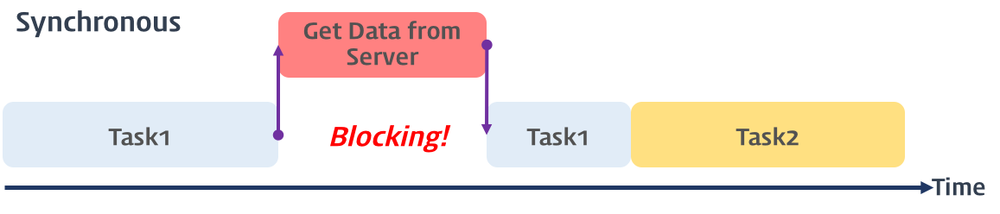
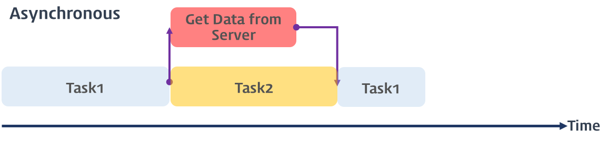

# 비동기처리(Asynchronous) - callback, promise, async, await

## 자바스크립트의 동기와 비동기

자바스크립트는 **싱글 스레드 언어**이기 때문에 한 번에 하나의 작업만 수행할 수 있다. 즉, 이전 작업이 완료되어야 다음 작업을 수행할 수 있게 된다. 우리가 프로그래밍을 하면서 일반적으로 각 함수와 코드들이 위에서 아래로 차례로 동작하는 방식이라고 할 수 있다. 이러한 코드 순차 실행을 **동기(Synchronous)** 라고 부른다.

그런데 동기 방식은 간단하고 직관적이지만, 작업이 오래 걸리거나 응답이 늦어지는 경우에는 전체적인 성능과 사용자 경험에 영향을 줄 수 있다. 예를 들어 서버에 데이터를 요청하고 응답을 받아야 하는 작업이 있다면, 응답이 올 때까지 다른 작업을 하지 못하고 대기해야 한다. 이렇게 되면 프로그램의 흐름이 멈추거나 지연되게 된다.

<p align="center">

</p>

따라서 자바스크립트로 여러 작업을 동시에 처리하기 위해 **비동기(Asynchronous)** 라는 개념을 도입하여, 특정 작업의 완료를 기다리지 않고 다른 작업을 동시에 수행할 수 있도록 하였다. 자바스크립트를 배우다 보면 setTimeout() 함수나 fetch() 함수를 접해볼 것이고, 이들은 비동기로 동작한다는 소리를 한번 쯤은 들어본 적이 있을 것이다. 비동기는 메인 스레드가 작업을 다른 곳에 인가하여 처리되게 하고, 그 작업이 완료되면 콜백 함수를 받아 실행하는 방식으로, 쉽게 말해 작업을 백그라운드에 요청하여 처리되게 하여 멀티로 작업을 동시에 처리하는 것으로 보면 된다.

<p align="center">

</p>

## 비동기처리 예제

```jsx
function func1() {
  console.log('func1')
  func2()
}

function func2() {
  setTimeout(function () {
    console.log('func2')
  }, 0)

  func3()
}

function func3() {
  console.log('func3')
}

func1()
```

위 예제는 비동기식으로 동작하는 코드로 순차적으로 실행되지 않는다.
위 예제를 실행하면 setTimeout 메소드에 두번째 인수 인터벌을 0초로 설정하여도 콘솔에 “func1 func2 func3”의 순서로 로그가 출력되지 않는다. 이는 setTimeout 메소드가 비동기 함수이기 때문이다.

함수 func1이 호출되면 함수 func1은 Call Stack에 쌓인다. 그리고 함수 func1은 함수 func2을 호출하므로 함수 func2가 Call Stack에 쌓이고 setTimeout가 호출된다. **setTimeout의 콜백함수는 즉시 실행되지 않고 지정 대기 시간만큼 기다리다가 “tick” 이벤트가 발생하면 태스크 큐로 이동한 후 Call Stack이 비어졌을 때 Call Stack으로 이동되어 실행된다.**

<p align="center">

</p>

## ****자바스크립트 비동기 처리 3가지 방식****

## callback

콜백은 다른 함수의 인자로 함수를 넘기는 것을 말한다. 콜백 함수로 비동기 프로그래밍을 짤 수 있지만, 모든 콜백 함수가 비동기이진 않다. 예를 들어 `map()`, `filter()`의 첫 번째 인자로 들어가는 콜백 함수는 동기식으로 호출된다.

```jsx
const POSTS_URL = 'https://jsonplaceholder.typicode.com/posts';

const getPosts = (url) => {
  const xhr = new XMLHttpRequest();
  xhr.open('GET', url);
  xhr.send();

  xhr.onload = () => {
    if (xhr.status === 200) {
      console.log(JSON.parse(xhr.response));
    } else {
      console.error(`${xhr.status} ${xhr.statusText}`);
    }
  };
};

const posts = getPosts(POSTS_URL);
console.log('posts: ', posts); //undefined
```

여기서 post를 console로 찍었을 때 어떤 결과가 나올까?

`xhr.onload()`가 비동기로 동작하기 때문에 post는 undefined라는 결과를 반환한다. 이렇듯 비동기로 동작하는 함수는 외부에서 그 값을 바로 참조하지 못하여, **무조건 콜백 함수 내부에서 그 처리를 진행해야 한다.**

```jsx
const getPosts = (url, whenSuccess, whenFail) => {
  const xhr = new XMLHttpRequest();
  xhr.open('GET', url);
  xhr.send();

  xhr.onload = () => {
    if (xhr.status === 200) {
      whenSuccess(JSON.parse(xhr.response));
    } else {
      whenFail(xhr.status, xhr.statusText);
    }
  };
};

const handlePosts = (response) => {
  // ...
};

const errorHandling = (status, statusText) => {
  // ...
};

const posts = getPosts(POSTS_URL, handlePosts, errorHandling);
```

따라서 콜백의 후속처리를 모두 그 콜백 함수내에서 처리해야 하기 떄문에, 위처럼 다시 콜백함수를 넘기는 수 밖에 없게 되었다.

그런데 만약 해당 콜백함수에 또 예외 처리를 해야 하거나, 여러 에러 상황의 각기 다른 조치를 취해야 한다면 어떻게 해야할까? 끔찍하게도 이것 역시 또 다른 콜백함수로 넘겨야한다. 그리고 이런 상황이 곧 콜백 헬(callback hell) 이라고 불린다.

⇒ *동기적으로 실행할 모든 코드들을 콜백함수형태로 인수로 전달함으로써 스크립트 엔진으로 하여금 다음에 (비동기적으로) 처리할 업무를 물리적으로 없앤다. web api가 특정 업무를 수행할때까지 강제로 동기화시키는 것으로, 가독성이 떨어지고 코드 중첩이 많아서 이를 보완하기 위해 나온것이 promise 다.*

## Promise

### 프로미스란?

Promise란 기본적으로 callback이 하는 일과 같지만, 차이점이라면 Promise는 작업이 끝난 후 실행할 함수를 제공하는 것이 아니라  비동기처리에 사용되는 객체이다.  Promise는  `.then()`과 같은 자체 메서드를 연속적으로 사용가능하다.

### 프로미스 기본 사용법

Promise 객체를 생성하려면 `new` 키워드와 Promise 생성자 함수를 사용하고, Promise 생성자안에 두개의 매개변수를 가진 콜백 함수를 넣게 되는데, 첫번째 인수는 작업이 성공했을 때 성공(*resolve*)임을 알려주는 객체이고, 두번째 인수는 작업이 실패했을 때 실패(*reject*)임을 알려주는 오류 객체이다.

Promise로 생성된 객체는 각각 then, catch, finally를 통해서 값을 받아올 수 있다. 즉, 작업 결과 따라  `.then()` 과 `.catch()` 메서드 체이닝을 통해 성공과 실패에 대한 후속 처리를 진행할 수 있다.

만일 처리가 성공하여 프로미스 객체 내부에서 `resolve(data)` 를 호출하게 되면, 바로 `.then()` 으로 이어져 then 메서드의 콜백 함수에서 성공에 대한 추가 처리를 진행한다. 이때 호출한 `resolve()` 함수의 매개변수의 값이 then 메서드의 콜백 함수 인자로 들어가 then 메서드 내부에서 프로미스 객체 내부에서 다룬 값을 사용할 수 있게 된다.

반대로 처리가 실패하여 프로미스 객체 내부에서 reject(”Error”) 를 호출하게 되면, 바로 `.catch()` 로 이어져 catch 메서드의 콜백 함수에서 성공에 대한 추가 처리를 진행한다.

```jsx
const getPostsWithPromise = (url) => {
  return new Promise((resolve, reject) => {
    const xhr = new XMLHttpRequest();

    xhr.open('GET', url);
    xhr.send();

    xhr.onload = () => {
      if (xhr.status === 200) {
        resolve(JSON.parse(xhr.response));
      } else {
        reject(xhr.status, xhr.statusText);
      }
    };
  });
};

const posts = getPostsWithPromise(POSTS_URL);

posts
  .then((res) => console.log(res))
  .catch((err) => console.error(err))
  .finally(() => console.log('끝'));
```

### 프로미스 후속 처리 메서드

- **then**

then 메소드는 두 개의 콜백 함수를 인자로 전달 받는다. 첫 번째 콜백 함수는 성공(fulfilled, resolve 함수가 호출된 상태) 시 호출되고 두 번째 함수는 실패(rejected, reject 함수가 호출된 상태) 시 호출된다.  
**then 메소드는 Promise를 반환한다.**

- **catch**

예외(비동기 처리에서 발생한 에러와 then 메소드에서 발생한 에러)가 발생하면 호출된다. catch 메소드는 Promise를 반환한다.

- **finally**

성공,실패 상관없이 마지막으로 수행한다.  

`fetch()` 함수가 바로 Promise 기반으로 만들어진 HTTP 요청 전송 기능인 클라이언트 사이드 Web API다. 쓰임새도 Promise와 매우 유사하다.

```jsx
fetch(POSTS_URL)
	.then((res) => console.log(res))
	.catch((err) => console.error(err))
	.finally(() => console.log('끝'));
```

⇒ *프로미스는 후속 처리 메소드를 체이닝(chaining)하여 여러 개의 프로미스를 연결하여 사용할 수 있다. 이로써 콜백 헬을 해결한다. 콜백 못지않게 프로미스의 `then()` 메서드가 지나치게 체인되어 반복되면 코드가 장황해지고 가독성이 굉장히 떨어질 수 가 있다. 이를 또다시 극복하기 위해 나온 것이 async/await 키워드이다.*

## async / await

promise를 기반으로 promise를 조금 더 간결하고 간편하게 하고, 동기적으로 실행되는 것처럼 보이게 만들어준다.

함수앞에 async를 붙여주면 자동적으로 함수안에 있는 코드블럭이 promise로 변환된다.

```jsx
const getPostWithAsync = async (url) => {
  try {
    const response = await fetch(url);
    return await response.json(); // 혹은 다른 형태로 데이터 전처리 가능
  } catch (err) {
    console.err(err);
  }
};

const posts = getPostWithAsync(POSTS_URL);
console.log('posts: ', posts);

posts.then(console.log);
```

콜백 함수나 Promise는 무조건 api를 호출한 후, 또 다른 콜백 함수를 실행하여 데이터의 처리가 가능했지만, async/await는 해당 함수 내부에서 바로 동기 처리처럼 데이터를 수정할 수 있다. 또한 try/catch 문으로 에러 처리도 훨씬 수월하다.

### Promise의 유용한 API

항상 async/await이 효과적인 것은 아니고, 동시다발적으로 일어날 수 있도록 동시다발적으로 처리하기 위해서는 Promise.all() 을 사용하는 것이 좋다. Promise.all API는 Promise배열을 전달하게 되면 모든 Promise들이 await처럼 순차적이 아닌 병렬적으로 다 받아질때까지 모아준다.

```jsx
function delay(ms) {
	return new Promise((resolve) => setTimeout(resolve, ms));
}
async function getApple() {
	await delay(2000);
	return '🍎';
}
async function getBanana() {
	await delay(1000);
	return '🍌';
}

//async를 사용했을 때
async function pickFruits() {
	const apple = await getApple(); //2초 기다리고 
	const banana = await getBanana(); //1초 기다려야한다.
	return `${apple} + ${banana}`;
}
pickFruits().then(console.log);

//위를 보완하기 위해 async를 병렬적으로 처리하기 -> 안좋은 예!!
async function pickFruits() {
	const applePromise = getApple();
	const bananaPromise = getBanana();
	const apple = await applePromise;
	const banana = await bananaPromise;
	return `${apple} + ${banana}`;
}
pickFruits().then(console.log);

//Promise.all을 사용했을떄 -> 좋은 예!
function pickAllFruits() {
	return Promise.all([getApple(), getBanana()]).then(
	(fruits ) => fruits.join(' + '));
}
pickAllFruits().then(console.log);

```

## callback, promise, async/await의 차이

callback, promise, async/await는 (싱글스레드로 이루어져) 단일 호출 스택을 가진 자바스크립트에서 비동기를 처리할 수 있게 하는 방법들입니다.

### callback

- CallBack 함수란 이름 그대로 나중에 호출되는 함수를 말합니다. 특정한 문법적 특징을 가진 것이 아니라, **파라미터로 함수를 전달 받아 함수의 내부에서 실행하는 함수**로, 주로 비동기 처리를 위해 사용됩니다.
- **함수의 처리 순서를 보장하는 과정에서 함수를 중첩해서 사용**하게 되고, 이른바 **콜백지옥**이라는 상황이 발생해, 가독성과 유지보수가 떨어지게 됩니다.

### promise

- 프로미스란 생성된 시점에는 **결과를 아직 반환하지 않은 객체**를 뜻합니다.
- ES6에서 도입된 문법으로, 콜백 패턴이 가진 단점을 보완하여, **비동기 처리 시점을 명확하게 표현할 수 있고, 콜백 지옥의 문제에서 비교적 자유**롭습니다.
- **프로미스는 3가지 상태 중 하나**를 가지는데, 생성되면 기본적으로 pending 상태. 이후 비동기 처리 결과에 따라 resolve나 reject 함수를 호출하고, 처리에 성공했다면,프로미스를 fulfilled 상태로, 실패했다면 rejected 상태로 변경됩니다.
- 프로미스에는 then, catch, finally라고 하는 **후속 처리 메서드 존재**. 이 메서드들을 연속적으로 호출하는 것을 **프로미스 체이닝**이라고 부른다.

### async/awiat

- promise를 **더욱 쉽고 직관적**으로 사용할 수 있도록 ES8에 추가된 문법이다.
- async/await은 Promise의 **간결성, 에러핸들링, 에러위치확인**과 같은 여러 불편한 점들을 해결하기 위해 추가된 문법으로, 비동기 코드를 **마치 동기 코드처럼** 직관적이고 쉽게 작성할 수 있다.
- **await 키워드는 async 키워드가 붙어있는 함수 내부에서만 사용**할 수 있고, 비동기 함수가 return하는 promise로부터 결과값을 추출해준다.즉, await 키워드를 사용하면 일반 비동기 처리처럼 바로 실행이 다음 라인으로 넘어가는 것이 아니라, 결과값을 얻을 수 있을 때까지 기다려주기 때문에 **일반적인 동기 코드처리와 동일한 흐름으로 코드를 작성할 수 있다.**
- 또한, **동기/비동기 구분없이 try/catch로 일관되게 예외 처리**를 할 수 있다.

참조  

[https://inpa.tistory.com/entry/🌐-js-async](https://inpa.tistory.com/entry/%F0%9F%8C%90-js-async)  
https://poiemaweb.com/js-async  
https://www.howdy-mj.me/javascript/asynchronous-programming  
[https://velog.io/@wkqkel/callback-promise-asyncawait의-차이](https://velog.io/@wkqkel/callback-promise-asyncawait%EC%9D%98-%EC%B0%A8%EC%9D%B4)  
[드림코딩엘리](https://www.youtube.com/watch?v=s1vpVCrT8f4&list=PLv2d7VI9OotTVOL4QmPfvJWPJvkmv6h-2&index=11)  