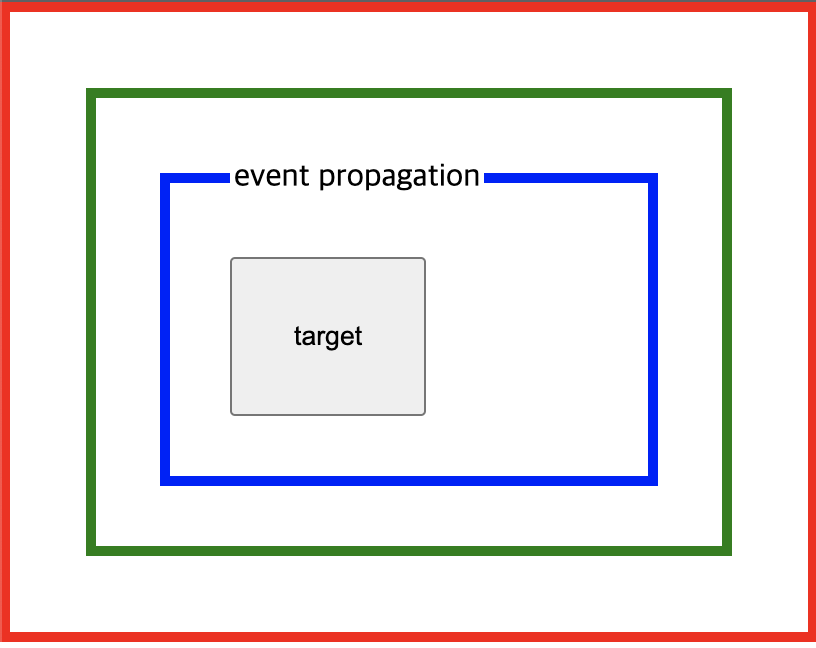

# 이벤트 캡처링, 버블링 그리고 이벤트 위임

## 이벤트란

이벤트가 발생하면 누군가 이를 감지할 수 있어야 하며 그에 대응하는 처리를 호출해주어야한다. 이를 위해 이벤트는 일반적으로 함수에 연결되며 그 함수는 이벤트가 발생하기 전에는 실행되지 않다가 이벤트각 발생되면 실행된다. 이 함수를 **_이벤트 핸들러_**라 하며 이벤트에 대응하는 처리를 기술한다.

```jsx
<!DOCTYPE html>
<html>
<body>
  <button class="myButton">Click me!</button>
  <script>
    document.querySelector('.myButton').addEventListener('click', function () {
      alert('Clicked!');
    });
  </script>

</body>
</html>

```

## 이벤트핸들러 등록방식 - addEventListener 메소드 방식

`addEventListener` 메소드를 이용하여 대상 DOM 요소에 이벤트를 바인딩하고 해당 이벤트가 발생했을 때 실행될 콜백 함수(이벤트 핸들러)를 지정한다.

<p align="center">

</p>

addEventListener 메소드의 세번째 매개변수에 *true 또는 { capture : true }*를 설정하면 캡처링으로 전파되는 이벤트를 캐치하고, *false 또는 미설정*하면 버블링으로 전파되는 이벤트를 캐치한다.

## 이벤트의 흐름

계층적 구조에 포함되는 HTML 요소에 이벤트가 발생할 경우 연쇄적 반응이 일어난다. 즉, 이벤트가 전파(_Event Propagation_)되는데 전파 방향에 따라 버블링(_Event Bubbling_)과 캡처링(_Event Capturing_)으로 구분할 수 있다.

- **이벤트 버블링** - 자식 요소에서 발생한 이벤트가 부모 요소로 전파되는 것.
- **이벤트 캡처링** - 자식요소에서 발생한 이벤트가 부모 요소부터 시작하여 이벤트를 발생시킨 자식 요소까지 도달하는 것.

**주의할 것은 버블링과 캡처링은 둘 중에 하나만 발생하는 것이 아니라 캡처링부터 시작하여 버블링으로 종료한다는 것이다.** 즉, 이벤트가 발생했을 때 캡처링과 버블링은 순차적으로 발생한다.

캡처링은 IE8 이하에서 지원되지 않는다.

<p align="center">

</p>

### 이벤트 캡처링

```jsx
<html>
<head>
  <style>
    html {border: 5px solid red; padding: 30px;}
		body {border: 5px solid green; padding: 30px;}
    fieldset {border: 5px solid blue; padding: 30px;}
    input {border: 5px solid balck; padding: 30px;}
  </style>
</head>

<body>
  <fieldset>
    <legend>event propagation</legend>
    <input type="button" id="target" value="target">
  </fieldset>
  <script>
    function handler(event) {
      let phases = ['capturing', 'target', 'bubbling']
      console.log(event.target.nodeName, this.nodeName, phases[event.eventPhase - 1]);
    }
    document.getElementById('target').addEventListener('click', handler, true);
    document.querySelector('fieldset').addEventListener('click', handler, true);
    document.querySelector('body').addEventListener('click', handler, true);
    document.querySelector('html').addEventListener('click', handler, true);
  </script>
</body>

</html>
```

<p align="center">

</p>

```jsx
INPUT HTML capturing
INPUT BODY capturing
INPUT FIELDSET capturing
INPUT INPUT target
```

### event.target 과 this(=event.currentTarget)의 차이

- `event.target`은 실제 이벤트가 시작된 ‘타깃’ 요소, 즉 이벤트를 발생시킨 요소를 가리킨다. 버블링이 진행되어도 변하지 않습니다.
- `this`는 ‘현재’ 요소로, 현재 실행 중인 핸들러가 할당된 요소를 참조합니다.
  이벤트에 바인딩된 DOM 요소를 가리킨다. 즉, addEventListener 앞에 기술된 객체를 가리킨다.
  addEventListener 메소드에서 지정한 이벤트 핸들러 내부의 this는 이벤트에 바인딩된 DOM 요소를 가리키며 이것은 이벤트 객체의 currentTarget 프로퍼티와 같다. 따라서 이벤트 핸들러 함수 내에서 currentTarget과 this는 언제나 일치한다.

### 이벤트 버블링

```jsx
document.getElementById('target').addEventListener('click', handler)
document.querySelector('fieldset').addEventListener('click', handler)
document.querySelector('body').addEventListener('click', handler)
document.querySelector('html').addEventListener('click', handler)
```

```jsx
INPUT INPUT target
INPUT FIELDSET bubbling
INPUT BODY bubbling
INPUT HTML bubbling
```

## 이벤트 위임(event delegation)

**이벤트 위임** 이란 다수의 자식 요소에 각각 이벤트 핸들러를 바인딩하는 대신 하나의 부모 요소에 이벤트 핸들러를 바인딩하는 방법이다. 이 패턴으로 얻는 이점들은 다음과 같다.

- 동적으로 엘리먼트를 추가할 때마다 핸들러를 고려할 필요가 없다.
- 상위 엘리먼트에 하나의 이벤트 핸들러만 추가하면 되기 때문에 코드가 훨씬 깔끔해진다.
- 메모리에 있게되는 이벤트 핸들러가 적어지기 때문에 퍼포먼스 측면에서 이점이 있다.

### 이벤트 위임의 예

`li` 에 각각 핸들러를 달지 않고 상위 엘리먼트인 `ul` 에만 달았다.

```jsx
<!DOCTYPE html>
<html>
<body>
  <ul class="post-list">
    <li id="post-1">Item 1</li>
    <li id="post-2">Item 2</li>
    <li id="post-3">Item 3</li>
    <li id="post-4">Item 4</li>
    <li id="post-5">Item 5</li>
    <li id="post-6">Item 6</li>
  </ul>
  <div class="msg">
  <script>
    const msg = document.querySelector('.msg');
    const list = document.querySelector('.post-list')

    list.addEventListener('click', function (e) {
      // 이벤트를 발생시킨 요소
      console.log('[target]: ' + e.target);
      // 이벤트를 발생시킨 요소의 nodeName
      console.log('[target.nodeName]: ' + e.target.nodeName);

      // li 요소 이외의 요소에서 발생한 이벤트는 대응하지 않는다.
      if (e.target && e.target.nodeName === 'LI') {
        msg.innerHTML = 'li#' + e.target.id + ' was clicked!';
      }
    });
  </script>
</body>
</html>
```

## 기본 동작의 변경

이벤트 객체는 요소의 기본 동작과 요소의 부모 요소들이 이벤트에 대응하는 방법을 변경하기 위한 메소드는 가지고 있다.

### Event.preventDefault()

폼을 submit하거나 링크를 클릭하면 다른 페이지로 이동하게 된다. 이와 같이 요소가 가지고 있는 기본 동작을 중단시키기 위한 메소드가 preventDefault()이다.

```jsx
<!DOCTYPE html>
<html>
<body>
  <a href="http://www.google.com">go</a>
  <script>
  document.querySelector('a').addEventListener('click', function (e) {
    console.log(e.target, e.target.nodeName);

    // a 요소의 기본 동작을 중단한다.
    e.preventDefault();
  });
  </script>
</body>
</html>
```

### Event.stopPropagation()

어느 한 요소를 이용하여 이벤트를 처리한 후 이벤트가 부모 요소로 이벤트가 전파되는 것을 중단시키기 위한 메소드이다. 부모 요소에 동일한 이벤트에 대한 다른 핸들러가 지정되어 있을 경우 사용된다.

아래 코드를 보면, 부모 요소와 자식 요소에 모두 mousedown 이벤트에 대한 핸들러가 지정되어 있다. 하지만 부모 요소와 자식 요소의 이벤트를 각각 별도로 처리하기 위해 button 요소의 이벤트의 전파(버블링)를 중단시키기 위해서는 stopPropagation 메소드를 사용하여 이벤트 전파를 중단할 필요가 있다.

```jsx
<!DOCTYPE html>
<html>
<head>
  <style>
    html, body { height: 100%;}
  </style>
</head>
<body>
  <p>버튼을 클릭하면 이벤트 전파를 중단한다. <button>버튼</button></p>
  <script>
    const body = document.querySelector('body');
    const para = document.querySelector('p');
    const button = document.querySelector('button');

    // 버블링
    body.addEventListener('click', function () {
      console.log('Handler for body.');
    });

    // 버블링
    para.addEventListener('click', function () {
      console.log('Handler for paragraph.');
    });

    // 버블링
    button.addEventListener('click', function (event) {
      console.log('Handler for button.');

      // 이벤트 전파를 중단한다.
      event.stopPropagation();
    });
  </script>
</body>
</html>
```

참조

https://poiemaweb.com/js-event  
[생활코딩](https://www.youtube.com/watch?v=8TurB6yoots&t=270s)
