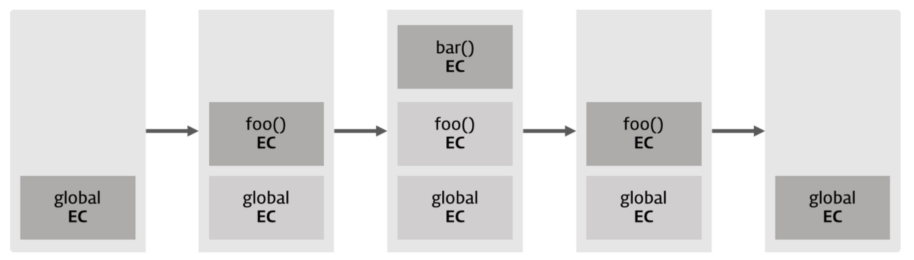
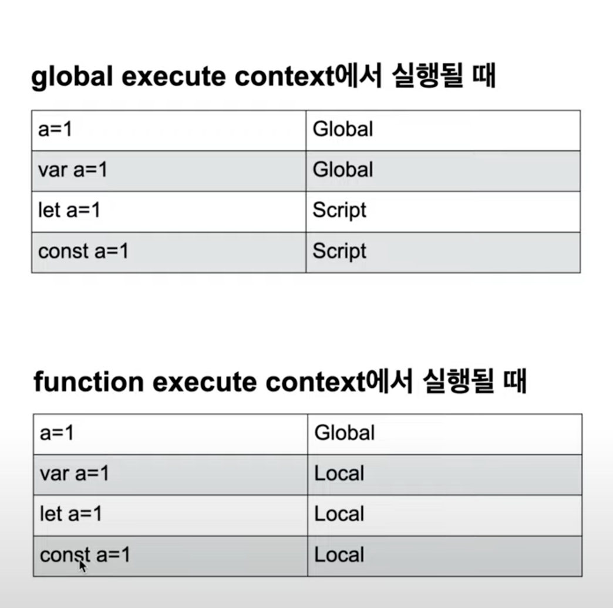

# 실행 컨텍스트(execution context)

## 실행 컨텍스트

실행 컨텍스트(Execution Context)는 scope, hoisting, this, function, closure 등의 동작원리를 담고 있는 자바스크립트 핵심원리이다.

실행 컨텍스트를 바로 이해하지 못하면 코드 독해가 어려워지며 디버깅도 매우 곤란해 질 것이다.

자바스크립트 엔진은 코드를 실행하기 위해서 실행에 필요한 여러가지 정보를 알고 있어야 한다.

실행에 필요한 여러가지 정보란 아래와 같은 것들이 있다.

- 변수 : 전역변수, 지역변수, 매개변수, 객체의 프로퍼티
- 함수 선언
- 변수의 유효범위(Scope)
- this

이와 같이 실행에 필요한 정보를 형상화하고 구분하기 위해 자바스크립트 엔진은 실행 컨텍스트를 물리적 객체의 형태로 관리한다.

```jsx
var x = 'xxx'

function foo() {
  var y = 'yyy'

  function bar() {
    var z = 'zzz'
    console.log(x + y + z)
  }
  bar()
}
foo()
```

위 코드를 실행하면 아래와 같이 실행 컨텍스트 스택(stack)이 생성하고 소멸한다.

현재 실행 중인 컨텍스트에서 이 컨텍스트와 관련없는 코드(예를 들어 다른 함수)가 실행되면 새로운 컨텍스트가 생성된다.

이 컨센스트는 스택에 쌓이게 되고 컨트롤(제어권)이 이동한다.

<p align="center">

</p>

⇒ 실행 컨텍스트는 자바스크립트 코드가 실행되는 환경이다. 모든 JS코드는 실행 컨텍스트 내부에서 실행된다고 생각하면 된다. 즉 함수가 실행되면 함수 실행에 해당하는 실행 컨텍스트가 생성되고, 자바스크립트 엔진에 있는 콜 스택에 차곡차곡 쌓인다.

## 실행 컨텍스트의 실행순서

일단 처음 코드가 실행(여기서 실행은 브라우저가 스크립트를 로딩해서 실행하는 것을 말한다.)하는 순간 모든 것을 포함하는 **전역 컨텍스트**가 생긴다. 모든 것을 관리하는 환경이고, 페이지가 종료될 때까지 유지된다. 전역 컨텍스트 말고도 **함수 컨텍스트**가 있는데, 함수를 호출할 떄마다 함수 컨텍스트가 하나씩 더 생긴다.

- 먼저 전역 컨텍스트 하나 생성 후, 함수 호출 시마다 컨텍스느가 생긴다.
- 컨텍스트 생성 시 컨텍스트 안에 **변수객체(arguments, variable), scope, chain, this**가 생성된다.
- 컨텍스트 생성 후 함수가 실핸되는데, 사용되는 변수들은 변수 객체 안에서 값을 찾고, 없다면 스코프 체인을 따라 올라가며 찾는다.
- 함수 실행이 마무리되면 해당 컨텍스트는 사라진다.(클로저제외) 페이지가 종료되면 전역 컨텍스트가 사라진다.

```jsx
var name = 'zero' // (1)변수 선언 (6)변수 대입
function wow(word) {
  // (2)변수 선언 (3)변수 대입
  console.log(word + ' ' + name) // (11)
}
function say() {
  // (4)변수 선언 (5)변수 대입
  var name = 'nero' // (8)
  console.log(name) // (9)
  wow('hello') // (10)
}
say() //(7)

//결과는
//nero
//hello zero
```

### 실행 컨텍스트의 3가지 객체

실행 컨텍스트는 실행 가능한 코드를 형상화하고 구분하는 추상적인 개념이지만 물리적으로는 **객체의 형태**를 가지며 아래의 **3가지 프로퍼티**를 소유한다.

<p align="center">

</p>

- Variable Object(변수객체)
  실행 컨텍스트가 생성되면 자바스크립트 엔진은 **실행에 필요한 여러 정보들을 담을 객체를 생성**한다.
- Scope chain
  스코프 체인(Scope Chain)은 **해당 전역 또는 함수가 참조할 수 있는 변수, 함수 선언 등의 정보를 담고 있는 전역 객체(GO) 또는 활성 객체(AO)의 리스트**를 가리킨다.
- this
  this 프로퍼티에는 this 값이 할당된다. this 할당되는 값은 함수 호출 패턴에 의해 결정된다.

### 전역 컨텍스트

전역 컨텍스트가 생성된 후 두번째 원칙에 따라 변수객체, scope, chain, this가 들어온다. 전역 컨텍스트는 **arguments**(함수의 인자를 말한다)가 없고, **variable**은 해당 스코프의 변수들이다. 예저에서는 name, wow, say가 여기에 속한다.

scope chain(스코프 체인, 자신과 상위 스코프들의 변수객체이다.)은 자기 자신인 전역 변수객체이다. this는 따로 설정되어 있지 않으면 window이다. this를 바꾸는 방법이 바로 new를 호출하는 것이다. 원래 기본적으로 window이고 new나 bind 같은 상황에서 this가 바뀐다.

이를 객체 형식으로 표현해보자

```jsx
'전역 컨텍스트': {
  변수객체: {
    arguments: null,
    variable: ['name', 'wow', 'say'],
  },
  scopeChain: ['전역 변수객체'],
  this: window,
}
```

이제 코드를 위에서부터 실행하는데 wow랑 say는 호이스팅 때문에 선언과 동시에 대입이 된다. 그 후 variable의 name에 ‘zero’가 대입된다.

```jsx
variable: [{ name: 'zero' }, { wow: Function }, { say: Function }]
```

### 함수 컨텍스트

그 후 (7)번에서 `say();` 를 하는 순간 새로운 컨텍스트인 say 함수 컨텍스트가 생긴다. 아까 전역 컨텍스트는 그대로 있고, variable은 name만 있따. **scope chain**은 say 변수객체와 상위의 전역 변수 객체이다. this는 따로 설정해주지 않았으므로 window다.

```jsx
'say 컨텍스트': {
  변수객체: {
    arguments: null,
    variable: ['name'], // 초기화 후 [{ name: 'nero' }]가 됨
  },
  scopeChain: ['say 변수객체', '전역 변수객체'],
  this: window,
}
```

say를 호출한 후 위에서부터 차례대로(8)~(10)을 실행하는데, **variable**의 name에 nero를 대입해주고 나서 `console.log(name);` 이 있다. name 변수는 say 컨텍스트 안에서 찾으면 된다. **variable**의 name이 nero이기에 nero가 콘솔에 찍힌다. 그 다음엔 `wow(’hello’);`가 있는데, say 컨텍스트 안에서 wow 변수를 찾을 수 없다. 찾을 수 없다면 scope chain을 따라 올라가 상위 변수객에서 찾는다. 그래서 전역 변수객체에서 찾고, 전역 변수객체의 variable에 있는 wow라는 함수를 호출한다.

(10)번에서 wow함수가 호출되었으니 wow 컨텍스트도 생긴다. **arguments**는 word=’hello’고, **scope chain**은 wow 스코프와 전역 스코프이다. 여기서 중요한게 lexical scoping에 따라 wow 함수의 스코프 체인은 선언 시에 이미 정해져있다. 따라서 say 스코프는 wow 컨텍스트의 **scope chain**이 아니다. variable은 없고, this는 window다.

```jsx
'wow 컨텍스트': {
  변수객체: {
    arguments: [{ word : 'hello' }],
    variable: null,
  },
  scopeChain: ['wow 변수객체', '전역 변수객체'],
  this: window,
}
```

이제 컨텍스트가 생긴 후 함수가 실행된다. say 함수는 아직 종료된게 아니다. wow 함수 안에서 `console.log(word + ' ' + name);` 이 있는데 word랑 name 변수는 wow 컨텍스트에서 찾으면 된다. word는 **arguments**에서 찾을 수 있고, name은 wow 변수객체에는 값이 없으니, **scope chain**을 따라 전역 스코프에서 찾으면 된다. 전역 변수객체로 올라가니 variable에 name이 zero라고 되어 있고, 그래서 hello nero가 아닌 hello zero가 되는 겁니다. wow 컨텍스트에 따르면 wow 함수는 애초에 say 컨텍스트와 일절 관련이 없었던 것이다.

**이제 wow 함수 종료 후 wow 컨텍스트가 사라지고, say 함수의 실행이 마무리된다. 따라서 say 컨텍스트도 사라지고, 마지막에 전역 컨텍스트도 사라진다.**

### 전역 과 함수 컨텍스트의 차이

<p align="center">

</p>

참조

[https://inpa.tistory.com/entry/JS-📚-실행-컨텍스트#실행\_컨텍스트](https://inpa.tistory.com/entry/JS-%F0%9F%93%9A-%EC%8B%A4%ED%96%89-%EC%BB%A8%ED%85%8D%EC%8A%A4%ED%8A%B8#%EC%8B%A4%ED%96%89_%EC%BB%A8%ED%85%8D%EC%8A%A4%ED%8A%B8)  
https://velog.io/@edie_ko/js-execution-context  
https://www.zerocho.com/category/JavaScript/post/5741d96d094da4986bc950a0.
