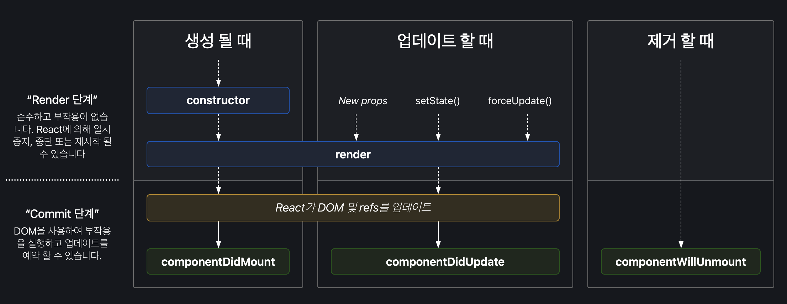

# 클래스 컴포넌트 라이프사이클(생명주기)

## React의 생명주기 용어

--

| 용어    | 설명                                                                                                                                            |
| ------- | ----------------------------------------------------------------------------------------------------------------------------------------------- |
| ~will   | 어떤 작업을 수행하기 전에 실행되는 메서드와 관련된 용어다                                                                                       |
| ~didi   | 어떤 작업을 수행한 이후에 실행되는 메서드와 관련된 용어다.                                                                                      |
| mount   | 컴포넌트 내에서 DOM이 생성되고 웹 브라우저 상에 나타는 메서드와 관련된 용어다.                                                                  |
| unmount | 컴포넌트 내에서 DOM을 제거하는 메서드와 관련된 용어다.                                                                                          |
| update  | 컴포넌트 내에서 변화가 발생하였을때 수행하는것을 의미한다. ex) props, state, 부모 컴포넌트의 리 렌더링, forceUpdate를 통해 강제로 변경하는 경우 |

## React의 생명주기 상세 설명

> **Adding lifecycle methods to a class component**  
>  If you define the `[componentDidMount]` method, React will call it when your component is added _(mounted)_ to the screen. React will call `[componentDidUpdate]` after your component re-renders due to changed props or state. React will call `[componentWillUnmount]` after your component has been removed _(unmounted)_ from the screen.

**[ 생명주기 순서 요약 ]**

1. 컴포넌트의 실행
2. **constructor()** 실행
3. **render()** 실행
4. **ComponenDidMount()** 실행

**[ 조건부 수행 ]**

- 컴포넌트 내에 변화가 있을 때, **componentDidUpdate()** 실행 - 리렌더링이 된다.
- 컴포넌트의 소멸이 수행되었을 때, **componentWillUnmount()** 실행 - 완료되지 않은 비동기 요청을 componentWillUnmount에서 정리해준다.

### 📌 Mount

컴포넌트가 처음 실행될 때 그것을 Mount라고 표현합니다. 컴포넌트가 시작되면 우선 context, defaultProps와 state를 저장한다. 그리고 **render**로 컴포넌트를 DOM에 부착한 후 Mount가 완료된후 **componentDidMount**가 호출된다. → 즉, render 메서드가 호출되면 mount가 된다(화면에 그려진다)

componentDidMount에서는 **DOM**에 접근할 수 있습니다. 그래서 여기에서는 주로 AJAX 요청을 하거나, setTimeout, setInterval같은 행동을 한다. → componentDidMount는 컴포넌트가 생성된 후 해야할 일을 처리하게 해준다.

### 📌 ComponentDidMount

> 💡 컴포넌트 내에서 렌더링이 수행된 이후에 실행이 되는 메서드이다.

- 자바스크립트 라이브러리 또는 프레임워크의 함수를 호출하거나 이벤트 등록에 사용된다.
- setTimeout, setInterval, 네트워크 요청 같은 비동기 작업을 처리할 때 사용된다.

### 📌 ComponentDidUpdate

> 💡 컴포넌트 내에서 변화가 발생하였을 경우에 실행되는 메서드이다.

- 변화라 함은 부모 컴포넌트로부터 전달받은 props 값의 변화가 발생하거나 부모 컴포넌트가 리렌더링이 발생을 하는 경우 수행된다.
- 해당 컴포넌트 내에서 state의 값이 변하는 경우 수행된다.

### 📌 ComponentWillUnmount

> 💡 컴포넌트 내에서 DOM을 제거할 때에 실행이 되는 메서드이다.

- `componentWillUnmount` 는 컴포넌트가 화면에서 사라지기 직전에 호출된다
- 주로 DOM에 직접 등록했었던 이벤트를 제거하고, 만약에 `setTimeout` , `setInterval` 을 걸은것이 있다면 `clearTimeout` , `clearInterval` 을 통하여 제거를 한다. - 비동기 요청한 것들이 사라지지 않고 있으면, 렌더링 될때 같이 render 되기 때문에 문제가 될 수 있다.

### 📍레거시 생명주기 메서드

아래의 생명주기 메서드들은 “레거시”로 분류됩니다. 즉 여전히 작동하지만, 새로 작성하는 코드에서는 사용하지 않을 것을 권장한다.

- componentWillMount() -> UNSAFE_componentWillMount()
- componentWillUpdate() -> UNSAFE_componentWillUpdate()
- componentWillReceiveProps() -> UNSAFE_componentWillReceiveProps()

참조  
[제로초](https://www.zerocho.com/category/React/post/579b5ec26958781500ed9955)  
https://adjh54.tistory.com/42  
리액트 공식문서
