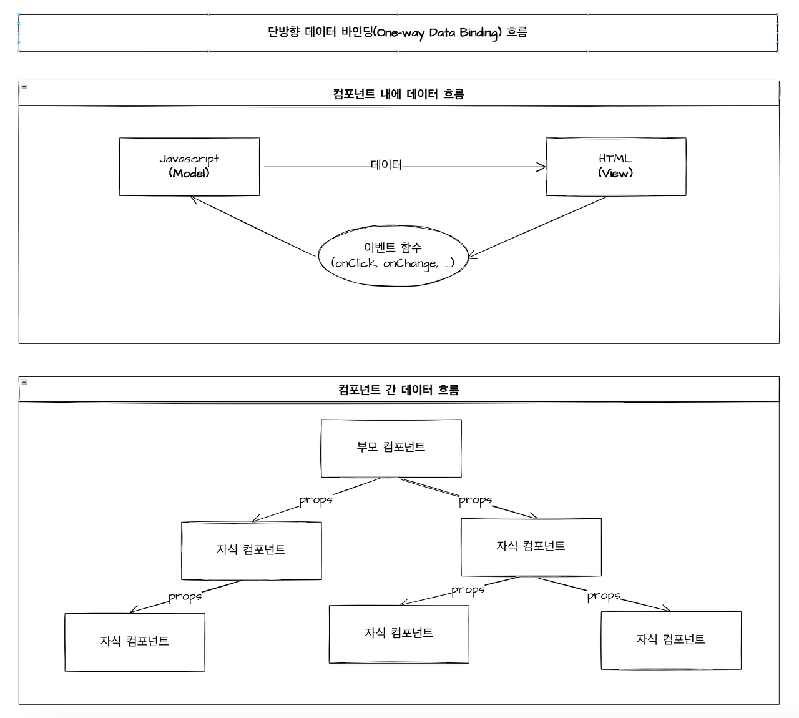

# React

## 1. React란?
---

- React는 facebook에서 제공해주는 프론트엔드 라이브러리. → **복잡한 웹/앱에서 data와 화면일치문제를 쉽게 풀어주기 위해 react 사용** - 업데이트 빈도가 높아도 그렇게 무리가 가지 않는데, React는 **가상 DOM**을 사용해 브라우저의 부담을 줄였기 때문입니다. DOM 조작이 브라우저에 엄청 무리를 주기 때문에 가상 DOM을 만들어 달라진 부분만 비교해 업데이트합니다
- 웹페이지에 인터렉션이 자주 발생하고, 동적인 UI를 기존의 JavaScript만으로 표현하면 개발과 수정이 일어날때마다 DOM을 직접 수정해야하기 떄문에 코드가 난잡해지는 문제가 발생하곤 한다.
처리해야 할 이벤트도 다양해지고, 관리해야한 상태 값이나 DOM의 구조도 다양해지게 된다면 이에 따라 처리해야 하는 업데이트 규칙도 복잡해지기 마련이다.

리액트는 이러한 문제점을 개선하기 위해 아래와 같은 방법을 사용한다.

리액트는 **Virtual DOM**이라는 것을 사용한다. 
이 Virtual Dom은 가상의 DOM으로, 브라우저에 실제로 보여지는 DOM이 아니라 단순히 메모리에 가상으로 존재한 DOM으로서, 단순한 JavaScript객체이기 때문에 작동 성능이 브라우저에서 DOM을 보여주는 것보다 속도가 훨씬 빠르다고 한다.
리액트는 상태가 업데이트 되면 업데이트가 필요한 곳의 UI를 가상의 DOM을 통해 렌더링한다. 이때 리액트 내부의 엔진을 통해 실제 브라우저에서 보여지고 있는 DOM과 비교를 한 후, 차이가 있는 곳을 감지해서 실제 DOM에 패치시킨다.

## 2. React의 특징
---

1. Data Flow  
2. Component 기반 구조  
3. Virtual Dom  
4. Props and State  
5. JSX**  

### 1. Data Flow - 단반향 데이터 바인딩

**데이터 바인딩이란?**  
두 데이터 혹은 정보의 소스를 일치시키는 기법으로, 화면에 보이는 데이터(View)와 브라우저 메모리에 있는 데이터(Model, 여러개의 자바스크립트 객체)를 일치시키는 것을 말한다.

예를 들어서 HTML에서 서버 혹은 스크립트상에서 받아온 데이터를 화면상에 그려주고 있다고 가정을 했을 때, 해당 값이 변경이 될 경우 다시 HTML 상에 데이터(값)를 변경된 값에 따라서 맞추어 주는 동작을 '데이터 바인딩'이라고 한다.

**React는 데이터의 흐름이 한 방향으로만 흐르는 단뱡향 데이터 흐름을 가진다.**

📌 컴포넌트 내에서 '단방향 데이터 바인딩'은 **Javascript(Model에서 HTML(View)로 한 방향으로만 데이터를 동기화하는 것을 의미**합니다. [JS(Model) -> HTML(View)]

📌 **단방향 데이터 바인딩이기에 역으로 HTML(View)에서 JS(Model)로의 직접적인 데이터 갱신은 불가능**합니다. '이벤트 함수(onClick, onChange,...)'를 주고 함수를 호출한 뒤 Javascript에서 HTML로 데이터를 변경해야 합니다. [HTML(View) -> JS(Model)]

📌 컴포넌트 간에서 단방향 데이터 바인딩은 **부모 컴포넌트에서 자식 컴포넌트로만 데이터가 전달되는 구조입니다.**

### 2. Component 기반 구조  

> Component는 독립적인 단위의 소프트웨어 모듈을 말한다.
즉, 소프트웨어를 독립적인 하나의 부품으로 만드는 방법이라고 볼 수 있습니다.
> 

React는 UI(View)를 여러 컴포넌트(component)를 쪼개서 만든다.
한 페이지 내에서도 여러 각 부분을 독립된 컴포넌트로 만들고, 이 컴포넌트를 조립해 화면을 구성한다.

컴포넌트 단위로 쪼개져 있기 때문에, 전체 코드를 파악하기가 상대적으로 쉽다. 이렇게 기능 단위, UI 단위로 캡슐화시켜 코드를 관리하기 떄문에 재사용성이 높다. 따라서 코드는 반복해 입력할 필요 없이, 컴포넌트만 import해 사용하면 된다는 간편함이 있으며, 어플리케이션이 복잡해지더라도 코드이 유지보수, 관리가 용이해지는 장점이 있다.

컴포넌트의 두 가지 핵심 원리, **독립적으로 기능할 것**과 **재사용 가능할 것**이다.

### 3. Virtual DOM

DOM은 Document Object Model의 약자이다.
DOM은 html, xml, css 등을 트리 구조로 인식하고, 데이터를 객체로 간주하고 관리한다.

React는 이 DOM Tree 구조와 같은 구조체를 Virtual DOM으로 가지고 있다.

> Vurtual DOM은 가상의 Document Object Model을 말한다.
> 

이벤트가 발행할 때마다 Virtual DOM을 만들고, 다시 그릴 때마다 실제 DOM과 비교하고 전후 상태를 비교해, 변경이 필요한 최소한의 변경사항만 실제 DOM에 반영해, 앱의 효율성과 속도를 개선할 수 있다고 한다.

### 4. Props and State

### Props

- Props는 부모 컴포넌트에서 자식 컴포넌트로 전달해 주는 데이터를 말한다.
- 컴포넌트는, 데이터를 가진 하나의 'props' 객체 인자를 받은 후 React 엘리먼트를 반환한다. 이때 **props는 속성을 나타내는 데이터**다.
- props는 **읽기 전용**이므로 **컴포넌트의 내부에서 props를 수정해서는 안 된다.** → 자식 컴포넌트에서 부모 컴포넌트로 부터 전달받은 props는 변경이 불가능하고 props를 전달해준 최상위 부모 컴포넌트만 props를 변경할 수 있다.

### State

- **state**는 **컴포넌트 내부의 동적 데이터**를 의미한다. State는 컴포넌트 내부에서 선언하며 내부에서 값을 변경할 수 있습니다. state는 동적인 데이터를 다룰 때 사용하며, 사용자와의 상호작용을 통해 데이터를 동적으로 변경할 때 사용한다.
- state를 사용하는 방식에는 컴포넌트의 종류에 따라 2가지가 있다. **클래스형 컴포넌트에서는 컴포넌트 자체가 state를 지니는 방식**으로 사용한다. **함수형 컴포넌트에서는 useState라는 함수, Hook을 통해 사용**한다.

⇒ props 와 state 모두 값이 변경되면 새로운 리턴 값을 만들어서 UI를 바꾼다. 단, **다른점은 props는 컴포넌트를 사용하는 외부자를 위한 데이터이고, state는 컴포넌트를 만드는 내부자를 위한 데이터이다.**

### 5. JSX

- HTML도 아닌 JSX(JavaScript XML)라는 JavaScript에 XML을 추가하여 확장한 문법이다. HTML과 같이 생겼지만, 실제로는 Javascript 기반이다. - 자바스크립트 파일 하나가 독립적인 컴포넌트 임무를 수행해야 하므로 자바스크립트 코드와 HTML 코드가 같이 있다.  
- 브라우저에서 실행하기 전에 코드가 번들링되는 과정에서 **바벨을 사용하여 일반 자바스크립트 형태의 코드로 변환됩니다.**  리엑트 컴포넌트 파일에서 XML 형태로 코드를 작성하면 Babel이 JSX를 Javascript로 변환해주는데, Babel은 자바스크립트의 문법을 확장해주는 도구로, 최신 자바스크립트 문법들을 정식 자바스크립트 형태로 변환해줌으로 구형 브라우저 같은 환경에서도 동작할 수 있게 해주는 역할을 한다.  
- React는 JSX 사용이 필수가 아니지만, JS 코드 안에서 UI관련 작업을 할 수 있기 때문에 시각적으로 더 도움이 된다. 또한 JSX를 사용하면 React가 더욱 도움이 되는 에러 및 경고 메시지를 표시할 수 있게 해준다.

참조

https://narup.tistory.com/183  
(제로초)[https://www.zerocho.com/category/React/post/5774fc91785a21150007807e]  
[https://velog.io/@jini_eun/React-React.js란-간단-정리](https://velog.io/@jini_eun/React-React.js%EB%9E%80-%EA%B0%84%EB%8B%A8-%EC%A0%95%EB%A6%AC)    
https://adjh54.tistory.com/49
