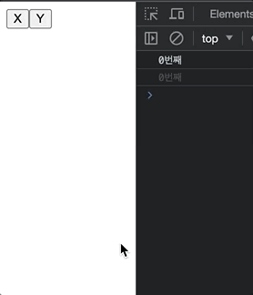

# useMemo 와 useCallback

## Memoization

메모이제이션은 **기존에 수행한 연산의 결과값을 어딘가에 저장해두고 동일한 입력이 들어오면 재활용**하는 프로그래밍 기법입니다.

이것을 적절하게 활용하면 **중복 연산**을 피할 수 있기 때문에 메모리를 조금 더 쓰더라도 애플리케이션의 성능을 최적화 할 수 있습니다.

## useMemo

useMemo는 메모이제이션된 **값을 반환**하는 함수다. 즉, **값을 캐싱하는 훅**이다.

```jsx
useMemo(() => fn, [deps])
```

여기서 deps로 지정한 값이 변하게 된다면 `() => fn` 함수를 실행하고, 그 함수의 **반환 값을 반환**해준다

deps는 dependency의 약어로, 의존성을 뜻하며 useMemo가 이 deps에 의존하고 있다는 것을 말한다.

```jsx
import React, { useState, useCallback, useMemo } from 'react'

export default function App() {
  const [ex, setEx] = useState(0)
  const [why, setWhy] = useState(0)

  // useMemo 사용하기
  useMemo(() => {
    console.log(ex)
  }, [ex])

  // 두 개의 버튼을 설정했다. X버튼만이 ex를 변화시킨다.
  return (
    <>
      <button onClick={() => setEx((curr) => curr + 1)}>X</button>
      <button onClick={() => setWhy((curr2) => curr2 + 1)}>Y</button>
    </>
  )
}
```

여기서 X라는 버튼을 클릭했을 때 setEx에 의해서 ex의 값을 1씩 증가시키는데, ex의 값이 변하기 때문에 useMemo에서 의존성으로 등록한 ex가 변화된 것을 감지해 지정한 함수가 실행되고, console.log로 인해 ex값이 출력되게 된다.

### 🎈 useMemo를 쓰는 이유?

```jsx
import React, { useState, useCallback, useMemo } from 'react'

export default function App() {
  const [ex, setEx] = useState(0)
  const [why, setWhy] = useState(0)

  // 버튼 클릭시 ex값이 출력된다.
  console.log(ex)

  return (
    <>
      <button onClick={() => setEx((curr) => curr + 1)}>X</button>
      <button onClick={() => setWhy((curr2) => curr2 + 1)}>Y</button>
    </>
  )
}
```

<p align="center">

</p>

컴포넌트의 **state 값이 변하면 리렌더링이 일어난다.** 버튼을 클릭할 경우 setState로 인해 state값이 변화되어 리렌더링이 일어나면 console.log가 찍히도록 위처럼 코드를 작성하면 되는데, useMemo를 사용하는 이유는 뭘까요?

사실, 위처럼 코드를 작성할 경우 X버튼, Y버튼, 혹은 컴포넌트가 부모 컴포넌트에 의해서 리렌더링이 될 경우 상태 값에 관계 없이 `console.log`가 찍히는 연산이 발생하게 된다.

만약, 단순하게 `console.log`가 아닌 복잡한 연산, 연산할 때마다 약 0.3초씩 걸린다고 가정하면 어떨까? 답답하겠지?

따라서 **ex값이 변할 경우에만 연산을 실행할 수 있도록 useMemo를 사용해 ex라는 변수에 의존하도록 등록**하는 것이지요.

결과, 리렌더링이 발생할 경우, 특정 변수가 변할 때에만 useMemo에 등록한 함수가 실행되도록 처리하면 불필요한 연산을 하지 않게 된다.

## useCallback

useCallback은 **메모이제이션된 함수를 반환**하는 특징을 가지고 있다. 즉, **함수를 캐싱(또는 메모이제이션)할 때 사용하는 훅**이다.

```jsx
useCallback(fn, [deps])
```

useCallback 또한 deps, 의존성이 있는 값이 변하면 fn에 등록한 함수를 반환하는 기능을 가지고 있다.

### 🎈 useMemo와 useCallback 비교

**useCallback은 함수 자체를 캐싱하고, useMemo는 값을 캐싱한다.**

```jsx
useCallback(() => {}, [])
useMemo(() => 값, [])
```

둘 다 함수를 첫 번째 인자로 받고, 두 번째 인자로는 deps 배열을 받는다. 하지만 useCallback은 () => {} 자체를 캐싱하는 것이고, useMemo는 값만 캐싱하게 됩니다(물론 값이 함수일 수는 있다.). 캐싱한 값을 바꾸고 싶을 때는 deps 배열을 사용하면 된다. deps 배열 내부의 값이 달라지면 기존 캐싱된 것을 버리고 새로 값을 구한다.

```jsx
useMemo(() => console.log(), [test])
const memoizedCallback = useCallback(() => console.log(), [test])
```

일단은 useMemo와 useCallback의 모양은 위와 같다.
useCallback이 함수를 반환하기 때문에 그 함수를 가지는 **const 변수에 초기화**하는 것이 일반적인 모양입니다.

### 🎈 useCallback을 사용하는 경우

1. 자식 컴포넌트에 props로 함수를 전달할 경우  
   (함수 자체가 바뀌는게 없어도 부모가 렌더링되면 자식컴포넌트도 리렌더링이 발생할 수 있다.)
2. 외부에서 값을 가져오는 api를 호출하는 경우

### 1. 자식 컴포넌트에 props로 함수를 전달하는 경우

먼저 **함수는 값이 아닌 참조로 비교된다!**는 점을 알고 있어야한다.

```jsx
const functionOne = function () {
  return 5
}
const functionTwo = function () {
  return 5
}
// 서로의 참조가 다르기 때문에 false
console.log(functionOne === functionTwo)
```

동일한 값을 반환하지만 참조가 다르기 때문에 false가 나온다.
위와 같이 컴포넌트에서 특정 함수를 정의할 경우 각각의 함수들은 모두 고유한 함수가 된다.
이런 고유한 함수가 생성될 경우, 부모를 통해 props에 함수를 전달받는 자식 컴포넌트에서는 props가 변경되었다고 판단해 리렌더링이 발생하게 된다.

```jsx
function App() {
  const [name, setName] = useState('')
  const onSave = () => {}

  return (
    <div className="App">
      <input
        type="text"
        value={name}
        onChange={(e) => setName(e.target.value)}
      />
      <Profile onSave={onSave} />
    </div>
  )
}
```

useCallback을 사용하지 않을 경우, name이 변경되어 리렌더링이 발생하면 onSave함수가 새로 만들어지고, Profile 컴포넌트의 props로 onSave함수가 새로 전달되게 된다.  
이때 Profile 컴포넌트에서 useMemo를 사용해도 **이전 onSave와 이후 onSave가 같은 값을 반환하지만 참조가 다른 함수**가 되어버리기 때문에 리렌더링이 일어나게 된다.
부모 컴포넌트만 수정하려고 했지만 연쇄적으로 하위 컴포넌트들 모두 렌더링이 일어나게 되어버린다.

따라서 아래와 같이

```jsx
import React, { useCallback, useState } from 'react'
import Profile from './Profile'

function App() {
  const [name, setName] = useState('')
  const onSave = useCallback(() => {
    console.log(name)
  }, [name])

  return (
    <div className="App">
      <input
        type="text"
        value={name}
        onChange={(e) => setName(e.target.value)}
      />
      <Profile onSave={onSave} />
    </div>
  )
}
```

useCallback을 사용해서 onSave라는 함수를 재사용하는 것으로 자식 컴포넌트의 리렌더링을 방지할 수 있다.

### 2. 외부에서 값을 가져오는 api를 호출하는 경우

```jsx
import React, { useState, useEffect } from 'react'

function Profile({ userId }) {
  const [user, setUser] = useState(null)

  const fetchUser = () =>
    fetch(`https://your-api.com/users/${userId}`)
      .then((response) => response.json())
      .then(({ user }) => user)

  useEffect(() => {
    fetchUser().then((user) => setUser(user))
  }, [fetchUser])

  // ...
}
```

위의 코드는 fetchUser 함수가 변경될 때만 외부에서 api를 가져와 useEffect가 실행된다. 사실 이 코드는 정상적인 코드가 아니다.  
Profile이라는 컴포넌트가 리렌더링이 발생할 경우 fetchUser 함수에는 새로운 함수가 할당되게 된다. 러면 useEffect()함수가 호출되어 user 상태값이 바뀌고, state 값이 바뀌었기 때문에 다시 리렌더링이 일어난다.

**무한루프**에 빠져버리게 되는 것이다.

이때 **useCallback을 사용할 경우 fetchUser 함수의 참조값을 동일하게 유지**시킬 수 있습니다.

```jsx
import React, { useState, useEffect } from 'react'

function Profile({ userId }) {
  const [user, setUser] = useState(null)

  const fetchUser = useCallback(
    () =>
      fetch(`https://your-api.com/users/${userId}`)
        .then((response) => response.json())
        .then(({ user }) => user),
    [userId],
  )

  useEffect(() => {
    fetchUser().then((user) => setUser(user))
  }, [fetchUser])

  // ...
}
```

api의 옵션으로 사용되는 userId가 변동될 때만 fetchUser에 새로운 함수가 할당되도록 설정하고, 그것이 아니면 동일한 함수가 실행되게 되서 무한 루프에 빠지지 않도록 할 수 있다.

참조  
https://narup.tistory.com/273  
[제로초](https://www.zerocho.com/category/React/post/5f98e5841d7a110004463b87)
