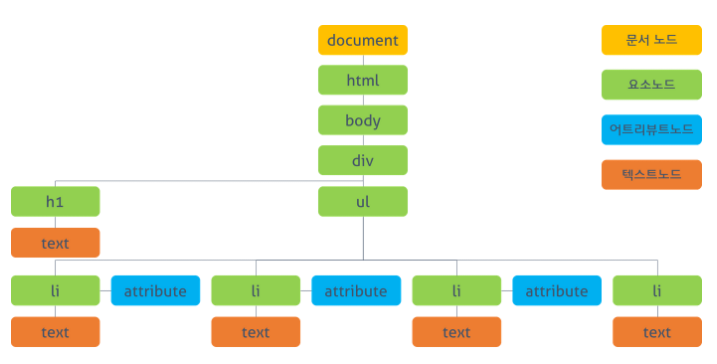
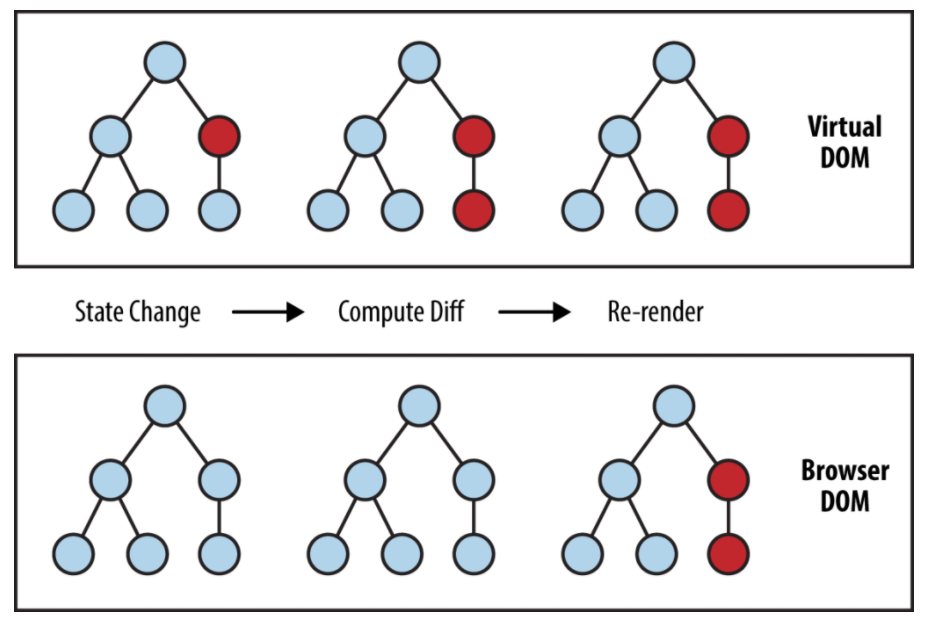
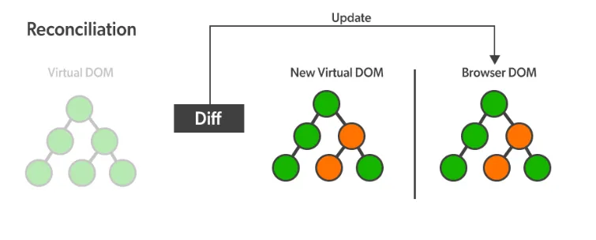

# Virtual DOM

리액트가 수많은 개발자들 사이에서 엄청난 사랑을 받는 이유중 한가지는 바로 빠른 속도이다.

리액트는 가상돔(Virtual DOM)을 사용해 보다 효율적으로 우리가 원하는 페이지를 브라우저에 빠르게 그려주기 때문이다.

## DOM 이란?
___

Document Object Model(문서 객체 모델)의 약자이다.
문서 객체 란 Web Browser 안에서 HTML 문서에 JavaScript가 접근할 수 있도록 <html 태그>들을 객체(object)로 만든 것이다.
프로그래밍 언어가 DOM 구조에 접근할 수 있는 방법을 제공하여 그들이 문서 구조, 스타일, 내용 등을 변경할 수 있게 돕는 역할을 한다.

하나하나의 Element(HTML)들을 담고 있는 웹페이지를 Document라고 하는데, 이를 브라우저는 분석해 페이지를 띄워주는 방식이다. DOM이란 이런 HTML element 들을 tree 형태로 표현한 것인데, DOM tree 안에는 각각의 element에 상응하는 Node가 들어있다.

개발자들은 DOM이 제공하는 API를 통해 DOM구조에 접근을 하고, 원하는 Element를 입맛대로 조작할 수 있다. 이를 DOM 조작이라고 한다. 흔히 getElementById 나, querySelector 같은 API를 통해 돔 구조안의 Element에 접근해 원하는 대로 내용, 스타일, 레이아웃 등을 수정하는 것이다.

## 기존 렌더링 방식
---

1. 브라우저는 서버가 보내준 **HTML 파일** 을 해석(Parsing)하여 **DOM 트리** 를 만든다.
2. 브라우저는 서버가 보내준 **CSS 파일** 을 해석(Parsing)하여 **CSSOM 트리** 도 만든다.
3. **DOM 트리 + CSSOM 트리** 를 결합해 **렌더트리** 를 만든다.
4. 렌더트리로 각 노드의 위치와 크기를 계산한 **레이아웃** 을 만든다. 뷰포트(Viewport) 내에서 각 노드들의 위치와 크기를 계산한다
5. Layout 계산이 완료되면 이제 요소들을 실제 화면을 그리는 **페인트(Paint)** 를 한다.

## 기존 렌더링 방식의 문제점
---

DOM은 새로운 요청이나 변경사항이 있을 때마다 매번 리렌더링을 한다. 하지만 매번 새롭게 구성하기 때문에, 렌더할 양이 많으면 속도가 느려지게 된다.

만약 폰트의 컬러만 바꾸고 싶어도, 다음과 같은 DOM 조작을 필요로 하게 된다.
브라우저는 HTML을 탐색해 해당 Element를 찾고, 해당 Element와 자식 Element들을 DOM에서 제거한다. 이후 새롭게 수정된 Element로 이를 교체하는데, CSS는 과정 이후 다시 계산하여 결과적으로는 레이아웃 정보를 알맞게 수정하게 되는 것이다. 새롭게 계산된 내용이 브라우저에 그려지는 방식으로 플로우가 진행된다.
사실 DOM조작은 트리에 있는 정보를 업데이트시켜 준다는 점, 그리고 빠른 알고리즘을 사용한다는 조건 하에선 그렇게 퍼포먼스적으로 무리가 있는 작업은 아니다.
하지만 이를 반복적으로 수행한다면, 충분히 무거워질 수 있는 작업이 되는 것이다.

⇒ **그래서 가상돔(Virtual DOM)이 나왔다!**

## 가상돔(Virtual DOM)이란?
---

Virtual DOM 은 실제 DOM과 같은 내용을 담고 있는 복사본이라고 생각하면 쉽다. 복사본은 실제 DOM이 아닌 JS 객체 형태로 메모리 안에 저장되어 있다.

실제 DOM과 다르게 직접적으로 브러우저 화면의 UI를 조작할 수 있게 해주는 API는 제공하지 않는다. 가상돔은 메모리에 저장되어 있는 자바스크립트 객체에 불과하기 때문이다. 때문에 가상돔에 접근하고 수정하는 것은 매우 가볍고 빠른 작업이 되는 것이다.

## 리액트가 가상돔을 반영하는 절차
---

리액트는 항상 두개의 가상돔 객체를 가지고 있습니다.

1. 렌더링 이전 화면 구조를 나타내는 가상돔
2. 렌더링 이후에 보이게 될 화면 구조를 나타내는 가상돔

리액트는 STATE가 변경될 때마다 Re-Rendering이 발생하는데, 이 시점마다 새로운 내용이 담긴 가상돔을 생성하게 된다. 실제 브라우저가 그려지기 이전에 말이다.

특정 페이지에서 데이터가 변했다고 가정했을 때, 리액트를 이용해 돔을 업데이트시키는 절차는 다음과 같다.

1. 변화가 일어나면 변화된 버전을 가상돔으로 바꾼다. 
- 데이터가 업데이트 되면 전체 UI를 가상돔에 리렌더링한다.
2. 가상돔끼리 비교한다.(Diff)  
렌더링 이전에 화면의 내용을 담고있는 첫번째 가상돔과 업데이트 이후에 발생할 두번재 가상돔을 비교해 정확히 어떤 Element가 변했는지 비교한다. - 이를 리액트에서 **Diffing**이라고 표현한다.
3. 바뀐 부분만 실제 DOM에 적용한다. (레이아웃계산은 한번만)  
Diffing은 효율적인 알고리즘을 사용해 진행되기 때문에 어떤 Element에 차이가 있는지를 매우 신속하게 파악할 수 있게 된다. 리액트는 이를 통해 차이가 발생한 부분만을(브라우저상의) 실제 DOM에 적용하게 되는데, 이 과정을 **Reconciliation(재조정)**이라고 한다.

Reconcilication 과정이 매우 효율적인 이유는 Batch Update 때문이다. 이는 **변경된 모든 Element를 집단화시켜 이를 한번에 실제 DOM에 적용하는 방식**이다. 

예를 들어, 리스트안에 10개의 항목이 바뀌었다면 실제 DOM을 10번 반복해 수정하는 것이 아니라, 한 번에 집단화시켜 이를 적용한다는 점이다.

DOM조작에 비용이 가장 많이 발생하는 지점은 브라우저에 화면을 그려주는 작업인만큼 Batch Update는 변경된 Element를 별개로 그려주는 것이 아닌, 변경된 내용을 한번에 받아와 이를 실제 DOM에 한번에 적용시켜준다는 점이 효율적인라는 것이다.

⇒ **작은 규모의 레이아웃(리플로우)이 여러번 발생하는 것보다 큰 규모의 레이아웃이 한번에 발생하는것은 성능상의 큰 차이를 나타낸다. 리액트는 이와 같은 얕은 비교와 일괄 돔 업데이트 방식을 이용해 성능 향상을 이끄는 것이다.**

참조

https://devbirdfeet.tistory.com/219  
[https://callmedevmomo.medium.com/virtual-dom-react-핵심정리-bfbfcecc4fbb](https://callmedevmomo.medium.com/virtual-dom-react-%ED%95%B5%EC%8B%AC%EC%A0%95%EB%A6%AC-bfbfcecc4fbb)   
[https://velog.io/@mollog/React에서의-가상돔-개념](https://velog.io/@mollog/React%EC%97%90%EC%84%9C%EC%9D%98-%EA%B0%80%EC%83%81%EB%8F%94-%EA%B0%9C%EB%85%90).